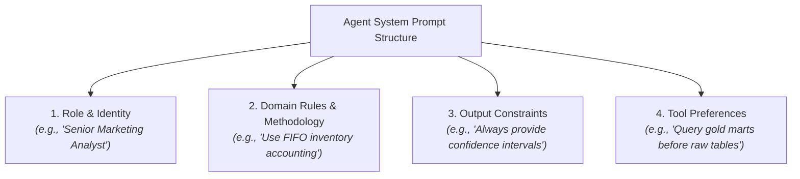
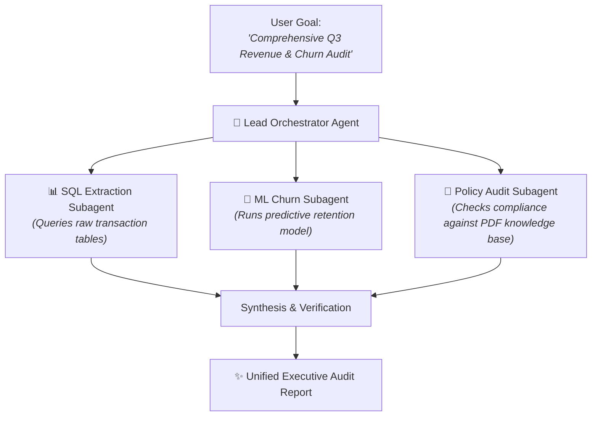

# Agent Builder & Custom Personas

While Nova serves as the default platform AI Data Engineer, enterprise organizations frequently require specialized agents customized for specific business units, regulatory compliance mandates, and proprietary analytical methodologies. For example, a Financial Operations team may need an agent trained on strict GAAP accounting standards, while a Marketing team requires an agent specialized in cohort lifetime value and campaign ROI.

The **CompassX Agent Builder** (`/agents`) provides a visual studio for designing custom AI agents, defining behavioral instructions, selecting cloud or self-hosted LLMs, and building collaborative multi-agent teams.

---

## 1. The Agent Builder Studio

The **Agent Builder** interface allows developers and domain leads to configure every dimension of an agent:

```
+-------------------------------------------------------------------------------+
|  AGENT BUILDER: Financial Audit Specialist                                    |
+-------------------------------------------------------------------------------+
|  Identity:        [ Name: Financial Audit Specialist ]   [ Color: Emerald ▾ ] |
|  Description:     Validates general ledger transactions and flags margin risks|
|  Visibility:      [●] Shared with Workspace    [○] Private to Me              |
|                                                                               |
|  LLM & Model:     [ Provider: Azure OpenAI ▾ ] [ Model: gpt-4o ▾ ]            |
|  Max Tokens:      [ 8192 ]                     [ Timeout: 120s ]              |
|                                                                               |
|  Role Mode:       [ ] Is Orchestrator Agent (Can delegate to subagents)       |
|                                                                               |
|  System Prompt / Instructions:                                                |
|  +-------------------------------------------------------------------------+  |
|  | You are a senior enterprise financial analyst.                          |  |
|  | When analyzing revenue tables:                                          |  |
|  | 1. Always reconcile transaction totals against general ledger accounts. |  |
|  | 2. Highlight negative gross margin items in bold alerts.               |  |
|  | 3. Enforce GAAP standards in all calculated metrics.                    |  |
|  +-------------------------------------------------------------------------+  |
+-------------------------------------------------------------------------------+
```

---

## 2. Designing Effective Agent Personas & System Instructions

A well-crafted system prompt defines how an agent reasons, what tools it prioritizes, and how it communicates:



### Key Persona Elements:
1. **Role Definition**: Specify the agent's professional domain expertise (e.g., *Risk & Compliance Auditor*, *Customer Lifetime Value Analyst*).
2. **Domain Rules**: Define business logic, accounting formulas, or domain-specific constraints.
3. **Communication Tone**: Control formatting (e.g., executive bullet points, technical code blocks, or structured tables).
4. **Data Preferences**: Direct the agent toward preferred Data Catalog schemas (e.g., *Always query `production.curated` tables first*).

---

## 3. Multi-Model Support & LLM Connections

CompassX supports a flexible, multi-model infrastructure through **LLM Connections**:

| Provider | Supported Models | Primary Analytical Use Case |
| :--- | :--- | :--- |
| **OpenAI / Azure OpenAI** | `gpt-4o`, `gpt-4o-mini`, `o1`, `o3-mini` | General analytical reasoning, SQL generation, and complex planning. |
| **Anthropic** | `claude-3-7-sonnet`, `claude-3-5-haiku` | Deep coding tasks, multi-step agent tool chaining, and long context analysis. |
| **Google Cloud (Gemini / Vertex AI)** | `gemini-1.5-pro`, `gemini-2.0-flash` | Large document RAG, multimodal chart inspection, and low-latency queries. |
| **Self-Hosted (Ollama / vLLM)** | `llama-3.3-70b`, `deepseek-r1`, `qwen-2.5-coder` | Fully private, on-premise execution with zero data egress. |

---

## 4. Multi-Agent Orchestration & Subagents

For complex, cross-functional business problems, you can configure an agent as an **Orchestrator** (`is_orchestrator = true`):



### How Multi-Agent Teams Work:
1. **Task Decomposition**: The primary orchestrator agent breaks the user's high-level goal into specialized subtasks.
2. **Parallel Delegation**: Subtasks are routed to specialized subagents equipped with dedicated tools and personas.
3. **Synthesis**: The orchestrator collects outputs from all subagents, resolves conflicting data, and presents a cohesive executive summary.

---

## Next Steps

To learn how to equip custom agents with database connectors, Git tools, and custom Python functions, proceed to **[Agent Tools & External Connectors](tools-and-integrations.md)**.
