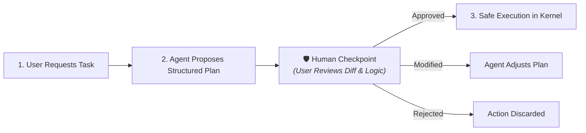
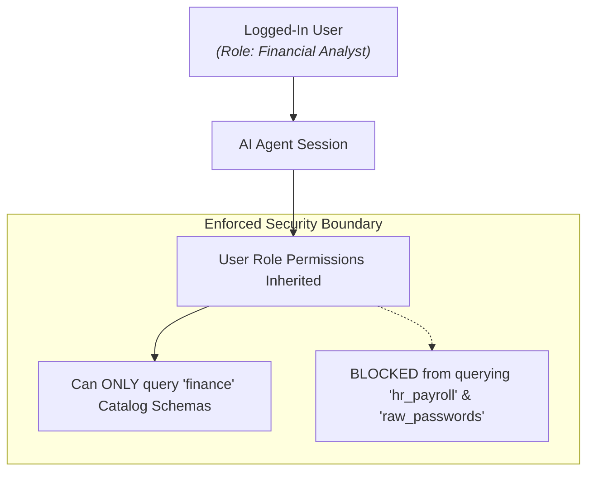
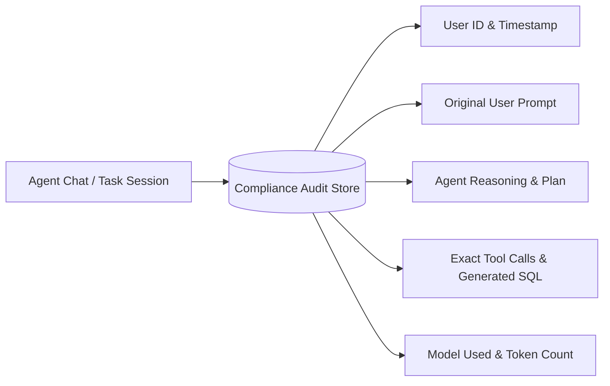

# Human-in-the-Loop Safety, Cost & Governance

Deploying autonomous AI agents in enterprise environments requires robust governance, predictable operational costs, strict permission boundaries, and active human oversight.

CompassX implements an enterprise-grade AI safety and governance framework that ensures humans remain in control of critical decisions.

---

## 1. The Plan & Checkpoint Model

To prevent unreviewed code execution or unintended data mutations, CompassX uses an interactive **Plan & Checkpoint Model**:



### Safety Controls in the Editor:
- **Visual Code Diff Review (`AgentEditDiff`)**: All proposed notebook code modifications, schema alterations, or DAG adjustments are displayed as side-by-side visual diffs before execution.
- **Granular Actions**: Users can choose to **Accept & Run**, **Accept Only** (to edit manually first), **Modify with Prompt**, or **Reject**.
- **No Silent Mutations**: Agents cannot write to production database tables or push Git commits without explicit user confirmation.

---

## 2. Role-Based Permission Inheritance

CompassX ensures that AI agents operate strictly within the security boundaries of the person using them:



### Permission Guarantees:
- **Identity Propagation**: The agent executes all tool calls using the user's active session token.
- **Zero Permission Elevation**: If a user does not have permission to view a table (e.g., `production.hr.salaries`), the agent cannot read the table schema, query its rows, or reveal its contents.
- **Row- & Column-Level Security**: All database security constraints and masking rules configured in the Data Catalog apply equally to agent queries.

---

## 3. Token Consumption & Cost Management

Enterprise AI deployments require strict cost visibility. CompassX tracks token usage and financial cost across every model connection:

```
+-------------------------------------------------------------------------------+
|  AI USAGE & COST DASHBOARD (August 2025)                                      |
+-------------------------------------------------------------------------------+
|  Model Connection            Tokens Used      Input Cost    Output Cost Total |
|  Azure OpenAI (gpt-4o)       14.2M            $35.50        $142.00     $177.50|
|  Anthropic (claude-3-7-sonnet)8.8M            $26.40        $132.00     $158.40|
|  Self-Hosted (Ollama Qwen)   45.1M            $0.00         $0.00       $0.00 |
+-------------------------------------------------------------------------------+
|  Total Workspace Spend: $335.90                  Monthly Budget Limit: $500.00|
+-------------------------------------------------------------------------------+
```

### Cost Tracking Controls:
- **Rate Configuration**: Administrators configure `input_cost_per_1k_tokens` and `output_cost_per_1k_tokens` on each LLM connection.
- **Workspace Budget Caps**: Set monthly spending limits per workspace to avoid unexpected billing spikes.
- **Model Routing**: Configure lower-cost models (e.g., `gpt-4o-mini` or local Ollama instances) for routine metadata summarization and route complex reasoning tasks to frontier models.

---

## 4. Comprehensive Audit Trails

Every interaction between users, agents, and underlying data assets is permanently recorded in the system audit log:



- **Forensic Reproducibility**: Replay any past agent analysis to inspect the exact query, data version, and model response that produced an executive recommendation.
- **Security Monitoring**: Automated detection of anomalous query volumes or unauthorized access attempts.

---

## Next Steps

Now that you have explored AI Agents & Nova, proceed to the final chapter: **[Compute & SQL Warehouses](../compute/index.md)** to learn how to manage DuckDB engines, clusters, and kernel runtimes.
