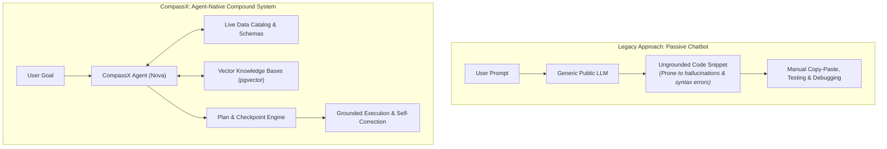
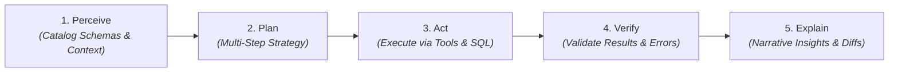
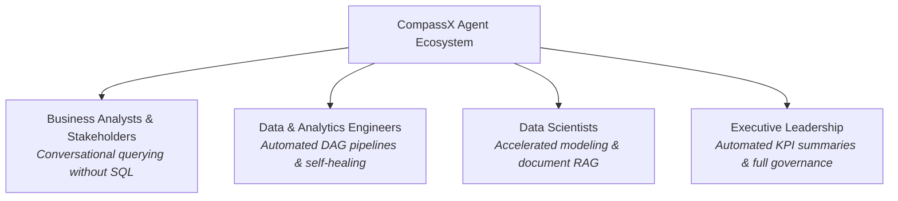

# AI Agents & Nova

The integration of Artificial Intelligence into enterprise data platforms represents one of the most profound technological shifts of the decade. However, in most legacy platforms, AI is treated merely as a disconnected conversational chatbot &mdash; a generic sidebar plugin that generates ungrounded code snippets that users must manually copy, paste, and debug.

**CompassX** takes a fundamentally different architectural approach: it is engineered from the ground up as an **agent-native data platform**.

In CompassX, autonomous AI agents are embedded natively into every layer of the platform &mdash; the Data Catalog, interactive notebooks, SQL warehouses, workflow jobs, and executive dashboards. Operating as **Grounded Compound AI Agents**, CompassX agents do not simply generate text; they formulate structured multi-step plans, invoke platform tools, execute queries within isolated compute sandboxes, verify results, and collaborate with humans through transparent visual code diffs.

---

## The Paradigm Shift: From Chatbots to Compound Agents

To understand the power of an agent-native data platform, consider the limitations of traditional chatbot assistants versus CompassX compound agents:

### Why Compound Agents Outperform Chatbots:
1. **Live Environmental Context**: Generic chatbots operate in a vacuum &mdash; they have no knowledge of your company's actual database tables, column names, or active notebook variables. CompassX agents are deeply grounded in live Data Catalog metadata and vector embeddings.
2. **Autonomous Tool Execution**: Chatbots cannot run code. CompassX agents can execute SQL queries in DuckDB, inspect returned DataFrames, and verify output distributions before presenting an answer.
3. **Self-Correction & Self-Healing**: When a query fails (for example, due to a missing table column), a compound agent reads the execution traceback, inspects the schema, corrects the query, and re-executes automatically.
4. **Human-in-the-Loop Governance**: Agents operate under the **Plan & Checkpoint Model**, presenting code changes as reviewable visual diffs (`AgentEditDiff`) rather than applying silent modifications.

---

## The 5-Stage Agent Operational Loop

Every agent interaction in CompassX follows a structured, verifiable operational cycle:

1. **Perceive**: The agent reads the user prompt, inspects live catalog metadata, checks active notebook variables, and retrieves relevant vector context.
2. **Plan**: The agent formulates a transparent, step-by-step strategy outlining required queries, data transformations, or visualizations.
3. **Act**: The agent invokes platform tools (e.g., executing DuckDB SQL queries, mounting storage volumes, or modifying code cells).
4. **Verify**: The agent inspects execution outputs and stack traces. If an error occurs (such as a missing column), the agent diagnoses the issue and automatically self-corrects.
5. **Explain**: The agent delivers clear, narrative business summaries alongside visual code diffs for human approval.

---

## What Teams Achieve with CompassX Agents

- **Accelerated Data Discovery**: Explore terabytes of enterprise data using plain English questions.
- **Automated Pipeline Design**: Convert high-level business logic into production-grade Airflow DAGs in seconds.
- **Continuous Data Quality**: Automatically profile newly ingested tables, detect anomalies, and generate schema documentation.
- **Enterprise Safety & Governance**: Eliminate AI risk through role-based access control, human-in-the-loop approvals, and complete cost tracking.

---

## In This Section

Explore the comprehensive guides below to learn how to interact with Nova, build custom domain agents, and configure tools:

-   **[Nova: The Built-In AI Data Engineer](nova-data-engineer.md)**

    ---

    Discover what Nova does out of the box across notebooks, data catalogs, SQL warehouses, and jobs.

    [:octicons-arrow-right-24: Learn About Nova](nova-data-engineer.md)

-   **[Agent Builder & Custom Personas](agent-builder-and-personas.md)**

    ---

    Create specialized domain agents, customize system prompts, select models, and orchestrate subagents.

    [:octicons-arrow-right-24: Build Custom Agents](agent-builder-and-personas.md)

-   **[Agent Tools & External Connectors](tools-and-integrations.md)**

    ---

    Equip agents with database connectors, Git integrations (Azure DevOps/GitHub), and custom Python tools.

    [:octicons-arrow-right-24: Explore Agent Tools](tools-and-integrations.md)

-   **[Knowledge Bases & Vector Grounding](knowledge-bases-and-rag.md)**

    ---

    Connect unstructured PDF documents and technical specifications using PostgreSQL `pgvector`.

    [:octicons-arrow-right-24: Connect Knowledge Bases](knowledge-bases-and-rag.md)

-   **[Human-in-the-Loop Safety, Cost & Governance](governance-and-safety.md)**

    ---

    Enforce human checkpoints, role-based permissions, token budget limits, and audit logs.

    [:octicons-arrow-right-24: Learn Safety & Governance](governance-and-safety.md)

---

## Next Steps

To explore how the built-in AI Data Engineer (**Nova**) operates across everyday data workflows, proceed to **[Nova: The Built-In AI Data Engineer](nova-data-engineer.md)**.
