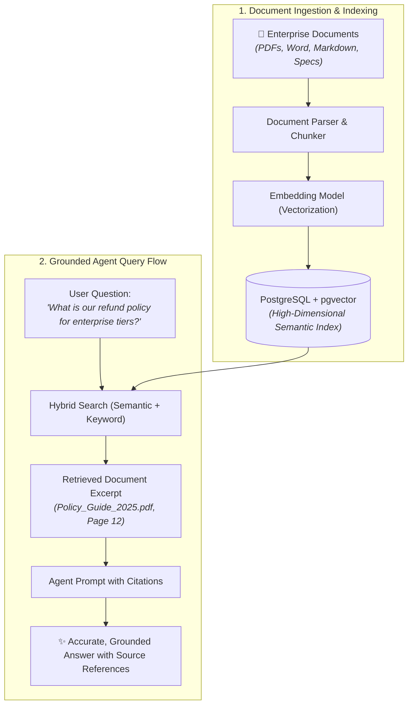
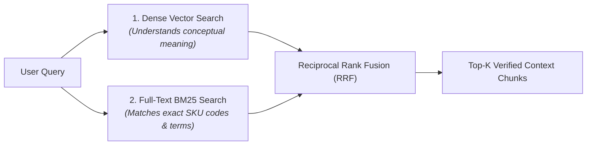

# Knowledge Bases & Vector Grounding

Enterprise intelligence rarely lives in structured relational tables alone &mdash; critical business rules, compliance policies, operational procedures, and technical specifications are often trapped in unstructured documents (PDFs, Word docs, research briefs).

CompassX bridges this divide using **Knowledge Bases** and **Vector Grounding** powered by PostgreSQL `pgvector`, allowing agents to retrieve and cite verified corporate knowledge.

---

## 1. The Need for Vector Grounding (RAG)

When an AI agent operates without domain documents, it must rely solely on its pre-trained public data &mdash; which knows nothing about your company's proprietary discount policies, internal accounting rules, or system architectures.

**Retrieval-Augmented Generation (RAG)** grounds the agent in your private enterprise documentation:



---

## 2. Ingesting Enterprise Knowledge Bases

You can attach knowledge bases to any custom agent in the **Agent Builder** (`/agents`):

```
+-------------------------------------------------------------------------------+
|  KNOWLEDGE BASE: Corporate Policy & SLA Guidelines                            |
|  [ + Upload Document ]   [ + Mount Storage Volume ]    [ 🔍 Search Chunks ]   |
+-------------------------------------------------------------------------------+
|  Document Name               Type     Chunks   Status   Last Indexed          |
|  📄 Enterprise_SLA_2025.pdf  PDF      42       Ready    2025-08-28 14:20      |
|  📄 Revenue_Recognition.docx Word     18       Ready    2025-08-29 09:15      |
|  📄 API_Architecture.md      Markdown 8        Ready    2025-08-29 11:30      |
+-------------------------------------------------------------------------------+
```

### Document Processing Lifecycle:
1. **Parsing & Chunking**: Documents are split into coherent semantic passages (typically 300 to 500 words) while preserving header hierarchies and table structures.
2. **Vectorization**: Each chunk is transformed into a dense numerical vector embedding (e.g., 1536-dimensional or 3072-dimensional vector).
3. **Database Indexing**: Vectors are stored in PostgreSQL using `pgvector` with high-performance `HNSW` (Hierarchical Navigable Small World) index structures.

---

## 3. Hybrid Search: Semantic Similarity + Keyword Matching

CompassX uses **Hybrid Search** to achieve higher retrieval accuracy than pure vector search alone:



- **Semantic Understanding**: Searching for *"client cancellation terms"* retrieves sections titled *"Subscription Termination & SLA Breaches"* even without exact word overlap.
- **Exact Keyword Precision**: Guarantees that specific product codes, error identifiers, or legal clause numbers (e.g., `Clause 14.2(b)`) are matched precisely.

---

## 4. Citation Transparency & Hallucination Defense

When an agent answers a question using a knowledge base, it provides inline markdown citations:

> *"According to our **[Enterprise SLA 2025 (Page 12)](file:///volumes/legal/policies/Enterprise_SLA_2025.pdf)**, customers on the Platinum tier are eligible for a 15% credit if system uptime falls below 99.9% in a given calendar quarter."*

### Safety Guarantees:
- **Auditability**: Business stakeholders can click citations to view the exact original source paragraph.
- **Strict Boundary Prompting**: Agents are instructed never to invent policies or guess numbers when knowledge base context is missing.

---

## Next Steps

To learn how to enforce human checkpoints, role-based access control, token budgets, and audit logs, proceed to **[Human-in-the-Loop Safety, Cost & Governance](governance-and-safety.md)**.
