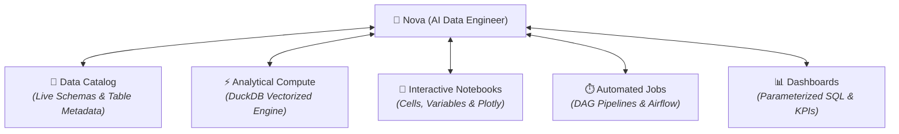
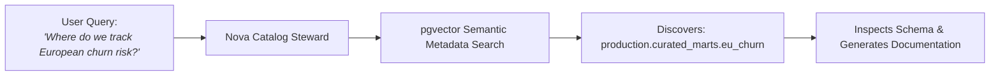
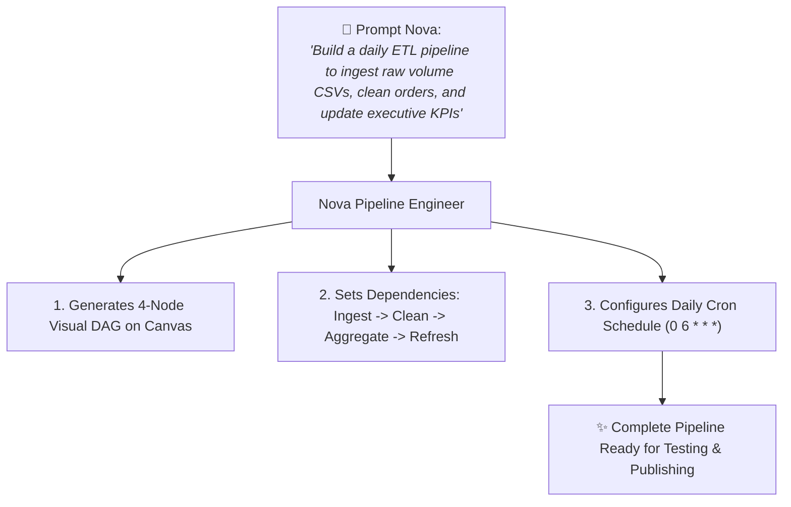

# Nova: The Built-In AI Data Engineer

In most enterprise data organizations, data engineers and analysts spend more than 60% of their working hours on repetitive, operational maintenance: writing boilerplate SQL queries, generating schema documentation, debugging pipeline syntax errors, and formatting dashboard datasets.

**Nova** is the autonomous AI Data Engineer built directly into the core fabric of CompassX. Rather than requiring complex configuration, API setups, or external plugins, Nova is active and available across every platform module from day one &mdash; assisting data practitioners across the entire lifecycle of data discovery, code authoring, automated workflow design, and business intelligence reporting.

---

## 1. What Makes Nova Unique?

Unlike general-purpose public chatbots that generate disconnected text, Nova is an **embedded, environmental agent** integrated directly into the CompassX execution engine:



### Core Architectural Strengths:
- **Zero Hallucination Grounding**: Before generating a single line of SQL or Python, Nova queries the live Data Catalog to inspect actual table schemas, column data types, and primary key relationships.
- **Self-Correction & Automated Patching**: If a cell execution or pipeline task fails, Nova parses the error traceback, inspects the environment, and drafts an accurate code patch in seconds.
- **The Plan & Checkpoint Model**: Nova never applies silent or unreviewed changes to your code; every modification is presented as a reviewable visual diff (`AgentEditDiff`).

---

## 2. Nova in the Data Catalog

In the **Data Catalog** (`/data-catalog`), Nova acts as an automated data steward:



### Key Catalog Capabilities:
- **Natural Language Discovery**: Find relevant tables and volumes using high-level business phrases (e.g., *"Where is our customer renewal risk stored?"*) even if the exact table names use different technical abbreviations.
- **Automated Schema Documentation**: Generate comprehensive, professional markdown descriptions for newly registered tables and columns with a single click.
- **Data Quality Profiling Summaries**: Automatically compute null rates, column distributions, and anomaly indicators for newly imported datasets.

---

## 3. Nova in Interactive Notebooks

Inside **Interactive Notebooks** (`/notebooks`), Nova serves as an expert pair programmer and analytical co-author:

```
+-------------------------------------------------------------------------------+
|  NOVA NOTEBOOK CO-AUTHOR                                                      |
|  Prompt: "Calculate rolling 30-day retention cohorts and chart the results"   |
+-------------------------------------------------------------------------------+
|  📋 Step-by-Step Plan:                                                        |
|  1. Query active users from production.curated.user_logins                    |
|  2. Calculate weekly signup cohorts using Pandas datetime grouping            |
|  3. Render an interactive Plotly heatmap with percentage retention shading    |
|                                                                               |
|  [ Review Diff & Accept ]    [ Modify with Prompt ]    [ Reject ]             |
+-------------------------------------------------------------------------------+
```

### Key Notebook Capabilities:
- **Context-Aware Code Authoring**: Authors Python and SQL cells that reference already-loaded DataFrames and active variables seamlessly.
- **Visual Code Diff Review (`AgentEditDiff`)**: Inspect side-by-side color-coded additions (green) and deletions (red) before executing.
- **Interactive Plotly Chart Generation**: Automatically generates code for multi-series area charts, distribution histograms, and heatmaps.
- **One-Click Traceback Debugging**: Click **Ask Nova to Fix** on any failed cell to diagnose and patch errors in seconds.

---

## 4. Nova in Workflow Jobs & Orchestration

In **Jobs & Workflow Orchestration** (`/jobs`), Nova operates as an autonomous data pipeline engineer:



### Key Jobs Capabilities:
- **Conversational DAG Generation**: Translate high-level business requirements into visual task graphs with configured dependencies (`depends_on`).
- **Failure Root-Cause Diagnosis**: When an automated Airflow run fails, Nova inspects the task logs, identifies the root cause (e.g., upstream API schema drift), and drafts the remediation patch.

---

## 5. Nova in Dashboards & Business Intelligence

In **Dashboards** (`/dashboards`), Nova helps analysts transform business questions into visual dashboards:

- **Automated Dataset Authoring**: Writes parameterized SQL queries against live catalog tables (`:region`, `:start_date`).
- **Intelligent Chart Selection**: Recommends the ideal visualization type for the data (e.g., Waterfall for revenue walks, Cohort grids for retention, Funnels for pipelines).
- **Executive KPI Summaries**: Reads live metric tiles across the canvas and writes a real-time Markdown narrative highlighting performance trends and business takeaways.

---

## Next Steps

To learn how to design custom agents with specialized system prompts and personas, proceed to **[Agent Builder & Custom Personas](agent-builder-and-personas.md)**.
