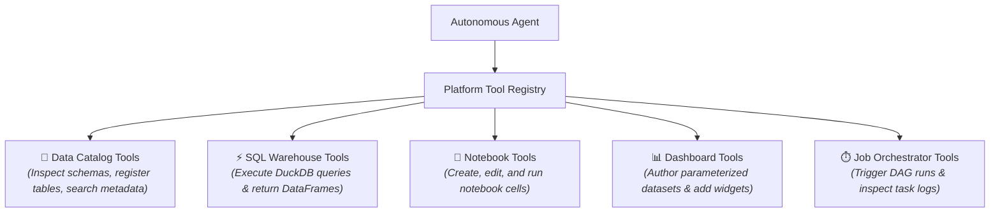
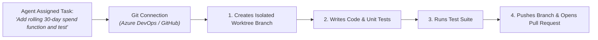

# Agent Tools & External Connectors

An AI model without tools is limited to generating text based on static training data. To perform meaningful enterprise work, an agent must be empowered to interact with live systems &mdash; querying databases, inspecting catalog schemas, executing notebook code, and creating pull requests in code repositories.

In CompassX, **Tools** and **External Connectors** define an agent's operational capabilities and establish strict security boundaries. This guide explains the built-in platform tool suite, external database connectors, Git repository integrations, and custom Python tool development.

---

## 1. Built-In Platform Tools

CompassX provides a rich suite of built-in tools that allow agents to interact with native platform modules:



| Tool Name | Capability Description | Primary Safety Boundary |
| :--- | :--- | :--- |
| **`catalog_tools`** | Lists catalogs, searches table schemas, and updates column descriptions. | Read/write permissions inherited from the user's role. |
| **`sql_warehouse_tools`** | Runs analytical queries against DuckDB and connected data warehouses. | Read-only by default; execution timeouts enforced. |
| **`notebook_tools`** | Reads active notebook state, appends cells, and triggers kernel runs. | User reviews visual diffs (`AgentEditDiff`) before code runs. |
| **`dashboard_tools`** | Generates parameterized SQL datasets and configures visual chart widgets. | Changes saved to drafts before publishing. |
| **`job_tools`** | Creates visual DAG tasks, inspects Airflow logs, and triggers runs. | Strict validation on dependency graphs. |

---

## 2. External Database Connectors (`DBConnection`)

Agents can connect directly to external enterprise databases to query source systems:

```json
{
  "db_name": "snowflake_enterprise_dw",
  "db_type": "snowflake",
  "host": "xy12345.us-east-1.snowflakecomputing.com",
  "allowed_tables": [
    "analytics.public.customer_billing",
    "analytics.public.subscription_tiers"
  ]
}
```

### Supported Database Engines:
- **Cloud Warehouses**: Snowflake, Google BigQuery, Databricks Lakehouse.
- **Relational Databases**: PostgreSQL, Microsoft SQL Server (MSSQL), MySQL, Oracle, SQLite.

### Scoped Table Isolation (`allowed_tables`):
To prevent data exposure, administrators can restrict an agent's access to an explicit whitelist of tables (`scoped_tables`). The agent cannot see or query any table outside its assigned whitelist.

---

## 3. Git & Code Repository Integrations

CompassX agents can interact with enterprise version control systems &mdash; including **Azure DevOps** and **GitHub** &mdash; to automate software development and data pipeline engineering:



### Key Git Capabilities:
- **Worktree Sandboxing**: The agent works within an isolated git worktree without modifying the primary repository branch.
- **Autonomous PR Creation**: The agent writes clean code, runs local unit tests, commits changes with descriptive messages, and automatically opens a Pull Request for team review.
- **Encrypted Credentials**: Personal Access Tokens (PATs) are encrypted at rest using AES-256 Fernet encryption.

---

## 4. Custom Python Tools & MCP (Model Context Protocol)

When built-in tools are insufficient, developers can equip agents with custom business logic:

### 1. Custom Python Function Tools
Define standard Python functions with JSON schema definitions:
```python
from app.agents.tools import tool

@tool(name="calculate_discount_eligibility")
def calculate_discount(customer_id: int, annual_spend: float) -> dict:
    """Calculates enterprise discount tier based on annual spend volume."""
    tier = "platinum" if annual_spend >= 100000 else "gold"
    return {"customer_id": customer_id, "discount_tier": tier, "discount_pct": 20 if tier == "platinum" else 10}
```

### 2. Model Context Protocol (MCP) Connectors
Connect CompassX agents directly to external Model Context Protocol (MCP) servers to access specialized enterprise systems (e.g., Salesforce, Jira, ServiceNow, Slack).

---

## Next Steps

To learn how to connect unstructured corporate documents to agents using semantic vector search, proceed to **[Knowledge Bases & Vector Grounding](knowledge-bases-and-rag.md)**.
