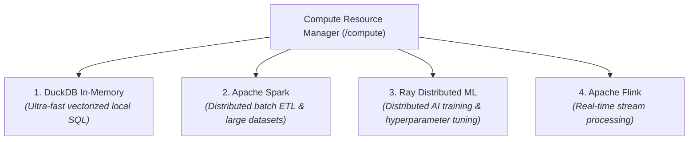
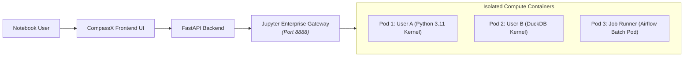

# Compute Clusters & Kernel Pods

In addition to SQL Warehouses, CompassX provides **Compute Resources and Kernel Pods** for executing interactive notebooks, data engineering pipelines, distributed Spark jobs, and machine learning workloads.

Managed by the **Jupyter Enterprise Gateway (EG)**, compute clusters isolate user execution processes in secure, containerized environments.

---

## 1. Supported Runtimes & Engines

CompassX supports four specialized distributed compute runtimes:

| Runtime | Primary Strength | Typical Workloads |
| :--- | :--- | :--- |
| **`duckdb`** | Low-latency in-memory SQL execution directly on Parquet and Delta tables. | Interactive notebook data analysis, quick data exploration, local ETL. |
| **`spark`** | Large-scale distributed data processing across multiple worker nodes. | Heavy ETL batch transformations, multi-terabyte data joins, data lake compaction. |
| **`ray`** | Distributed Python computing framework for AI and machine learning. | Model training, distributed hyperparameter search, reinforcement learning. |
| **`flink`** | Stateful, low-latency streaming event processing. | Real-time fraud detection, live telemetry processing, continuous metric streams. |

---

## 2. Resource Profiles & Sizing

Administrators can assign predefined hardware profiles to match workload demands:

| Profile Identifier | CPU Allocation | Memory (RAM) | Primary Use Case |
| :--- | :--- | :--- | :--- |
| **`local`** | 2 Cores | 4 GB | Lightweight notebook analysis and SQL prototyping. |
| **`cloud-s` (Standard)** | 4 Cores | 16 GB | General data engineering, Pandas transformations, and standard jobs. |
| **`cloud-l` (Large)** | 16 Cores | 64 GB | High-throughput data transformations and large in-memory DataFrames. |
| **`gpu` (Accelerated)** | 8 Cores + NVIDIA GPU | 32 GB | Deep learning, PyTorch / TensorFlow training, and LLM fine-tuning. |

---

## 3. Kernel Isolation via Enterprise Gateway

To ensure multi-tenant security and prevent compute crashes from impacting other users, CompassX routes all kernel executions through the **Jupyter Enterprise Gateway**:

### Isolation Guarantees:
- **Process Sandboxing**: Each notebook session executes in an isolated Docker container or Kubernetes pod. Memory leaks or kernel crashes in User A's session cannot affect User B.
- **Custom Container Images**: Attach custom Docker images containing domain-specific Python/R packages and C++ libraries.
- **Dynamic Pod Attachment**: Switch a notebook from a lightweight 2-core pod to a high-memory 16-core pod on the fly from the notebook toolbar.

---

## Next Steps

To learn how to inspect query history, monitor cluster performance, and review execution logs, proceed to **[Query History, Audit & Monitoring](history-and-monitoring.md)**.
