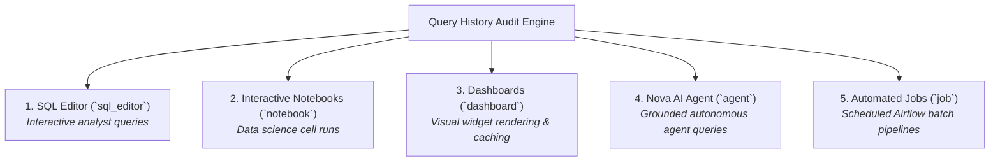

# Query History, Audit & Monitoring

CompassX provides full operational observability into platform execution, query performance metrics, user attribution, and cluster resource utilization.

---

## 1. Query History & Audit Logging

Every SQL query executed across the platform &mdash; whether from the **SQL Editor**, an **Interactive Notebook**, a **Dashboard widget**, or **Nova** &mdash; is permanently recorded in the **Query History** (`/sql-warehouse/history`):

```
+-----------------------------------------------------------------------------------------------+
|  QUERY HISTORY (1,420 Queries Executed Today)                         [ 🔍 Filter Queries ]   |
+-----------------------------------------------------------------------------------------------+
|  Query (SQL)                     User / Source   Status    Duration    Rows     Data Scanned  |
|  SELECT region, SUM(revenue)...  sarah (Editor)  ● Success 18ms        142      4.2 MB        |
|  SELECT * FROM curated.users...  Nova (Agent)    ● Success 12ms        1,200    850 KB        |
|  SELECT date, arr FROM marts...  Dashboard #4    ● Success 0ms (Cache) 30       0 KB          |
|  SELECT * FROM raw_logs WHER...  john (Notebook) ● Failed  140ms       0        12.4 MB       |
+-----------------------------------------------------------------------------------------------+
```

### Logged Query Attributes (`SqlQueryRecord`):
- **Exact SQL Text**: The complete query statement executed against the engine.
- **User & Source Attribution**: Identifies whether the query was triggered by a specific human analyst (`user_id`), an automated dashboard refresh (`dashboard_id`), or the AI Data Engineer (`source: 'agent'`).
- **Execution Performance**: Records runtime duration in milliseconds (`duration_ms`), total rows returned (`rows_returned`), and physical volume scanned from storage (`bytes_scanned`).
- **Cache Hit Indicator**: Flags whether the result was served instantly from memory (`cache_hit: true`) or evaluated against disk.
- **Error Tracebacks**: Captures detailed syntax errors and engine tracebacks for failed queries.

---

## 2. Cross-Platform Source Attribution

CompassX tracks query origins across five primary execution channels:



---

## 3. Prometheus Cluster & Infrastructure Monitoring

In addition to query history, CompassX integrates natively with **Prometheus** (`port 9090`) to provide real-time cluster telemetry in the **Monitoring Dashboard** (`/monitoring`):

```
+-------------------------------------------------------------------------------+
|  PLATFORM CLUSTER TELEMETRY (Prometheus)                                      |
+-------------------------------------------------------------------------------+
|  CPU Utilization:    [ ██████████░░░░░░░░░░ ] 52% (8 Cores Active)             |
|  Memory Usage:       [ ██████████████░░░░░░ ] 68% (21.8 GB / 32.0 GB)         |
|  Active Warehouses:  2 Running | 1 Stopped                                    |
|  Active Kernels:     4 Jupyter Pods Active                                    |
+-------------------------------------------------------------------------------+
```

### Monitored Metrics:
- **Compute Pod Health**: CPU and RAM consumption per container pod.
- **Enterprise Gateway Metrics**: Active Jupyter kernel sessions and WebSocket connection stability.
- **Storage I/O**: MinIO and S3 read/write throughput and latency.
- **Airflow Task Queue**: Active, queued, and retrying DAG tasks.

---

## 4. Performance Optimization Best Practices

1. **Leverage In-Memory Caching**: Avoid re-querying identical static datasets by enabling query caching on dashboards.
2. **Push Down Filters**: Always include partition keys and date filters in `WHERE` clauses to allow DuckDB to prune Parquet files before reading into memory.
3. **Audit Heavy Scans**: Filter the Query History by `bytes_scanned > 1GB` to identify unindexed queries and candidate tables for Parquet compaction.
4. **Set Auto-Stop Policies**: Configure aggressive auto-stop timeouts (e.g., 15 minutes) on ad-hoc analytical warehouses to optimize compute resources.

---

## Summary of Platform Documentation

Congratulations! You have completed the complete **CompassX Documentation Suite**:

- **[What is CompassX](../what-is-compassx/index.md)**: Architectural foundations and platform pillars.
- **[Getting Started](../getting-started/index.md)**: Fast onboarding and Docker quickstart.
- **[Data Catalog](../data-catalog/index.md)**: Unified metadata, schemas, tables, and storage volumes.
- **[Notebooks](../notebooks/index.md)**: Multi-language authoring, interactive grids, and Plotly charts.
- **[Jobs & Orchestration](../jobs/index.md)**: Visual DAG pipelines and Airflow batch automation.
- **[Dashboards](../dashboards/index.md)**: 19+ chart types, parameterized datasets, and the Business Center.
- **[AI Agents & Nova](../agents/index.md)**: Compound agent loops, custom personas, tools, and vector RAG.
- **[Compute & SQL Warehouses](../compute/index.md)**: DuckDB analytical engines, kernel pods, and query auditing.
