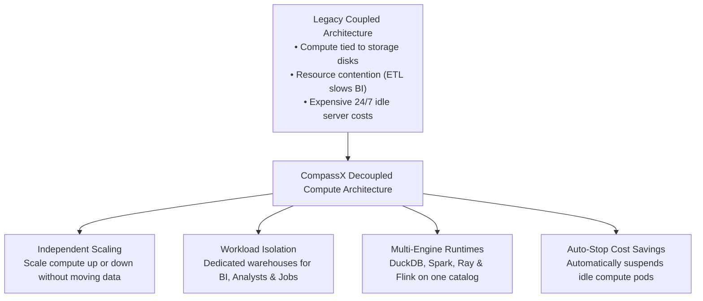
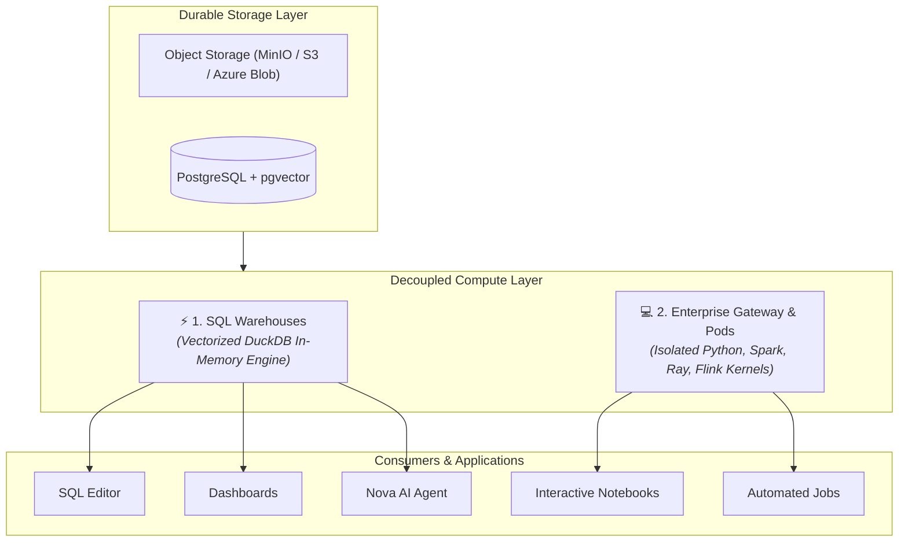

# Compute & SQL Warehouses

In modern data platform engineering, one of the most critical architectural decisions is the **separation of compute from storage**. In legacy monolithic database architectures, scaling query processing required purchasing additional physical database appliances, and running heavy ETL batch transformations severely degraded the query performance of live executive dashboards.

**CompassX Compute** implements a decoupled, multi-engine computing layer that separates durable cloud object storage from elastic execution engines.

By supporting both **serverless SQL Warehouses** (powered by DuckDB) for sub-second analytical queries and **multi-language compute clusters** (Python, Spark, Ray, Flink) managed by the **Jupyter Enterprise Gateway**, CompassX allows organizations to run diverse data engineering, data science, and BI workloads efficiently on a single unified platform.

---

## Why Decoupled Compute? Conceptual Overview

### Key Advantages of Decoupled Compute:
- **Zero Resource Contention**: Heavy data science models training on multi-gigabyte datasets never impact the response times of executive dashboards in the Business Center.
- **Direct Parquet Execution**: Vectorized DuckDB engines execute analytical queries directly against Parquet and Iceberg files stored in MinIO or S3 without copying data into proprietary database tables.
- **Automated Cost Optimization**: SQL Warehouses and container pods automatically suspend when inactive, eliminating cloud infrastructure waste.

---

## The Dual Compute Architecture

CompassX provides two specialized computing paradigms tailored to distinct enterprise data workloads:

### 1. SQL Warehouses (Analytical Query Engine)
Dedicated analytical compute endpoints optimized for interactive SQL queries, BI dashboard rendering, and AI agent data extraction:
- **Vectorized In-Memory DuckDB**: Delivers sub-second query performance across large columnar Parquet files and Data Catalog tables.
- **Auto-Stop & Instant Resume**: Suspends compute during idle periods and starts up automatically upon query arrival.

### 2. Compute Clusters & Kernel Pods (Data Science & Pipelines)
Isolated container pods managed by the **Enterprise Gateway** for running interactive notebooks and scheduled Airflow jobs:
- **Multi-Runtime Support**: Run Python 3.11, DuckDB, Apache Spark, Ray, or Apache Flink runtimes.
- **Resource Sizing**: Choose from preset hardware profiles (`local`, `cloud-s`, `cloud-l`, `gpu`) to match workload memory and CPU requirements.

---

## In This Section

Explore the comprehensive guides below to learn how to configure warehouses, author SQL queries, and monitor compute:

-   **[SQL Warehouses & Endpoints](sql-warehouses.md)**

    ---

    Create dedicated SQL warehouses, configure auto-stop policies, and manage concurrency.

    [:octicons-arrow-right-24: Manage SQL Warehouses](sql-warehouses.md)

-   **[SQL Editor & Query Execution](sql-editor.md)**

    ---

    Author queries in the multi-tab SQL studio, inspect explain plans, and export tabular data.

    [:octicons-arrow-right-24: Explore the SQL Editor](sql-editor.md)

-   **[Compute Clusters & Kernel Pods](clusters-and-runtimes.md)**

    ---

    Manage compute resource profiles (DuckDB, Spark, Ray, Flink) and kernel isolation.

    [:octicons-arrow-right-24: Configure Compute Clusters](clusters-and-runtimes.md)

-   **[Query History, Audit & Monitoring](history-and-monitoring.md)**

    ---

    Inspect the complete query audit log, analyze execution runtimes, and view Prometheus metrics.

    [:octicons-arrow-right-24: Monitor Query History](history-and-monitoring.md)

---

## Next Steps

To learn how to create and configure SQL warehouses, proceed to **[SQL Warehouses & Endpoints](sql-warehouses.md)**.
