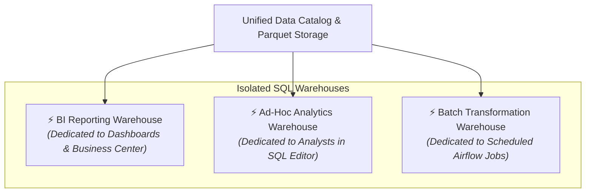
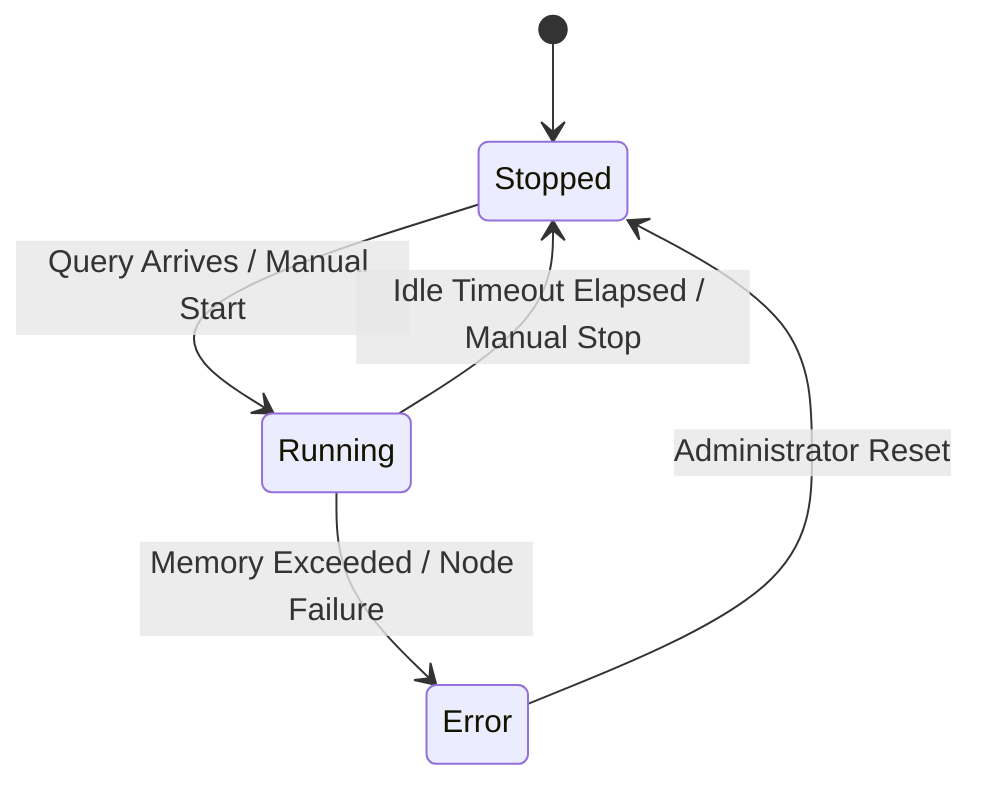

# SQL Warehouses & Endpoints

A **SQL Warehouse** is a dedicated analytical compute endpoint in CompassX that executes SQL queries against the **Data Catalog**, storage volumes, and cloud lakehouse tables.

Powered by a vectorized **DuckDB** in-memory engine, SQL Warehouses deliver sub-second query performance for interactive BI dashboards, SQL Editor queries, and AI agent data extraction.

---

## 1. Understanding SQL Warehouses

Unlike legacy shared databases where a heavy report can slow down all users, CompassX allows organizations to create **multiple dedicated SQL Warehouses** isolated by team or workload:



### Key Warehouse Advantages:
- **Workload Isolation**: Intensive ad-hoc data science queries never impact the latency of executive KPI dashboards.
- **Auto-Stop & Resume**: Suspends compute when idle to eliminate infrastructure waste, and resumes automatically when queries arrive.
- **Direct Parquet Execution**: DuckDB reads Parquet, Delta, and CSV files directly from MinIO, S3, or Azure Blob storage without copying or ingesting data twice.

---

## 2. Creating and Configuring a SQL Warehouse

To create a new warehouse:
1. Navigate to **SQL Warehouses** (`/sql-warehouse/warehouses`) from the left sidebar.
2. Click **+ Create Warehouse**.
3. Configure the warehouse parameters:

```
+-------------------------------------------------------------------------------+
|  CREATE SQL WAREHOUSE                                                         |
+-------------------------------------------------------------------------------+
|  Warehouse Name:      [ analytics_bi_warehouse ]                             |
|  Description:         Dedicated endpoint for executive KPI scorecards         |
|  Engine:              [ DuckDB (Vectorized In-Memory) ▾ ]                     |
|                                                                               |
|  Resource Policies:                                                           |
|  Auto-Stop After:     [ 15 Minutes ▾ ] (Stops when idle to save resources)    |
|  Max Concurrent:      [ 8 Queries ]                                           |
|  Memory Limit:        [ 16 GB ]                                               |
+-------------------------------------------------------------------------------+
```

### Configuration Parameters:
- **Engine**: DuckDB in-memory analytical query engine.
- **Auto-Stop Timeout**: Time in minutes (e.g., `15`, `30`, `60`, or `Never`) before an idle warehouse automatically suspends.
- **Concurrency Limit**: Maximum number of concurrent queries executing simultaneously before incoming queries enter the queue.

---

## 3. Warehouse Lifecycle States

CompassX manages warehouse availability across three operational states:



| Lifecycle State | Description | Behavior |
| :--- | :--- | :--- |
| **`Running`** | Warehouse is active and loaded in memory. | Executes queries with zero cold-start delay. |
| **`Stopped`** | Compute is suspended and memory is deallocated. | Automatically spins up when a user or dashboard sends a new query. |
| **`Error`** | Warehouse experienced a resource fault or OOM condition. | Displays diagnostic logs and allows one-click restart. |

---

## 4. Workload Isolation Best Practices

To ensure predictable performance across the organization, follow these recommended warehouse allocation patterns:

1. **Dedicated BI Warehouse**: Keep a small, low-latency warehouse allocated exclusively to published dashboards in the **Business Center**.
2. **Ad-Hoc Exploration Warehouse**: Provide data analysts with a dedicated warehouse where large, unoptimized exploratory queries cannot disrupt production pipelines.
3. **Scheduled ETL Warehouse**: Assign batch transformation jobs to a high-memory warehouse configured to run during scheduled processing windows.

---

## Next Steps

To learn how to author, execute, and analyze queries in the interactive SQL studio, proceed to **[SQL Editor & Query Execution](sql-editor.md)**.
