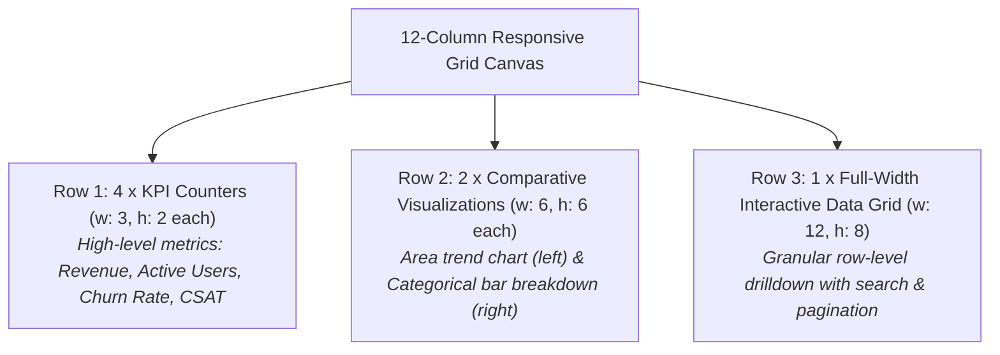
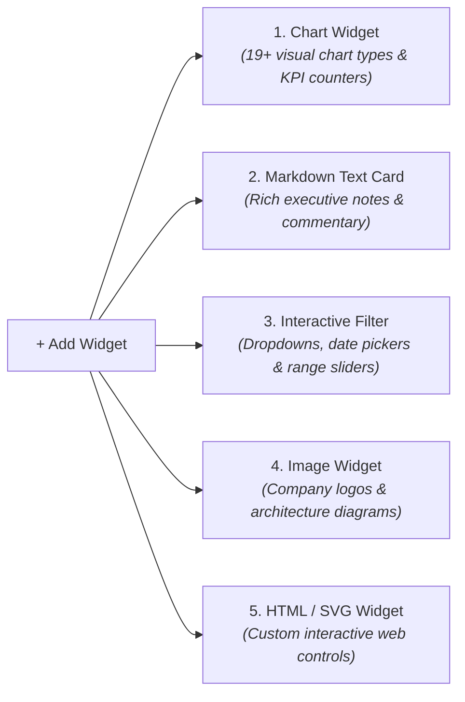
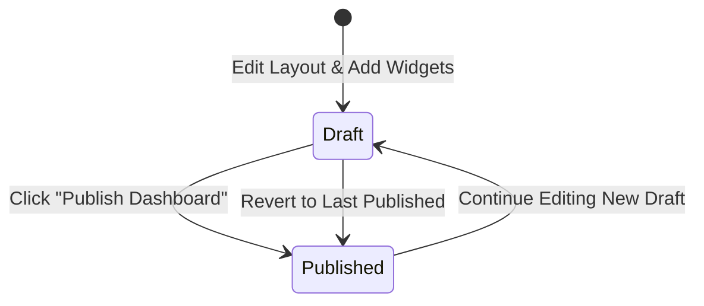

# Canvas Designer & Grid Layout

Building an effective executive dashboard requires more than simply assembling charts &mdash; it demands a disciplined layout that guides the viewer's eye from high-level summary KPIs at the top down to comparative visual distributions and granular operational data tables at the bottom.

The **CompassX Dashboard Canvas** provides a responsive, 12-column drag-and-drop layout engine powered by `react-grid-layout`. It gives designers complete control over widget positioning, sizing, multi-page tabbed organization, and safe draft-versus-published iteration.

---

## 1. The 12-Column Responsive Grid

The layout canvas is divided into 12 proportional horizontal columns that dynamically adapt to different screen dimensions (such as wide 4K desktop monitors, standard laptops, and tablet viewports):



### How the Grid Engine Operates:
- **Drag & Reposition**: Click and hold the header of any widget to move it across the canvas. Surrounding widgets automatically slide smoothly to make room, preventing overlapping collisions.
- **Resize Handle**: Drag the bottom-right corner of any widget to resize its width (`w: 1` to `w: 12`) and height (`h`).
- **Standardized Pixel Snapping**: Widgets automatically snap to pixel grid increments, ensuring that adjacent charts and cards align perfectly.

---

## 2. Standard Layout Sizing Guidelines

To design clean, easily readable executive dashboards, follow these standard sizing conventions:

| Component Type | Width (`w`) | Height (`h`) | Design Rationale & Placement |
| :--- | :--- | :--- | :--- |
| **KPI Summary Counters** | `3` (4 per row) or `4` (3 per row) | `2` to `3` | Positioned in the top row to give executives instant visibility into headline performance indicators. |
| **Comparative Charts (Bar / Line / Donut)** | `6` (2 side-by-side) | `5` to `7` | Positioned in the middle canvas to provide visual context and categorical breakdowns. |
| **Full-Width Time Series Trends** | `12` (full row) | `6` to `8` | Spanning the entire width to visualize long-term multi-year trajectories with fine time-step granularity. |
| **Interactive Data Tables & Pivots** | `12` (full row) | `8` to `12` | Positioned at the bottom of the page for detailed operational inspection, sorting, and CSV export. |
| **Narrative Markdown Commentary** | `3` to `6` | `2` to `4` | Positioned alongside KPI cards or section dividers to provide business context and leadership takeaways. |

---

## 3. Multi-Page & Tabbed Layouts (`pages`)

For complex business domains with multiple analytical dimensions, placing all charts on a single endless scrolling page creates cognitive overload. CompassX allows designers to organize dashboards across **Multi-Page Tabs**:

```
+-----------------------------------------------------------------------------------------------+
|  PAGES:  [ 📁 1. Executive Summary (Active) ]  [ 📁 2. Regional Sales ]  [ 📁 3. Customer Churn ] [ + Add Page ] |
+-----------------------------------------------------------------------------------------------+
```

### Multi-Page Capabilities:
- **Independent Tab Canvases**: Each page maintains its own isolated 12-column grid layout, widget set, and page-specific filters.
- **Tab Management**: Drag tabs to change navigation sequence, double-click to rename (e.g., *"Executive Overview"*, *"Supply Chain Bottlenecks"*), or delete obsolete pages.
- **Cross-Page Navigation**: Viewers in the **Business Center** can navigate between pages seamlessly with instant tab switching.

---

## 4. Supported Widget Types

The canvas supports five core visual and structural widget types:



---

## 5. Draft vs. Published State Isolation

To protect business stakeholders from viewing incomplete scorecards or experiencing broken queries during layout edits, CompassX enforces strict **Draft and Publish isolation**:



1. **Draft Mode (`is_draft = true`)**: All widget additions, query modifications, and layout resizing occur safely in draft state. Business users viewing the dashboard in the **Business Center** continue to see the last stable published version.
2. **Atomic Publishing**: Clicking **Publish** snapshots the layout and dataset queries, updating the production scorecard instantly.
3. **Discard Changes**: If an experimental layout adjustment does not work out, click **Discard Changes** to revert immediately to the last published snapshot.

---

## Next Steps

To explore all 19+ supported chart types and learn how to style visual widgets, proceed to **[Chart Types, KPI Counters & Visual Widgets](chart-types-and-widgets.md)**.
