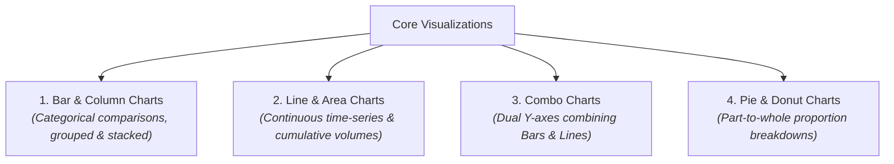
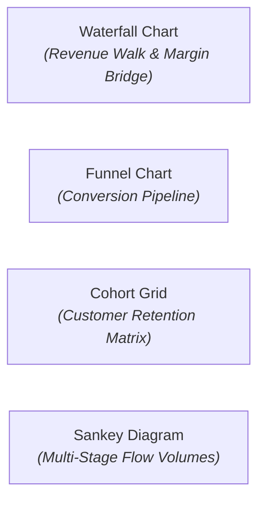

# Chart Types, KPI Counters & Visual Widgets

Selecting the appropriate visualization type is essential for communicating business insights effectively. An incorrect chart choice &mdash; such as using a crowded pie chart with 20 categories or presenting a cumulative revenue walk as a standard bar chart &mdash; obscures meaningful trends and confuses decision-makers.

**CompassX Dashboards** provides a comprehensive library of **19+ visualization types**, executive KPI summary cards, multi-dimensional pivot tables, and granular number formatting controls. This guide explains each visualization family, details configuration options, and provides real-world guidance on choosing the right chart for your data.

---

## 1. KPI Summary Counters (`counter`)

The **KPI Summary Counter** is the foundational visual element of executive scorecards. It displays a primary headline metric alongside target benchmarks, percentage delta change, and sparkline trend curves:

```
+-------------------------------------------------------------------------------+
|  TOTAL REVENUE (Q3 2025)                                                      |
|  $4,280,500                                                                   |
|  ▲ +14.2% vs. Prior Quarter  (Target: $3.75M)       [ ╭───/\─── Trend Line ]  |
+-------------------------------------------------------------------------------+
```

### Counter Properties & Configuration:
- **Primary Value**: Formatted with custom currency prefixes (`$`, `€`, `£`), suffixes (`pts`, `users`), or compact abbreviations (`$4.28M`).
- **Delta Indicator**: Automatically color-coded (green for positive improvement, red for negative decline) based on comparison with previous periods or budget targets.
- **Sparkline Curve**: An embedded mini time-series line that provides immediate visual context on the trajectory leading up to the current value.

---

## 2. Core Business Visualizations



### 1. Bar & Column Charts (`bar`)
- **Best for**: Comparing categorical dimensions (e.g., revenue by product line, sales by region).
- **Options**: Vertical columns or horizontal bars (ideal for long category labels), grouped side-by-side or stacked to 100%.

### 2. Line & Area Charts (`line`, `area`)
- **Best for**: Monitoring continuous time-series trends (e.g., monthly active users, daily server load, annual recurring revenue growth).
- **Options**: Multi-series overlays, smooth spline curves, step lines, and gradient area fills.

### 3. Combo Charts (`combo`)
- **Best for**: Comparing volume metrics and percentage rates simultaneously (e.g., Total Revenue in dollars on the primary Y-axis as bars, alongside Gross Margin % on the secondary Y-axis as a line).

### 4. Pie & Donut Charts (`pie`)
- **Best for**: Highlighting simple categorical share (recommended for 3 to 6 categories maximum). The donut variant allows embedding the overall total metric directly in the center cutout.

---

## 3. Advanced Analytical Visualizations

For specialized business domains, CompassX supports advanced analytical chart types:



### 1. Waterfall Chart (`waterfall`)
Visualizes the cumulative impact of sequentially introduced positive and negative drivers. Ideal for financial "revenue walks" (e.g., Starting ARR &rarr; New Sales [+] &rarr; Expansions [+] &rarr; Contractions [-] &rarr; Churn [-] &rarr; Ending ARR).

### 2. Funnel Chart (`funnel`)
Tracks conversion velocity and drop-off rates across multi-stage business pipelines (e.g., Marketing Leads &rarr; Qualified Opportunities &rarr; Proposals Sent &rarr; Closed Deals).

### 3. Cohort Retention Grid (`cohort`)
Displays customer retention rates over weekly or monthly cohorts, featuring automated color intensity shading to highlight retention decay over time.

### 4. Sankey Diagram (`sankey`)
Renders multi-stage transition flows and volume distributions (e.g., marketing acquisition channels &rarr; landing pages &rarr; checkout paths).

### 5. Heatmap (`heatmap`) & Correlation Matrix
Maps metric density across two categorical dimensions (e.g., customer support ticket volume across Day of Week vs. Hour of Day).

---

## 4. Tabular Displays & Pivot Grids

| Component | Capabilities & Behavioral Description | Best Used For |
| :--- | :--- | :--- |
| **Interactive Data Table (`table`)** | In-browser pagination, column sorting, global text search, conditional cell color formatting, and row-level drilldowns. | Granular operational inspection, customer lists, and transaction logs. |
| **Multi-Dimensional Pivot Grid (`pivot`)** | Dynamic cross-tabulation with row/column grouping, automatic subtotals, and aggregation functions (`SUM`, `AVG`, `MEDIAN`, `COUNT DISTINCT`). | Financial income statements, regional sales matrices, and multi-factor performance analysis. |

---

## 5. Number Formatting & Metric Styling

All widgets support granular formatting controls in the **Widget Inspector**:

```json
{
  "number_format": {
    "type": "currency",
    "currencySymbol": "$",
    "abbreviation": "compact",
    "decimals": 2,
    "groupSeparator": true
  }
}
```

- **Number Types**: `number`, `currency`, `percent`.
- **Abbreviation Modes**: `compact` (`$4.28M`), `scientific`, or exact full numbers (`$4,280,500.00`).
- **Negative Value Styling**: Standard minus sign (`-$500`), parentheses (`($500)`), or colored red text.

---

## Next Steps

To learn how to author dataset queries, bind dynamic parameters, and manage query caching, proceed to **[Datasets, SQL Queries & Parameters](datasets-and-parameters.md)**.
