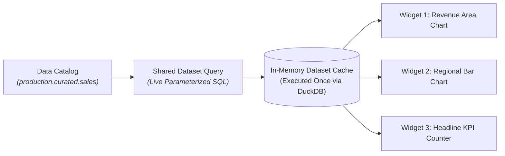

# Datasets, SQL Queries & Parameters

Every chart, KPI counter, and pivot table on a CompassX Dashboard is powered by an underlying **Dataset**. In CompassX, a Dataset is a named, parameterized SQL query that executes directly against the **Data Catalog** and **DuckDB SQL Warehouses**.

Unlike legacy BI tools that require extracting data into proprietary cloud cubes, CompassX Datasets execute directly on live catalog tables. This guide explains how datasets operate conceptually, how to author parameterized SQL queries, and how high-speed in-memory caching ensures sub-second dashboard performance.

---

## 1. Understanding Dashboard Datasets

In traditional reporting systems, every single visual widget on a page sends a separate query to the database, resulting in heavy database load, duplicate scans, and slow page loads.

CompassX resolves this with **Shared Parameterized Datasets**:



### Key Architectural Benefits:
- **Shared Query Execution**: Multiple widgets on a dashboard can bind to the same dataset. CompassX executes the query once, caching the results in memory to eliminate redundant database load.
- **Dynamic Parameter Injection**: Queries accept runtime parameter tokens (`:region`, `:start_date`) that respond dynamically to user filter interactions without requiring full page reloads.
- **Automatic Schema Inference**: CompassX infers column names, data types, and nullability directly from DuckDB result sets.

---

## 2. Authoring Dataset SQL

To create a new dataset for your dashboard:
1. Open your dashboard in edit mode and open the **Datasets Panel** in the left sidebar.
2. Click **+ Add Dataset**.
3. In the SQL Editor, author your query using standard three-level catalog naming:

```sql
SELECT 
    DATE_TRUNC('month', order_date) AS sales_month,
    region,
    product_category,
    SUM(revenue_usd) AS total_revenue,
    COUNT(DISTINCT customer_id) AS active_buyers
FROM production.curated_marts.daily_revenue
WHERE order_date >= :start_date 
  AND order_date <= :end_date
  AND (:region_filter = 'ALL' OR region = :region_filter)
GROUP BY sales_month, region, product_category
ORDER BY sales_month DESC, total_revenue DESC;
```

4. Click **Run Query & Test**. The preview table displays the query results and automatically registers the column schema.

---

## 3. Dynamic Query Parameters (`DatasetParam`)

Parameters allow queries to adapt dynamically to user inputs and interactive filters without writing separate queries for each variation:

```json
{
  "keyword": "region_filter",
  "type": "string",
  "displayName": "Operating Region",
  "defaultValue": "ALL",
  "allowMultiple": false
}
```

### Supported Parameter Data Types:

| Parameter Type | SQL Usage Example | Typical Filter Control |
| :--- | :--- | :--- |
| **`string`** | `WHERE region = :selected_region` | Single-select dropdown or text search. |
| **`date`** | `WHERE order_date >= :start_date` | Date picker calendar widget. |
| **`datetime`** | `WHERE event_timestamp >= :from_time` | Date-time timestamp selector. |
| **`integer`** | `LIMIT :record_limit` | Numeric input or threshold selector. |
| **`decimal`** | `WHERE gross_margin >= :min_margin` | Range slider or numeric threshold box. |

---

## 4. In-Memory Caching & Background Refresh

CompassX employs high-speed in-memory dataset caching to ensure lightning-fast dashboard interactions:

### Cache Lifecycles:
- **Instant Client-Side Filtering**: When filters change, widgets bound to cached datasets re-render in milliseconds without querying the disk.
- **Manual Cache Invalidation**: Viewers can click the **Refresh Data (🔄)** button in the dashboard header to bypass the cache and run fresh SQL queries against the warehouse.
- **Scheduled Automated Refreshes**: Use CompassX **Jobs** with a `dashboard_refresh` task to automatically invalidate and pre-warm dataset caches following nighttime ETL pipeline completions.

---

## Next Steps

To learn how to connect interactive filter widgets to dataset parameters, proceed to **[Interactive Filters & Cross-Filtering](filters-and-interactivity.md)**.
