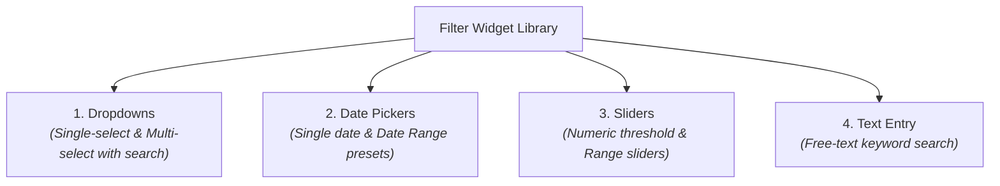
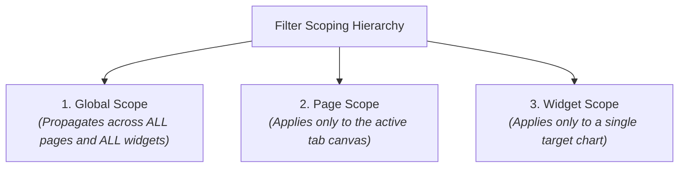

# Interactive Filters & Cross-Filtering

An effective dashboard is not a static picture &mdash; it is an exploratory analytical tool that enables business users to slice, dice, and drill down into performance metrics across different time windows, geographic regions, and customer segments.

**CompassX Dashboards** provides a multi-tiered filtering engine that allows users to apply interactive controls across single widgets, individual pages, or the entire dashboard. This guide explains supported filter types, details scoping rules (Global vs. Page), and compares execution modes (Instant vs. Button apply).

---

## 1. Supported Filter Widget Types

Filters can be added to the dashboard canvas as standalone interactive controls:



| Filter Type | Component UI | Primary Use Case |
| :--- | :--- | :--- |
| **`single_value`** | Searchable single-select dropdown. | Filtering by a primary entity (e.g., Select Country, Choose Store Location). |
| **`multi_value`** | Dropdown with multi-select checkboxes. | Selecting multiple product categories or customer segments simultaneously. |
| **`date_picker`** | Single calendar day selector. | Point-in-time snapshot reporting (e.g., End of Month Closing Date). |
| **`date_range`** | Dual calendar with presets (Last 7D, Last 30D, YTD, Custom). | Time-series analysis across flexible reporting windows. |
| **`range_slider`** | Dual-handle continuous numeric slider. | Filtering by value thresholds (e.g., Margin % between 15% and 60%). |
| **`text_entry`** | Keyword search text field with clear button. | Filtering table rows by customer name, order UUID, or product SKU. |

---

## 2. Filter Scoping Rules

CompassX provides three granular scopes to control how filters propagate across your dashboard:



### 1. Global Filters (`FilterScope: 'global'`)
Global filters reside in the top sticky filter bar. Changing a global filter (such as **Date Range: Last 30 Days**) updates all datasets and charts across all tabs simultaneously.

### 2. Page-Level Filters (`FilterScope: 'page'`)
Placed on a specific dashboard page (e.g., on the **Regional Performance** tab). Changing this filter modifies charts on the current page while leaving other tabs unaffected.

### 3. Widget-Level Filters (`FilterScope: 'widget'`)
Configured directly in the settings of an individual chart (e.g., permanently filtering a specific bar chart to `status = 'ACTIVE'`).

---

## 3. Filter Execution Modes

Depending on dataset size and query complexity, you can configure how filters trigger updates:

```
+-------------------------------------------------------------------------------+
|  FILTER BAR:                                                                  |
|  [ Date: Last 30 Days ▾ ]   [ Region: North, South ▾ ]   [ ▶ Apply Filters ]  |
+-------------------------------------------------------------------------------+
```

### 1. Instant Mode (`FilterApplyMode: 'instant'`)
- Every dropdown selection or slider movement updates the dashboard in real time.
- Best suited for in-memory DuckDB datasets and interactive exploratory dashboards.

### 2. Button Mode (`FilterApplyMode: 'button'`)
- Selections remain in a pending state until the user clicks **Apply Filters**.
- Prevents multiple sequential query re-executions when adjusting several complex parameters at once.

---

## Next Steps

To learn how to publish dashboards, manage access permissions, and present scorecards in the Business Center, proceed to **[Publishing, Sharing & Business Center](publishing-and-business-center.md)**.
