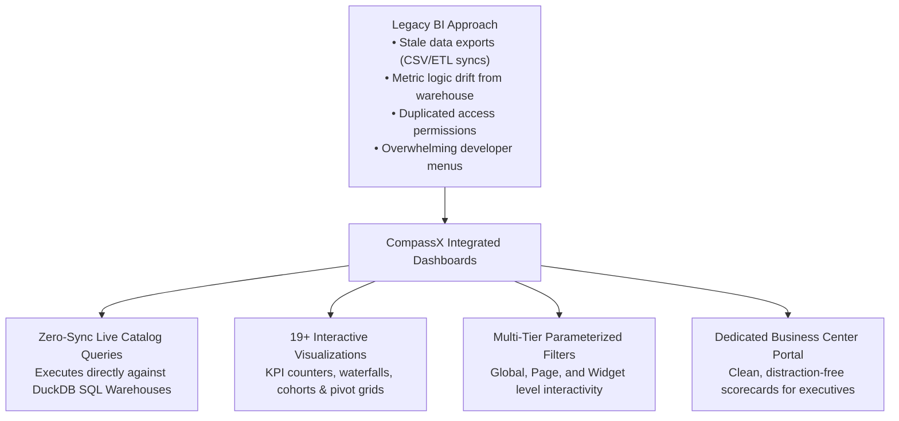
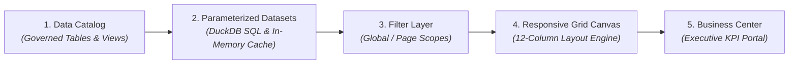

# Dashboards & Business Intelligence

In modern enterprise data organizations, the ultimate goal of data pipelines, analytical queries, and machine learning models is to deliver clear, actionable insights to decision-makers. Business leaders, department heads, and operational teams need real-time visibility into revenue metrics, customer retention, supply chain health, and marketing return on investment.

**CompassX Dashboards** provides an interactive, full-featured business intelligence and scorecard studio tightly coupled with the **Data Catalog** and **SQL Warehouses**. Unlike legacy BI tools that require external licenses, brittle database sync connectors, and duplicate credential management, CompassX Dashboards operate directly on live catalog tables with sub-second in-memory query execution, dynamic parameterized filtering, and a dedicated distraction-free **Business Center** designed for executive leadership.

---

## The Problem with Legacy BI Architectures

Traditional enterprise business intelligence workflows are plagued by latency, security risks, and governance fragmentation:
- **Data Synchronization Delays**: Analysts export CSV dumps or configure nightly ETL replication pipelines into third-party BI software, resulting in reports that are hours or days out of date.
- **Metric Logic Drift**: Business logic defined in external BI tools gradually drifts away from the centralized definitions maintained by data engineering in the data warehouse.
- **Credential & Access Governance Gaps**: Organizations must duplicate role-based permissions in external software, creating security vulnerabilities and credential sprawl.
- **Cluttered User Interfaces**: Business stakeholders logging into developer-focused platforms are often overwhelmed by code editors, terminal logs, and technical menus.

CompassX solves these challenges by providing an **integrated, catalog-native business intelligence layer**:



---

## Architecture & Real-Time Data Flow

CompassX Dashboards achieve sub-second rendering performance through a streamlined, five-stage execution pipeline:



### Architectural Breakdown:
1. **Governed Catalog Tables**: Dashboard widgets query live tables and views registered in the Data Catalog (`catalog.schema.table`), inheriting all row/column security constraints automatically.
2. **In-Memory Dataset Engine**: Queries execute through high-speed DuckDB analytical compute. Results are cached in memory to eliminate redundant database load when multiple widgets share the same underlying query.
3. **Interactive Filter Injection**: When a user selects a date range or filters by region, CompassX injects parameter values directly into the dataset queries without full page reloads.
4. **12-Column Responsive Canvas**: Renders visual components on a flexible grid that automatically adapts to widescreen monitors, laptops, and tablets.
5. **The Business Center (`/business_center`)**: Presents published dashboards in a clean, executive-friendly interface that hides technical developer navigation.

---

## Anatomy of the Dashboard Studio

The Dashboard Studio provides a comprehensive workspace for designing, styling, and exploring metrics:

```
+-----------------------------------------------------------------------------------------------+
| [ 📊 Executive Growth Scorecard ]  [ Status: Published ]  [ + Add Widget ]  [ + Add Filter ]  [ 🔗 Share ] |
+-----------------------------------------------------------------------------------------------+
|  PAGES: [ 📁 Executive Summary (Active) ]  [ 📁 Regional Sales ]  [ 📁 Cohort Retention ]    |
+-----------------------------------------------------------------------------------------------+
|  GLOBAL FILTERS:  [ Date Range: Last 30 Days ▾ ]  [ Region: All ▾ ]  [ Tier: Enterprise ▾ ]   |
+-----------------------------------------------------------------------------------------------+
|  [ KPI Counter ]            [ KPI Counter ]            [ KPI Counter ]                        |
|  Total Revenue: $4.28M      Active Accounts: 18,420    Net Churn: -1.2%                       |
|  ▲ +14.2% vs. Prior Period  ▲ +8.1% MoM                ▼ Improved 0.4%                        |
+-----------------------------------------------------------------------------------------------+
|  [ Revenue Trajectory (Area Chart) ]          |  [ Revenue by Product (Bar Chart) ]           |
|                                               |                                               |
|  $5M ┤    ╭───╮                               |  Enterprise  ████████████ $2.4M               |
|  $3M ┤  ╭─╯   ╰──╮                            |  Mid-Market  ████████ $1.2M                   |
|  $1M ┼──╯        ╰─                           |  SMB         ████ $0.6M                       |
+-----------------------------------------------------------------------------------------------+
```

---

## In This Section

Explore the comprehensive guides below to learn how to design layouts, configure visual widgets, author SQL datasets, and share scorecards with executive leadership:

<div class="grid cards" markdown>

-   **[Canvas Designer & 12-Column Grid Layout](canvas-and-layout.md)**

    ---

    Master the responsive 12-column grid canvas, manage multi-page tabs, and understand the draft vs. published lifecycle.

    [:octicons-arrow-right-24: Learn Canvas Design](canvas-and-layout.md)

-   **[Chart Types, KPI Counters & Visual Widgets](chart-types-and-widgets.md)**

    ---

    Explore all 19+ chart types (Counters, Waterfalls, Cohorts, Funnels, Heatmaps, Tables, Pivots) and custom number formatting.

    [:octicons-arrow-right-24: Explore Chart Types](chart-types-and-widgets.md)

-   **[Datasets, SQL Queries & Parameters](datasets-and-parameters.md)**

    ---

    Author parameterized SQL datasets, bind dynamic runtime tokens, and manage high-speed in-memory query caching.

    [:octicons-arrow-right-24: Manage Datasets & SQL](datasets-and-parameters.md)

-   **[Interactive Filters & Cross-Filtering](filters-and-interactivity.md)**

    ---

    Configure dropdowns, date range pickers, sliders, multi-level scoping (Global vs. Page), and Instant vs. Button apply modes.

    [:octicons-arrow-right-24: Configure Filters](filters-and-interactivity.md)

-   **[Publishing, Sharing & Business Center](publishing-and-business-center.md)**

    ---

    Publish scorecards to the Business Center, configure access permissions, export PDF reports, and co-author dashboards with Nova AI.

    [:octicons-arrow-right-24: Publish & Share Dashboards](publishing-and-business-center.md)

</div>

---

## Next Steps

To learn how to use the responsive drag-and-drop canvas and manage multi-page dashboards, proceed to **[Canvas Designer & 12-Column Grid Layout](canvas-and-layout.md)**.
