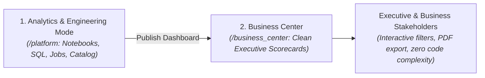
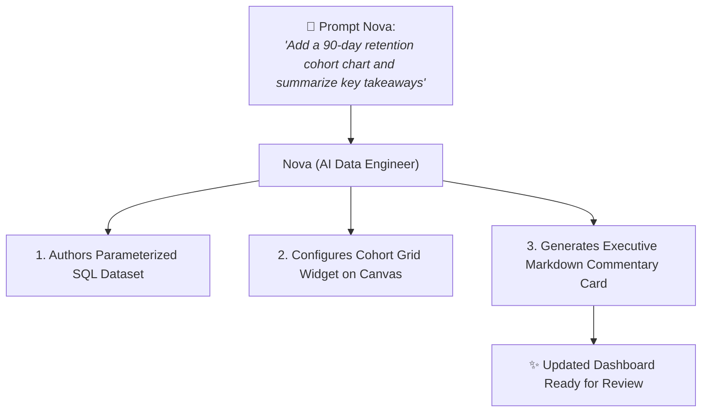

# Publishing, Sharing & Business Center

In most enterprises, the audience for business intelligence extends far beyond technical data engineers and SQL developers. C-suite executives, product managers, marketing directors, and financial controllers need seamless access to trustworthy metrics without being distracted by code editors, terminal output, or database connection strings.

**CompassX Dashboards** bridges this gap through the **Business Center** &mdash; a dedicated, executive-friendly viewing portal designed specifically for business consumers. This guide explains how to publish scorecards to the Business Center, configure access permissions, export publication-grade reports, and co-author dashboards with **Nova** (the AI Data Engineer).

---

## 1. The Business Center (`/business_center`)

The **Business Center** is a purpose-built consumption portal that allows business leaders and operational teams to explore scorecards in a clean, distraction-free view:



### Business Center Highlights:
- **Streamlined User Experience**: Hides complex technical menus (Notebooks, Jobs, Code Editors, Compute Settings) and focuses purely on high-impact metric delivery.
- **Interactive Drilldowns**: Stakeholders can adjust date filters, toggle regional views, and explore data grids without risking accidental modifications to the underlying dataset queries.
- **Fast Load Performance**: Leverages cached datasets and pre-aggregated tables for instantaneous scorecard viewing.

---

## 2. Permission Modes & Access Control

Dashboard access is controlled through two operational permission modes:

```json
{
  "permission_mode": "shared",
  "is_draft": false,
  "published_at": "2025-08-30T08:00:00Z"
}
```

| Permission Mode | Visibility Scope | Recommended Use Case |
| :--- | :--- | :--- |
| **Individual (`'individual'`)** | Visible only to the creator. | Private analytical experiments, draft scorecards, and ad-hoc personal reports. |
| **Shared (`'shared'`)** | Visible to all authorized team members in the active workspace. | Official team dashboards, department performance trackers, and executive scorecards. |

---

## 3. Exporting & Sharing Insights

CompassX Dashboards provide multiple export formats to support recurring executive presentations and offline compliance audits:

```
+-------------------------------------------------------------------------------+
|  EXPORT DASHBOARD: Executive Growth Scorecard                                 |
|  [ 📄 Export Full Dashboard to PDF ]       [ 🖼️ Export Page as PNG Image ]     |
|  [ 📊 Download Underlying Datasets (CSV) ] [ 🔗 Copy Secure Viewer Link ]     |
+-------------------------------------------------------------------------------+
```

### Supported Export Options:
- **Full PDF Report**: Generates a multi-page, publication-grade PDF report capturing all dashboard tabs and charts.
- **High-Resolution PNG**: Exports individual charts or canvas snapshots for inclusion in slide decks and memos.
- **Raw CSV / JSON Dumps**: Allows analysts to download filtered tabular datasets directly from any data table widget.

---

## 4. AI-Powered Dashboard Authoring with Nova

You can co-author and refine dashboards conversationally with **Nova** (the built-in AI Data Engineer):



### What Nova Can Do on Dashboards:
1. **Automated Dataset Authoring**: Nova inspects catalog tables, writes optimized DuckDB queries, and configures runtime parameters.
2. **Widget Creation & Layout Placement**: Nova selects the ideal chart type (e.g., Waterfall for revenue walks, Funnel for conversions) and places it on the grid canvas.
3. **Narrative Executive Summaries**: Nova analyzes metric trends across widgets and writes a real-time Markdown summary tile highlighting positive trends, outliers, and areas requiring leadership attention.

---

## Next Steps

Now that you have explored Dashboards, proceed to **[AI Agents & Nova](../agents/index.md)** to learn how to configure autonomous agents, tools, and custom system prompts.
