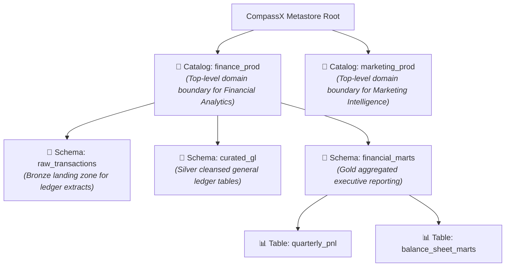
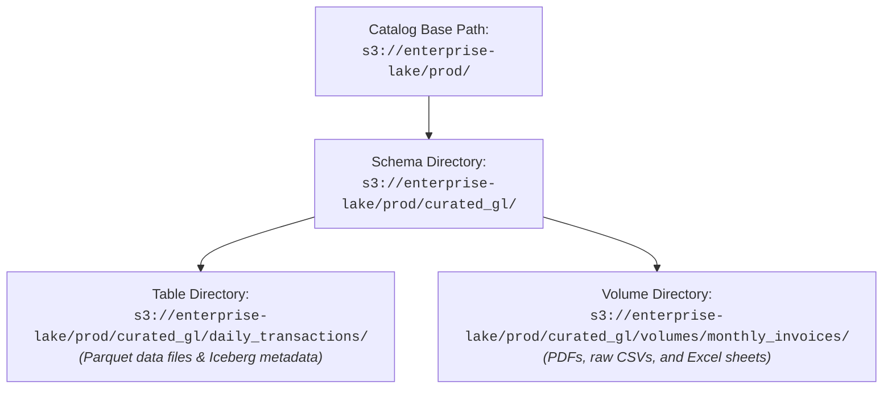

# Catalogs & Schemas Management

In enterprise data architectures, organizing hundreds of disparate datasets across multiple teams, business domains, and deployment environments is one of the most critical challenges. Without a clear structural framework, data estates quickly devolve into disorganized "data swamps" where finding the right table is difficult, naming collisions are frequent, and security permissions are inconsistent.

CompassX solves this challenge through **Catalogs and Schemas**, the top two organizational tiers of the three-level namespace (`catalog.schema.object`). This guide explains how catalogs and schemas work conceptually, how cloud storage paths are inherited, how multi-tenant workspace bindings enforce data isolation, and how to structure your schemas using the industry-standard Medallion Architecture.

---

## 1. Understanding the Role of Catalogs and Schemas

To understand how catalogs and schemas function in CompassX, consider how a physical library or filing system is organized. A single large organization does not toss all files into one open room; instead, files are organized into dedicated departmental archives (Catalogs), then divided into subject-matter cabinets (Schemas), and finally filed into individual folders and records (Tables, Views, and Volumes).



### The Concept of a Catalog
A **Catalog** is the top-level administrative and organizational boundary in the CompassX Data Catalog. It serves three primary functions:
1. **Domain & Environment Boundary**: Catalogs typically correspond to a major organizational business unit (such as `finance`, `operations`, or `customer_success`) or a development lifecycle environment (such as `prod_analytics`, `staging_analytics`, and `dev_analytics`).
2. **Storage Root Anchor**: When you configure a catalog, you assign a root cloud storage backend (such as an AWS S3 bucket, MinIO storage instance, or Azure Data Lake container). All tables and file volumes created within that catalog inherit this storage location automatically.
3. **Workspace Access Boundary**: Catalogs allow administrators to control which workspaces across the enterprise can discover and query underlying datasets.

### The Concept of a Schema
A **Schema** (historically referred to as a database in traditional relational engines) is a logical container nested inside a catalog. Schemas group related assets into cohesive functional subjects. For example, within the `finance_prod` catalog, a data team might create separate schemas for `general_ledger`, `accounts_payable`, `payroll_reporting`, and `tax_compliance`.

---

## 2. Required Privileges and Permission Matrix

To ensure that unauthorized users cannot create catalogs or access confidential schemas, CompassX enforces strict permission checks. Before attempting any administrative action, understand the required privileges:

| Operational Task | Required Privilege | Target Securable Object | Rationale & Behavioral Context |
| :--- | :--- | :--- | :--- |
| **Create a New Catalog** | `Admin` / `CREATE CATALOG` | Metastore / Workspace Root | Creating a catalog establishes a new domain and assigns cloud storage resources, requiring platform administrative authority. |
| **Traverse / View a Catalog** | `USE CATALOG` | Target Catalog | Without `USE CATALOG`, the catalog is invisible to the user in the Catalog Explorer and cannot be referenced in SQL queries. |
| **Create a New Schema** | `USE CATALOG` + `CREATE SCHEMA` | Target Catalog | Users must have traversal access to the parent catalog and explicit schema creation rights within it. |
| **Traverse / View a Schema** | `USE CATALOG` on Catalog + `USE SCHEMA` on Schema | Target Schema | Users require traversal privileges on both parent containers before inspecting tables, views, or volumes inside the schema. |
| **Alter / Drop a Catalog** | Catalog Owner or `Admin` | Target Catalog | Dropping a catalog deletes all child schemas and unregisters all associated tables. |
| **Alter / Drop a Schema** | Schema Owner or `Admin` | Target Schema | Dropping a schema removes all contained assets from the catalog. |

> [!NOTE]
> **The Traversal Rule**: Access in CompassX follows the physical world: to open a file in a cabinet, you must first have permission to enter the building (`USE CATALOG`) and permission to open the specific cabinet (`USE SCHEMA`). Even if a user has `SELECT` permission on a table, they cannot query it unless they also hold `USE` privileges on the parent catalog and schema.

---

## 3. Creating and Managing Catalogs

CompassX provides two ways to create and configure catalogs: an intuitive visual interface in the **Catalog Explorer** and standard declarative SQL statements in the **SQL Editor**.

### Method 1: Using the Catalog Explorer UI

1. Navigate to **Data Catalog** (`/data-catalog`) from the left sidebar navigation.
2. In the top toolbar of the Catalog Explorer, click the **+ New Catalog** button.
3. In the creation dialog, configure the following properties:
   - **Catalog Name**: Enter a lowercase alphanumeric name using underscores for readability (for example, `finance_prod` or `supply_chain_analytics`).
   - **Description**: Enter clear documentation explaining the domain purpose, data classification level, and owning team contact info. This description is automatically indexed for AI semantic search.
   - **Storage Backend**: Choose the cloud storage provider that will hold the physical files (options include `MinIO`, `AWS S3`, or `Azure Blob Storage`).
   - **Base Path**: Specify the cloud bucket root prefix (for example, `compassx-lakehouse/finance_prod/`).
   - **Global Visibility**: Check **All Workspaces** if the catalog should be visible across the entire company, or leave unchecked if it should be restricted to specific workspaces.
4. Click **Create Catalog** to provision the metadata and initialize the root storage directory.

### Method 2: Using SQL Statements

You can create catalogs programmatically using standard DDL statements in the SQL Editor or an interactive notebook:

```sql
-- Create a production financial catalog with a designated cloud storage root
CREATE CATALOG IF NOT EXISTS finance_prod
MANAGED LOCATION 's3://compassx-lakehouse/finance_prod/'
COMMENT 'Production general ledger, accounts payable, and executive financial marts';

-- Verify the catalog configuration and inspect assigned properties
DESCRIBE CATALOG EXTENDED finance_prod;
```

---

## 4. Storage Backend Association and Path Inheritance

One of the greatest operational advantages of the CompassX Data Catalog is automated **Storage Path Inheritance**. In legacy platforms, data engineers were forced to manually configure cloud bucket credentials, IAM roles, and absolute S3 URIs for every single dataset. 

CompassX completely automates this process through a standardized hierarchical path formula:

$$\mathbf{\text{s3://}} \mathbf{\text{bucket\_name}} \boldsymbol{/} \mathbf{\text{catalog\_base\_path}} \boldsymbol{/} \text{schema\_name} \boldsymbol{/} \text{asset\_name} \boldsymbol{/}$$



### How Path Inheritance Works in Practice:
1. When an administrator creates the `finance_prod` catalog with the base path `s3://enterprise-lake/prod/`, CompassX establishes this as the authoritative root directory for all child objects.
2. When an engineer creates a schema named `curated_gl`, CompassX automatically provisions the subfolder `s3://enterprise-lake/prod/curated_gl/`.
3. When a data pipeline creates a table named `daily_transactions`, the underlying Parquet files are written directly into `s3://enterprise-lake/prod/curated_gl/daily_transactions/`.
4. The engineer never needs to write custom cloud storage code &mdash; DuckDB, interactive notebooks, and automated jobs resolve the physical paths seamlessly through the catalog metadata.

### Schema-Level Storage Overrides
In certain enterprise scenarios, specific datasets require physical isolation on a separate cloud storage bucket. For example, an organization may have a strict compliance mandate requiring employee compensation records to reside in an encrypted, isolated cloud bucket with restricted IAM keys.

CompassX accommodates this by allowing administrators to **override the storage location** at the schema level:

```sql
-- Create a schema that overrides the catalog root and writes to a dedicated vault bucket
CREATE SCHEMA finance_prod.restricted_payroll
MANAGED LOCATION 's3://finance-restricted-vault/payroll_data/'
COMMENT 'Confidential payroll records stored in an isolated, encrypted S3 bucket';
```

When tables or volumes are created inside `finance_prod.restricted_payroll`, they inherit the overridden bucket path rather than the default catalog root.

---

## 5. Workspace Bindings and Multi-Tenant Isolation

In large organizations, multiple departments frequently work within separate, isolated workspaces. For instance, the Marketing team operates in a `marketing-analytics` workspace, while the Financial Operations team works in a `finops-workspace`. 

To maintain confidentiality and prevent clutter, CompassX uses **Catalog Workspace Bindings**:

```json
{
  "catalog_name": "hr_executive",
  "all_workspaces": false,
  "workspace_bindings": [
    {
      "workspace_id": "hr-operations-ws",
      "privilege": "admin",
      "is_default": true
    },
    {
      "workspace_id": "executive-leadership-ws",
      "privilege": "read",
      "is_default": false
    }
  ]
}
```

### Binding Modes Explained:
- **Global Catalogs (`all_workspaces = true`)**: These catalogs are globally available across every workspace in the tenant. They are ideal for shared reference data, master product lists, organizational calendar dimensions, and standardized postal code lookups.
- **Scoped Workspace Catalogs**: These catalogs are explicitly bound to a selected list of workspaces. Users working in any unassigned workspace cannot see the catalog in their Catalog Explorer, cannot query its tables in the SQL Editor, and cannot load its data into notebooks.

### Default Catalog Resolution
Writing full three-level paths (`finance_prod.general_ledger.daily_revenue`) in every SQL query can become tedious during ad-hoc analysis. To streamline daily workflows, administrators can designate one catalog as the **Default Catalog** for each workspace.

When a default catalog is established, analysts can query schemas and tables directly using shorthand syntax:

```sql
-- Shorthand query executed in the finance workspace:
SELECT * FROM general_ledger.daily_revenue;

-- DuckDB and CompassX automatically expand the query to:
SELECT * FROM finance_prod.general_ledger.daily_revenue;
```

---

## 6. Structuring Catalogs with the Medallion Architecture

To maintain high data quality and ensure clear data lineage across the enterprise, CompassX recommends organizing schemas using the **Medallion Architecture** pattern:

```mermaid
flowchart LR
    subgraph Bronze["🥉 1. Bronze Tier (raw_ingest)"]
        B1["Raw Ingestion Feeds"]
        B2["Immutable JSON/CSV Dumps"]
        B3["Zero Business Validation"]
    end

    subgraph Silver["🥈 2. Silver Tier (curated)"]
        S1["Cleansed & Deduplicated"]
        S2["Standardized Schema Types"]
        S3["Conformed Enterprise Entities"]
    end

    subgraph Gold["🥇 3. Gold Tier (marts)"]
        G1["Aggregated KPIs & Marts"]
        G2["Dimensional Models (Star Schema)"]
        G3["Optimized for BI & Executives"]
    end

    Bronze -->|Data Cleaning Pipelines| Silver
    Silver -->|Business Aggregations| Gold
```



### Detailed Breakdown of Tiers:

#### 1. Bronze Tier (`raw_ingest`)
- **Purpose**: Serves as the historical landing zone for incoming data from external APIs, IoT telemetry, transactional database CDC streams, and third-party CSV drops.
- **Characteristics**: Data is stored in its raw, unmodified form. Schema validation is minimal to ensure that incoming data is never rejected. Data is appended chronologically to preserve an immutable audit trail.
- **Who uses it**: Data engineers building ingestion pipelines.

#### 2. Silver Tier (`curated`)
- **Purpose**: Represents the cleansed, standardized, and validated "single source of truth" for core business entities (such as customers, orders, transactions, and product catalogs).
- **Characteristics**: Duplicate records are resolved, date formats are standardized to UTC timestamps, null values are handled, and schema types are strictly enforced.
- **Who uses it**: Data engineers, analytics engineers, and data scientists training predictive models.

#### 3. Gold Tier (`marts`)
- **Purpose**: Contains business-level aggregations, dimensional models, and curated data marts structured for consumption by business analysts and executive leaders.
- **Characteristics**: Tables are organized into star schemas (fact and dimension tables) or wide reporting tables optimized for sub-second query performance in **Dashboards** and the **Business Center**.
- **Who uses it**: Business analysts, executive dashboards, finance teams, and autonomous AI agents answering business questions.

---

## Next Steps

Now that you understand how to organize catalogs, configure cloud storage inheritance, and structure schemas, proceed to **[Tables, Views & Schema Explorer](tables-and-views.md)** to learn how to create and manage structured datasets.
