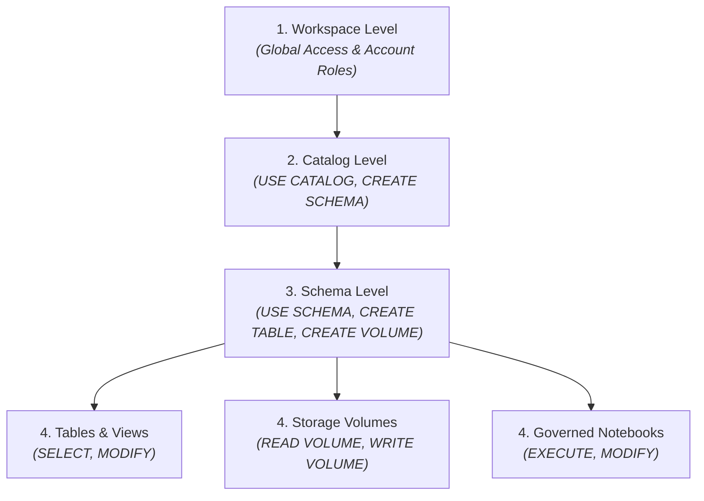
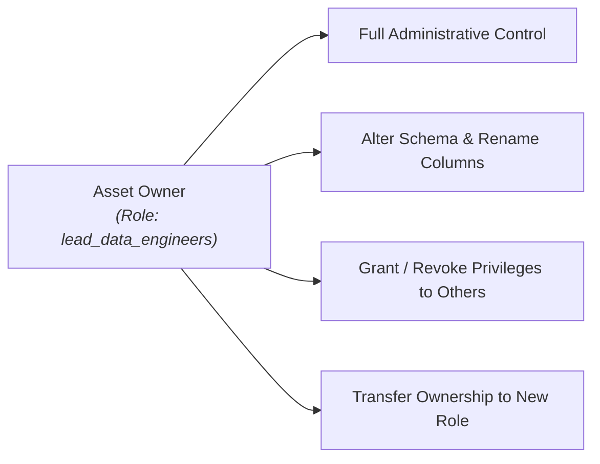
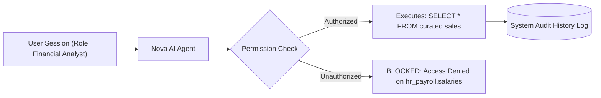

# Access Control & Governance

Enterprise data governance requires striking a delicate balance: data must be open, discoverable, and accessible for legitimate analytical exploration, while confidential financial records, customer PII, and sensitive business intelligence must be strictly protected against unauthorized access.

The **CompassX Data Catalog** implements an enterprise-grade access control and governance framework based on **Securable Objects Hierarchy**, **Privilege Inheritance**, and **Role-Based Access Control (RBAC)**. This guide explains how permissions propagate through the catalog hierarchy, details the complete privilege reference model, demonstrates how to manage access using SQL and visual tools, and explains how security guardrails protect AI workflows.

---

## 1. The Securable Objects Hierarchy & Privilege Inheritance

Securable objects in CompassX are organized in a strict top-down container hierarchy. To eliminate administrative overhead, privileges granted on a higher-level container object automatically **cascade and inherit downward** to all child objects contained within it:



### Understanding Privilege Inheritance:
- **Cascading Access**: If an administrator grants `SELECT` on the schema `production.curated_marts` to the `business_analysts` role, those analysts automatically gain read access to **every table and view currently in that schema, as well as any new tables created there in the future**. Administrators do not need to manually configure permissions on individual tables.
- **The Traversal Rule (`USE` Privileges)**: To access any object in the catalog, a user must have traversal permissions on all parent containers:
  - You must have `USE CATALOG` on the parent catalog to view or interact with any schema inside it.
  - You must have `USE SCHEMA` on the parent schema to view or query any table, view, or volume inside it.
  - If a user has `SELECT` permission on a table but lacks `USE CATALOG` on its parent catalog, the table remains completely invisible and inaccessible to them.

---

## 2. Comprehensive Privilege Reference Model

CompassX defines explicit, fine-grained privileges across each securable object type:

| Privilege Name | Applicable Objects | Operational Ability Granted | Best Practice & Real-World Usage |
| :--- | :--- | :--- | :--- |
| **`ALL PRIVILEGES`** | All Securable Objects | Grants full administrative control and all permissions on the target object. | Reserved exclusively for domain leads, lead data engineers, and workspace administrators. |
| **`USE CATALOG`** | Catalog | Allows traversing into the catalog and discovering its schemas. | Granted broadly to all authenticated team members who need to explore catalog metadata. |
| **`USE SCHEMA`** | Schema | Allows traversing into the schema and inspecting contained tables, views, and volumes. | Granted to analysts and data engineers working within that specific subject area. |
| **`CREATE SCHEMA`** | Catalog | Allows creating new schemas within the target catalog. | Granted to senior data engineers responsible for structuring new analytical domains. |
| **`CREATE TABLE`** | Schema | Allows creating new tables within the target schema. | Granted to ETL pipeline service accounts and data engineering roles. |
| **`CREATE VIEW`** | Schema | Allows authoring and publishing reusable SQL views within the schema. | Granted to analytics engineers creating standardized business reporting layers. |
| **`CREATE VOLUME`** | Schema | Allows provisioning new directory mounts for unstructured files within the schema. | Granted to data scientists and data engineers creating file landing zones. |
| **`SELECT`** | Table, View | Allows querying tabular data with `SELECT` statements in the SQL Editor, Notebooks, or Dashboards. | Standard read permission granted to business analysts, reporting dashboards, and AI agents. |
| **`MODIFY`** | Table | Allows modifying data with `INSERT`, `UPDATE`, `DELETE`, or `TRUNCATE` operations. | Restricted to automated data ingestion jobs, transformation pipelines, and data owners. |
| **`READ VOLUME`** | Volume | Allows browsing directory trees, downloading files, and loading datasets into notebooks. | Granted to data scientists loading training data, CSVs, or PDF documentation. |
| **`WRITE VOLUME`** | Volume | Allows uploading files, creating subfolders, overwriting existing files, and deleting artifacts. | Granted to ingestion services dropping raw data feeds and data scientists saving model checkpoints. |
| **`MANAGE PERMISSIONS`** | All Securable Objects | Allows granting and revoking privileges on the target object to other users and roles. | Delegated to team leads to manage their own departmental data access without contacting global IT admins. |

---

## 3. Managing Access Controls with SQL Statements

Administrators and asset owners can manage permissions declaratively using standard ANSI SQL `GRANT` and `REVOKE` statements:

### Scenario 1: Granting Read-Only Access to Business Analysts
To allow the business intelligence team to query all curated reporting tables in the `production` catalog:

```sql
-- Step 1: Grant container traversal rights
GRANT USE CATALOG ON CATALOG production TO ROLE business_analysts;
GRANT USE SCHEMA ON SCHEMA production.curated_marts TO ROLE business_analysts;

-- Step 2: Grant read access to all current and future tables in the schema
GRANT SELECT ON ALL TABLES IN SCHEMA production.curated_marts TO ROLE business_analysts;
```

### Scenario 2: Granting File Ingestion Rights to Data Engineers
To allow the data engineering team to upload raw feeds and manage unstructured directories in a storage volume:

```sql
-- Grant full read and write access to the raw telemetry volume
GRANT READ VOLUME, WRITE VOLUME ON VOLUME production.raw_ingest.inbound_telemetry TO ROLE data_engineers;
```

### Scenario 3: Revoking Modification Rights from External Contractors
To ensure third-party contractors can query reporting data but cannot alter records:

```sql
-- Revoke data modification rights while preserving read access
REVOKE MODIFY ON TABLE production.curated_marts.daily_revenue FROM ROLE external_contractors;
```

---

## 4. Asset Ownership and Lifecycle Management

Every securable object in the Data Catalog has an assigned **Owner** (either an individual user account or a team role):



### Managing Ownership:
- **Default Ownership**: The user or service principal that creates an object is automatically assigned as its initial Owner.
- **Role-Based Ownership Best Practice**: In production environments, ownership should always be assigned to an organizational role (e.g., `ROLE lead_data_engineers`) rather than an individual person. This prevents orphaned assets when team members change roles or leave the company.
- **Transferring Ownership**:
  ```sql
  -- Transfer ownership of a production table to the data engineering team role
  ALTER TABLE production.curated_marts.daily_revenue 
  SET OWNER TO ROLE lead_data_engineers;
  ```

---

## 5. Security in AI Workflows & Audit Logging

When users interact with **Nova** (the built-in AI Data Engineer), CompassX enforces strict security isolation to eliminate the risk of AI-driven data leaks:



### AI Governance Guarantees:
1. **Identity Propagation**: Nova executes all tool calls, schema lookups, and query generations under the active user's authenticated session. Nova has no elevated permissions and cannot view, query, or summarize any table that the human user lacks permission to access.
2. **Permanent Audit Logging**: Every query planned, generated, and executed by users or AI agents is permanently recorded in the platform **Query History** (`/sql-warehouse/history`) with execution runtimes, row counts, and data volumes scanned.

---

## Next Steps

Now that you have mastered the Data Catalog, proceed to **[Interactive Notebooks](../notebooks/index.md)** to learn how to query and analyze catalog datasets collaboratively.
