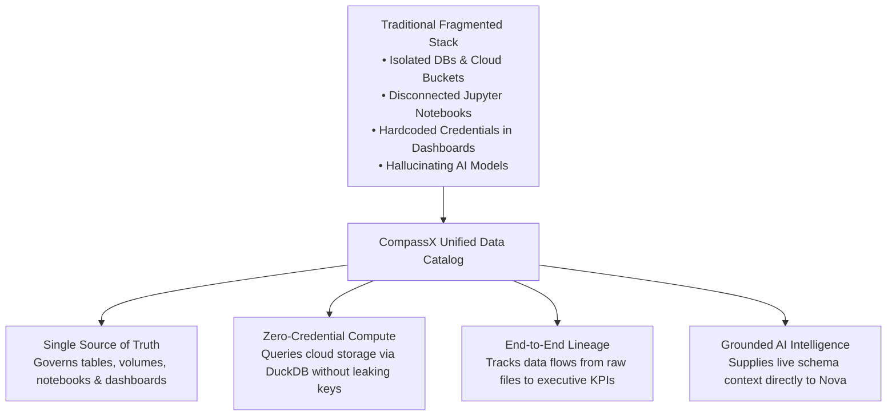
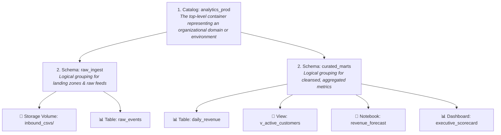
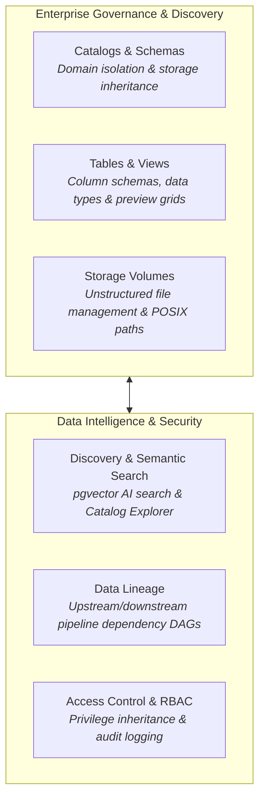

# What is the CompassX Data Catalog?

The **CompassX Data Catalog** is the centralized governance, metadata, and data management layer built directly into the CompassX platform. It operates silently beneath every user interaction across the system &mdash; automatically enforcing access control policies when an analyst queries a dataset, maintaining historical lineage as data flows through automated pipelines, indexing metadata for semantic search, and supplying live schema context to artificial intelligence agents.

Whether your organization manages terabytes of transactional records, archives of raw CSV logs in cloud storage, collaborative Python notebooks, or executive business intelligence dashboards, the Data Catalog acts as the single source of truth that connects every person, engine, and AI tool to trusted enterprise data.

---

## The Challenge: Data Fragmentation in Modern Enterprises

In most enterprise data teams, data and metadata are deeply fragmented across disconnected tools. Relational databases store structured customer transactions, but lack visibility into raw log files stored in cloud object storage. Data scientists write ad-hoc analytical notebooks on their local laptops, hardcoding database credentials and copying static CSV files that quickly become outdated. Business intelligence dashboards query isolated reporting databases, while data governance teams attempt to manually document schema changes in static spreadsheets.

When artificial intelligence models or chatbots are introduced into this fragmented environment, the problem worsens. Because the AI model lacks real-time knowledge of live table schemas, column data types, and organizational business rules, it frequently hallucinates non-existent tables or generates invalid SQL join conditions that fail in production.

CompassX resolves this fragmentation by establishing a **unified, agent-native governance layer**:

By consolidating structured tables, unstructured file directories, analytical notebooks, and dashboard assets into a standardized hierarchical catalog, CompassX eliminates data silos, strengthens security, and empowers teams to collaborate on live data assets with confidence.

---

## The Securable Object Model

Every asset registered in the CompassX Data Catalog is treated as a **securable object**. A securable object is any entity within the platform on which permissions and privileges (such as read access, write rights, or administrative ownership) can be granted to users, teams, service accounts, or organizational roles.

Securable objects are organized in a strict hierarchy. This hierarchical structure forms the foundational mental model for how data is organized, navigated, and secured across all CompassX workspaces.

### The Three-Level Namespace (`catalog.schema.object`)

To eliminate naming collisions and create clear organizational boundaries across departments, all data and analytical assets in CompassX reside within a standardized three-level namespace:

$$\mathbf{\text{catalog}} \boldsymbol{.} \mathbf{\text{schema}} \boldsymbol{.} \mathbf{\text{object}}$$

### Understanding the Three Tiers:

1. **Catalogs (`catalog`)**: The top-level administrative boundary in the Data Catalog. Catalogs typically represent major business domains (such as `finance`, `marketing`, or `supply_chain`) or distinct software development lifecycle environments (such as `prod`, `staging`, and `dev`). Catalogs define default cloud storage backend locations and database connection links that child schemas inherit.
2. **Schemas (`schema`)**: Logical databases contained within a catalog. Schemas organize assets into granular functional subject areas or pipeline stages. For example, a data engineering team might create a `raw_ingest` schema for staging incoming files, a `cleansed` schema for standardized datasets, and a `customer_marts` schema for business reporting.
3. **Securable Objects (`object`)**: The actual data, analytical, or AI assets contained within a schema:
   - **Tables**: Governed tabular datasets stored in high-performance columnar Parquet formats or relational PostgreSQL tables.
   - **Views**: Reusable virtual tables defined by saved SQL queries that compute dynamically upon execution.
   - **Storage Volumes**: Logical directory mounts governing raw, semi-structured, and unstructured files (such as CSVs, JSON feeds, PDF manuals, and model checkpoints).
   - **Governed Notebooks**: Reusable analytical notebooks versioned and persisted in cloud storage.
   - **Dashboards**: Executive KPI scorecards and operational visualizations linked directly to catalog queries.
   - **Saved Queries**: Standardized SQL query templates reusable across automated jobs and AI agents.

---

## Managed vs. External Assets Explained

A common architectural challenge in enterprise data platforms is deciding where physical data files should live and who manages their lifecycle. CompassX provides complete architectural flexibility by distinguishing between **Managed** and **External** assets:

### Managed Assets
In a managed asset (such as a Managed Table or Managed Volume), CompassX manages both the catalog governance metadata and the physical file lifecycle in cloud object storage:
- When you create a managed table or upload files to a managed volume, CompassX writes the underlying Parquet files into a standardized directory structure within the catalog's assigned cloud storage bucket.
- When an authorized administrator drops a managed table or volume, CompassX deletes the metadata record from the catalog **and permanently deletes the underlying physical data files from cloud storage**.
- **Best suited for**: New analytical pipelines, Lakehouse datasets, internal storage volumes, and curated reporting marts where CompassX serves as the primary data platform.

### External Assets
In an external asset (such as an External Table or External Volume), CompassX governs access to data stored in a customer-managed cloud storage path or an external enterprise database (such as Snowflake, Google BigQuery, or Amazon RDS):
- CompassX registers the schema, column types, and access permissions in the Data Catalog, but does not claim ownership of the underlying storage directory.
- When an administrator drops an external table or volume, CompassX unregisters the metadata from the catalog, **but the underlying files and external database tables remain completely untouched**.
- **Best suited for**: Connecting pre-existing corporate data lakes, shared third-party data buckets, and cross-cloud query federation without duplicating storage or running costly data migrations.

---

## Core Capabilities of the Data Catalog

The CompassX Data Catalog is engineered to support the diverse needs of data engineers, business analysts, data scientists, and autonomous agents through six interconnected capabilities:

### 1. Catalogs & Schemas Management
Provides the foundation for multi-tenant workspace isolation. Administrators can designate catalogs as globally accessible across all company workspaces or bind them exclusively to specific departments (such as Human Resources or Legal). Schemas inherit cloud storage paths automatically, eliminating the need to configure cloud bucket credentials for individual datasets.

### 2. Tables, Views & Schema Explorer
Allows data practitioners to inspect column schemas, view data types and nullability constraints, review live data previews, and author reusable SQL views. Vectorized DuckDB execution ensures that queries running against catalog tables execute in milliseconds directly over in-memory Parquet data.

### 3. Storage Volumes & File Management
Bridges structured tabular reporting with unstructured file management. Volumes provide governed directory mounts for raw CSVs, JSON streams, image libraries, and document knowledge bases. Notebooks can access volume files directly using standard filesystem paths without needing cloud access keys.

### 4. Data Discovery & Semantic Vector Search
Combines the intuitive browsing of the Catalog Explorer tree with cutting-edge AI semantic search. By indexing table names, column descriptions, and tags using high-dimensional vector embeddings in PostgreSQL `pgvector`, users and AI agents can locate relevant data using high-level business terminology (such as *"customer churn metrics"*).

### 5. Automated Data Lineage Tracking
Automatically traces how data transforms as it flows from raw landing volumes through intermediate cleansing transformations to final executive dashboards and predictive models. Lineage enables engineers to perform root-cause debugging when numbers change and conduct impact analysis before modifying schemas.

### 6. Role-Based Access Control & Auditing
Enforces the principle of least privilege across all assets. Permissions cascade predictably down the securable object hierarchy, ensuring that AI agents and human users cannot query or view data outside their assigned organizational roles. Every query, schema alteration, and file download is permanently recorded in the system audit log.

---

## Exploring the Data Catalog Documentation

To dive into the practical workflows, configuration options, and step-by-step guides for each functional area, explore the following topics:

-   **[Catalogs & Schemas Management](catalogs-and-schemas.md)**

    ---

    Learn how to create catalogs, configure cloud storage backends (MinIO, S3, Azure Blob), establish workspace bindings, and implement the Medallion Architecture.

    [:octicons-arrow-right-24: Read Catalogs & Schemas Guide](catalogs-and-schemas.md)

-   **[Tables, Views & Schema Explorer](tables-and-views.md)**

    ---

    Discover how to create managed and external tables, inspect column schemas and live data previews, manage data types, and author reusable SQL views.

    [:octicons-arrow-right-24: Read Tables & Views Guide](tables-and-views.md)

-   **[Storage Volumes & File Management](storage-volumes.md)**

    ---

    Understand how storage volumes govern unstructured files, explore directory hierarchies, and read volume file paths directly in Python notebooks.

    [:octicons-arrow-right-24: Read Storage Volumes Guide](storage-volumes.md)

-   **[Data Discovery, Lineage & Semantic Search](lineage-and-discovery.md)**

    ---

    Master data discovery using the Catalog Explorer, vector-powered semantic search, and automated upstream/downstream data lineage DAGs.

    [:octicons-arrow-right-24: Read Discovery & Lineage Guide](lineage-and-discovery.md)

-   **[Access Control & Governance](governance-and-permissions.md)**

    ---

    Explore the securable objects hierarchy, understand privilege inheritance, administer SQL grants, and enforce security guardrails in AI workflows.

    [:octicons-arrow-right-24: Read Access Control Guide](governance-and-permissions.md)

---

## Next Steps

To begin creating catalogs, configuring cloud storage locations, and organizing schemas, proceed to **[Catalogs & Schemas Management](catalogs-and-schemas.md)**.
