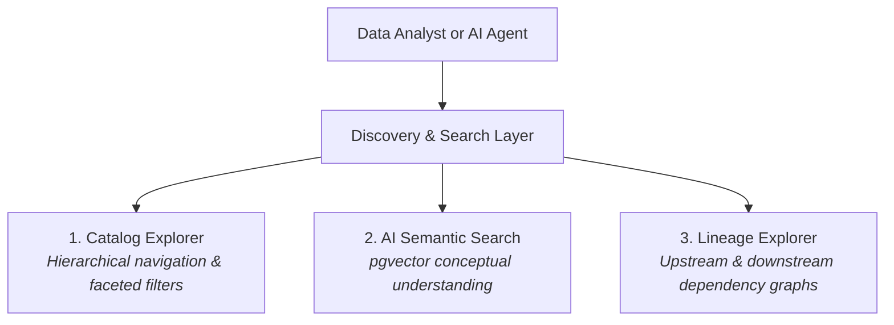
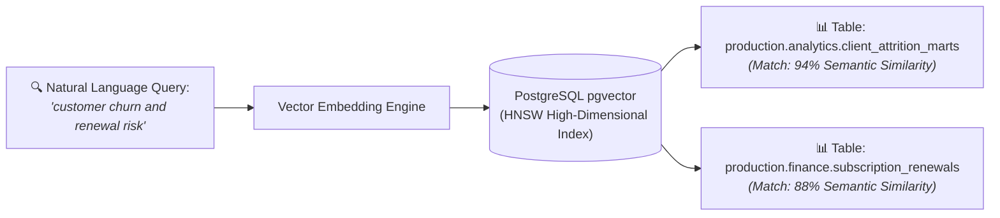
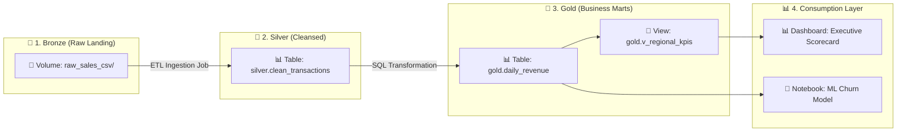

# Data Discovery, Lineage & Semantic Search

In modern data-driven enterprises, organizations generate thousands of tables, views, notebooks, file volumes, and dashboard scorecards. As data estates grow, two fundamental operational challenges emerge:
1. **The Data Discovery Problem**: Analysts struggle to find relevant data assets because datasets use cryptic abbreviations or different terminologies, leading to duplicated engineering effort and "dark data."
2. **The Lineage & Impact Problem**: Data engineers lack visibility into upstream data origins and downstream dependencies, making it dangerous to modify schemas and difficult to diagnose why numbers changed unexpectedly on an executive dashboard.

The **CompassX Data Catalog** resolves these challenges through **AI-Native Semantic Search** (powered by PostgreSQL `pgvector`) and **Automated End-to-End Data Lineage Tracking**. This guide explains how semantic search operates conceptually, how data lineage is captured automatically, and how to use these tools for root-cause debugging and impact analysis.

---

## 1. The Data Discovery Challenge & The Catalog Explorer

When enterprise teams cannot discover existing datasets, they often recreate pipelines from scratch &mdash; wasting compute resources, creating conflicting data definitions, and multiplying storage costs.

### Navigating the Catalog Explorer (`/data-catalog`)
The Catalog Explorer provides a structured visual tree for browsing the entire enterprise metadata estate:
- **Hierarchical Navigation**: Expand and collapse catalogs, schemas, tables, views, volumes, and notebooks in a structured tree view.
- **Contextual Faceted Filters**: Filter assets by object type (Tables, Views, Volumes, Notebooks), owner, creation date, or storage backend.
- **Global Search Palette (`Ctrl + K` / `Cmd + K`)**: Pressing `Ctrl + K` anywhere in CompassX opens an instant search palette that allows users to jump directly to any catalog asset in milliseconds.

---

## 2. AI-Native Semantic Search (`pgvector`)

Traditional database search engines rely exclusively on **exact keyword matching** (lexical search). If an analyst searches for *"customer churn risk"*, a traditional keyword search will fail to return a table named `client_attrition_marts` because none of the search terms match the table name exactly.

CompassX overcomes this limitation using **AI-Native Semantic Search** powered by PostgreSQL `pgvector`:

### How Semantic Search Operates:
1. **Continuous Metadata Vectorization**: When tables, schemas, column comments, or storage volumes are created or updated, CompassX's background embedding worker converts the asset's name, description, column definitions, and data tags into high-dimensional numerical vector embeddings.
2. **Conceptual Intent Understanding**: Instead of matching literal characters, the vector engine measures the mathematical distance (cosine similarity) between the meaning of your search query and the meaning of the dataset's metadata.
3. **Hybrid Search Fusion (Dense Vectors + BM25 Keywords)**: CompassX combines semantic vector search with exact full-text BM25 keyword matching via **Reciprocal Rank Fusion (RRF)**. This guarantees that conceptual questions return the right datasets while exact searches for technical table names or legal clause IDs are never missed.

---

## 3. Automated Data Lineage Tracking

**Data Lineage** represents the complete genealogy and lifecycle journey of data across CompassX. It answers three fundamental questions for every dataset:
- *Where did this data originate?* (Upstream Sources)
- *How was this data transformed?* (Transformation Logic & Pipeline Runs)
- *Who or what is consuming this data?* (Downstream Dashboards, Notebooks & Models)

### How Lineage is Captured Automatically:
Unlike legacy data catalogs that require engineers to manually maintain documentation or install complex third-party crawler agents, CompassX captures lineage **automatically at runtime**:
- When an analyst or Airflow job runs a query (e.g., `CREATE TABLE ... AS SELECT`), the DuckDB query engine parses the AST (Abstract Syntax Tree), identifies all source tables and destination tables, and records the dependency edge in the catalog lineage graph.
- When an interactive notebook reads from a volume and writes to a table, the notebook execution logs the relationship.
- When an executive dashboard queries a catalog view, the dashboard is registered as a downstream consumer.

---

## 4. Real-World Lineage Use Cases

### Scenario 1: Root-Cause Debugging (Anomalous Dashboard Metrics)

**The Situation**: On Monday morning, the VP of Finance opens the **Executive Revenue Scorecard** dashboard and notices that Q3 Net Revenue dropped by 14% overnight. 

**The Investigation Workflow**:
1. The financial analyst opens the dashboard and clicks **Inspect Source Table** to view `gold.daily_revenue` in the Data Catalog.
2. In the Schema Explorer, the analyst clicks the **Lineage** tab to view the visual dependency DAG.
3. The analyst traces upstream from `gold.daily_revenue` to `silver.clean_transactions`, and notices that the scheduled 3:00 AM transformation job failed due to an API timeout from a third-party payment gateway.
4. The team re-runs the pipeline job, updating the table and resolving the dashboard discrepancy in minutes &mdash; without hours of manual log parsing.

### Scenario 2: Impact Analysis (Safe Schema Migrations)

**The Situation**: A data engineer needs to rename the column `amount_gross` to `gross_revenue_usd` in the core table `production.curated.sales_orders` to conform to a new corporate naming standard.

**The Impact Analysis Workflow**:
1. Before applying the `ALTER TABLE` statement, the engineer navigates to the table in the **Catalog Explorer** and opens the **Lineage** tab.
2. The interactive graph reveals that `sales_orders` has:
   - 2 downstream SQL views (`v_monthly_sales` and `v_regional_performance`).
   - 1 scheduled Airflow batch pipeline (`nightly_financial_reconciliation`).
   - 1 published dashboard in the Business Center (`Executive Sales Hub`).
3. Armed with this complete visibility, the engineer updates the downstream views and coordinates with dashboard owners *before* running the migration, preventing production pipeline failures.

---

## Next Steps

To learn how to protect catalog assets, manage ownership, and enforce role-based permissions, proceed to **[Access Control & Governance](governance-and-permissions.md)**.
