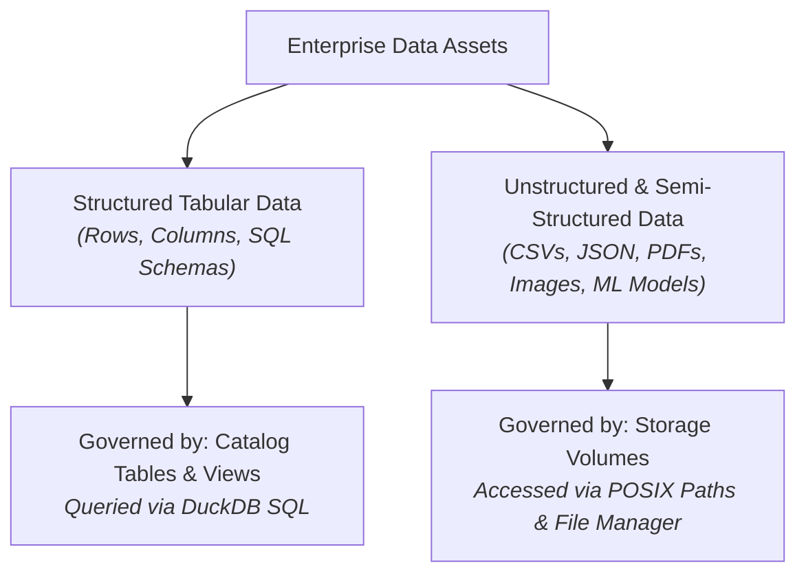
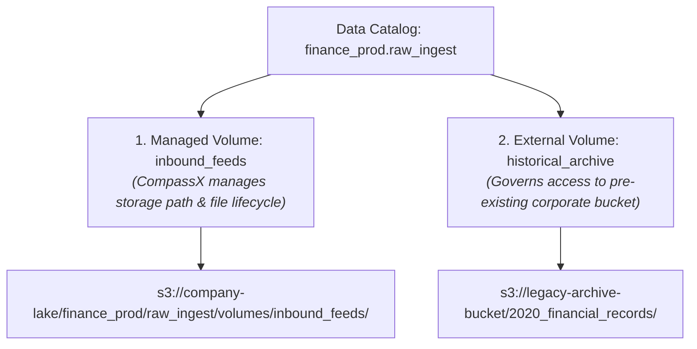

# Storage Volumes & File Management

While relational tables and columnar formats (such as Parquet) are ideal for structured tabular records, modern enterprise data architectures must also govern massive volumes of **non-tabular and unstructured data**. Data science teams frequently work with raw CSV and JSON dumps, AI engineers ingest PDF documentation and policy manuals for Retrieval-Augmented Generation (RAG), and machine learning pipelines generate binary model checkpoints and library artifacts.

Historically, managing these unstructured files required distributing sensitive cloud storage access keys, configuring complex cloud IAM policies, or relying on unmonitored local downloads that violated corporate compliance.

The **CompassX Data Catalog** resolves this challenge through **Storage Volumes** &mdash; securable objects that provide governed, credential-free directory mounts over cloud object storage (MinIO, AWS S3, or Azure Blob Storage). This guide explains how volumes operate conceptually, the differences between managed and external volumes, how to manage files via the visual File Manager, and how to access volume paths directly within Python notebooks.

---

## 1. Why Storage Volumes? Conceptual Overview

To understand why storage volumes are essential, consider the distinct requirements of tabular data versus unstructured files:



### The Problem with Legacy File Mounts:
In legacy platforms, accessing cloud files required data scientists to hardcode AWS Access Keys (`AWS_SECRET_ACCESS_KEY`) directly into notebook cells or configure brittle filesystem mounts that broke whenever network sessions disconnected. Furthermore, file access was rarely audited, making it impossible for security teams to determine who downloaded a sensitive customer PDF or uploaded an unapproved machine learning model.

### How CompassX Storage Volumes Solve This:
- **Unified Governance**: Volumes are first-class securable objects within the three-level namespace (`catalog.schema.volume`). Access is governed using standard role-based privileges (`READ VOLUME`, `WRITE VOLUME`).
- **Zero-Credential Direct Access**: Notebook kernels, Airflow batch jobs, and Python scripts can read and write files using standardized POSIX filesystem paths (e.g., `/volumes/catalog/schema/volume/file.csv`) without needing AWS or Azure credentials.
- **Complete Audit Trail**: Every file upload, download, and modification is logged in the central platform audit history.

---

## 2. Managed vs. External Volumes Explained

CompassX provides two volume architectures to match your organization's cloud storage strategy:



### 1. Managed Volumes
In a **Managed Volume**, CompassX automatically provisions the underlying storage directory inside the catalog schema's assigned cloud bucket.
- **Storage Path**: Inherits the standard path formula: `s3://bucket/base_path/schema/volumes/volume_name/`.
- **Lifecycle Behavior**: Managed volumes provide full lifecycle management. If an administrator deletes a managed volume, CompassX deletes the catalog metadata **and permanently deletes all physical files and subfolders within that cloud storage directory**.
- **Recommended for**: New raw data ingestion zones, document knowledge bases, data science workspaces, and internal ML model registries.

### 2. External Volumes
In an **External Volume**, CompassX establishes governance over a pre-existing cloud storage path that was created and populated outside the platform.
- **Storage Path**: Configured by specifying an explicit cloud URI (e.g., `LOCATION 's3://partner-data-exchange/inbound_reports/'`).
- **Lifecycle Behavior**: External volumes manage access permissions only. If an administrator drops an external volume, CompassX unregisters the volume from the catalog, **but the underlying files in the external cloud bucket remain completely untouched**.
- **Recommended for**: Connecting legacy enterprise S3 buckets, shared multi-cloud storage repositories, and cross-organization data drops without migrating data.

---

## 3. Required Privileges and Permission Matrix

Access to create and interact with storage volumes is governed by dedicated privileges:

| Operation | Required Privilege | Target Securable Object | Operational Rationale |
| :--- | :--- | :--- | :--- |
| **Create a Volume** | `USE CATALOG` + `USE SCHEMA` + `CREATE VOLUME` | Target Schema | Required to create new volume directory mounts within a schema. |
| **Read / Download Files** | `USE CATALOG` + `USE SCHEMA` + `READ VOLUME` | Target Volume | Allows browsing directory trees, downloading files, and loading datasets into notebooks. |
| **Upload / Modify Files** | `USE CATALOG` + `USE SCHEMA` + `WRITE VOLUME` | Target Volume | Allows creating subfolders, uploading new files, overwriting existing files, and deleting artifacts. |
| **Alter Volume Metadata** | Volume Owner or `ALTER` | Target Volume | Required to update volume descriptions, change tags, or modify storage properties. |
| **Drop a Volume** | Volume Owner or `DROP` | Target Volume | Deletes the volume object from the catalog. |

---

## 4. Creating and Managing Volumes

CompassX enables teams to create storage volumes visually in the **Catalog Explorer** or declaratively using SQL DDL statements.

### Method 1: Using the Catalog Explorer UI
1. Navigate to **Data Catalog** (`/data-catalog`) and expand the target Catalog and Schema in the tree.
2. Click the **+** icon next to the schema or click **Create Asset** &rarr; **Volume**.
3. Configure the volume parameters:
   - **Volume Name**: Enter a lowercase alphanumeric name (e.g., `partner_financial_docs` or `telemetry_raw`).
   - **Volume Type**: Choose **Managed** (recommended for new directories) or **External**.
   - **Cloud Location**: If External, provide the cloud URI (e.g., `s3://partner-vault/reports/`).
   - **Description**: Add comprehensive documentation describing the types of files stored, update frequency, and owning team.
4. Click **Create Volume**.

### Method 2: Using SQL Statements

```sql
-- Create a managed volume for raw telemetry feeds
CREATE VOLUME IF NOT EXISTS production.raw_ingest.inbound_telemetry
COMMENT 'Raw JSON telemetry feeds and sensor logs from factory devices';

-- Create an external volume pointing to an existing partner S3 bucket
CREATE EXTERNAL VOLUME production.raw_ingest.partner_audit_reports
LOCATION 's3://partner-audit-vault/2025_q3/'
COMMENT 'External financial audit statements and PDF documentation';
```

---

## 5. The Volume File Manager Interface

Selecting any storage volume in the **Catalog Explorer** opens the interactive **Volume File Manager**:

```
+-----------------------------------------------------------------------------------------------+
|  VOLUME: production.raw_ingest.inbound_telemetry                                              |
|  Type: Managed  |  Path: s3://compassx/prod/raw_ingest/volumes/inbound_telemetry/             |
+-----------------------------------------------------------------------------------------------+
|  [ ⬆ Upload Files ]    [ 📁 + New Folder ]    [ 🔍 Search Files... ]                          |
+-----------------------------------------------------------------------------------------------+
|  Name                          Size         Type              Uploaded By     Last Modified   |
|  📁 2025_q3/                   --           Directory         --              --              |
|  📄 telemetry_aug28.json       14.2 MB      application/json  data_service    2025-08-28 14:20|
|  📄 device_firmware_v2.bin     84.0 MB      application/octet data_service    2025-08-28 15:10|
|  📄 integration_guide.pdf      2.4 MB       application/pdf   sarah           2025-08-29 09:45|
+-----------------------------------------------------------------------------------------------+
```

### Key Capabilities of the File Manager:
- **Folder Hierarchies**: Create structured directory paths (e.g., `year=2025/month=08/region=us-east/`) to organize files logically.
- **Drag-and-Drop Batch Uploads**: Upload multiple files simultaneously with real-time progress indicators.
- **Instant File Previews**: Click any file to open built-in modal viewers:
  - **CSV / JSON Viewer**: Displays tabular files in an interactive data grid with column sorting.
  - **PDF Document Reader**: Allows reading policy manuals, specifications, and reports inline without downloading.
  - **Image Viewer**: Renders PNG, JPEG, and SVG diagram assets directly in the browser.

---

## 6. Accessing Volumes in Interactive Notebooks

CompassX translates storage volumes into standardized POSIX filesystem paths accessible by Python, R, and Bash environments. This eliminates the need for data scientists to manage cloud SDKs or configure credentials in their code.

The standard POSIX volume path structure is:

$$\mathbf{/volumes} \boldsymbol{/} \text{catalog\_name} \boldsymbol{/} \text{schema\_name} \boldsymbol{/} \text{volume\_name} \boldsymbol{/} \text{path\_to\_file}$$

### Scenario 1: Loading Raw CSV Data with Pandas
```python
import pandas as pd

# Direct POSIX volume path resolution
volume_path = "/volumes/production/raw_ingest/inbound_telemetry/2025_q3/telemetry_aug28.csv"

# Load data directly into a Pandas DataFrame
df = pd.read_csv(volume_path)
print(f"Successfully loaded {len(df):,} records from storage volume.")
display(df.head())
```

### Scenario 2: Processing PDF Manuals for AI Knowledge Bases (RAG)
```python
from pypdf import PdfReader

# Access a PDF document stored in a volume
pdf_file = "/volumes/production/raw_ingest/partner_audit_reports/integration_guide.pdf"
reader = PdfReader(pdf_file)

print(f"Document contains {len(reader.pages)} pages.")
first_page_text = reader.pages[0].extract_text()
print(f"Preview of Page 1:\n{first_page_text[:300]}...")
```

### Scenario 3: Saving Trained Machine Learning Model Artifacts
```python
import joblib

# Train a predictive model
# ... model training code ...

# Persist the binary model artifact directly into a governed volume
model_checkpoint_path = "/volumes/production/curated_marts/ml_models/customer_churn_xgboost_v2.pkl"
joblib.dump(trained_model, model_checkpoint_path)

print(f"Model successfully saved and versioned at: {model_checkpoint_path}")
```

---

## Next Steps

To learn how to discover catalog assets, search metadata using AI vector embeddings, and trace end-to-end data lineage, proceed to **[Data Discovery, Lineage & Semantic Search](lineage-and-discovery.md)**.
