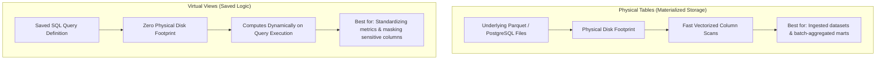
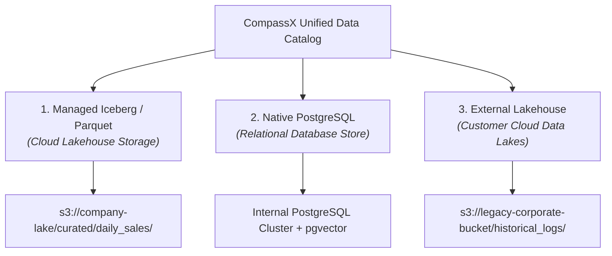

# Tables, Views & Schema Explorer

Structured tabular datasets form the analytical backbone of any enterprise data architecture. Whether powering financial forecasting models, operational ETL pipelines, or real-time executive dashboards, data practitioners require a unified, intuitive environment to define schemas, inspect data distributions, and execute high-speed analytical queries.

The **CompassX Data Catalog** provides a unified tabular interface that bridges modern columnar Lakehouse storage (such as Apache Parquet and Apache Iceberg) with traditional relational PostgreSQL databases. This guide explains how tables and views are structured, how storage architectures differ, how to create and manage schemas using the visual Schema Explorer, and how to query datasets using the vectorized DuckDB engine.

---

## 1. Tables vs. Views: Conceptual Foundations

Before creating structured assets, it is essential to understand the difference between **Tables** and **Views** and when to use each:



### What is a Table?
A **Table** is a collection of structured data organized into rows and columns, backed by physical file storage on disk or in cloud object storage (such as AWS S3 or MinIO). Tables are materialized &mdash; meaning their data is permanently written, compressed, and indexed. When an analyst runs a query against a table, the compute engine reads the physical data directly from storage.

### What is a View?
A **View** is a virtual table defined by a saved SQL query. Views do not store physical data on disk. Instead, whenever a user, dashboard, or AI agent queries a view, CompassX executes the underlying SQL query dynamically against the source tables. Views are ideal for:
- **Standardizing Business Logic**: Creating a single definition for complex metrics (such as *"Active Paying Customers"* or *"Gross Profit Margin"*) so that all analysts use the same calculation.
- **Data Security & Column Masking**: Exposing a subset of columns to general users while hiding sensitive fields (such as Social Security Numbers, internal cost structures, or raw customer email addresses).
- **Simplifying Complex Joins**: Abstracting multi-table joins into a clean, single-table interface for non-technical stakeholders.

---

## 2. Table Architectures: Managed vs. Native vs. External

CompassX supports three distinct table architectures to accommodate diverse enterprise storage topologies:



| Table Architecture | Physical Storage Engine | Optimization & Performance | Lifecycle & Ownership Rules | Recommended Use Cases |
| :--- | :--- | :--- | :--- | :--- |
| **Managed Iceberg / Parquet (`iceberg`)** | Cloud Object Storage (MinIO, S3, Azure Blob) | Columnar storage with high compression (Snappy/ZSTD), column pruning, and vectorized DuckDB execution. | **Full Lifecycle Managed**: Dropping the table unregisters the metadata AND permanently deletes the underlying Parquet files from cloud storage. | Core data lakehouse pipelines, Bronze/Silver/Gold medallion tiers, large-scale analytical tables. |
| **PostgreSQL Native (`postgres_native`)** | PostgreSQL Relational Database Engine | Row-based transactional storage with ACID compliance, primary/foreign key indexes, and `pgvector` embeddings. | **Full Lifecycle Managed**: Managed inside the internal relational cluster. | Transactional lookups, application state, reference lookup tables, vector embeddings for AI semantic search. |
| **External Table (`external`)** | Pre-Existing Cloud Storage Paths | Reads existing remote files directly without data duplication or ingestion overhead. | **Metadata Only Managed**: Dropping the table removes the catalog registration, but leaves the physical cloud storage files completely untouched. | Querying pre-existing enterprise data lakes, third-party data shares, or cross-cloud federated repositories. |

---

## 3. Required Privileges and Permission Matrix

To maintain security, access to create, modify, and query tables is governed by role-based privileges:

| Action | Required Privilege | Target Securable Object | Operational Context & Rationale |
| :--- | :--- | :--- | :--- |
| **Create a Table** | `USE CATALOG` + `USE SCHEMA` + `CREATE TABLE` | Target Schema | Users must have container traversal rights and table creation authority in the schema. |
| **Query Data (`SELECT`)** | `USE CATALOG` + `USE SCHEMA` + `SELECT` | Target Table / View | Required to read rows, inspect previews, or use datasets in notebooks and dashboards. |
| **Modify Data (`INSERT`/`UPDATE`)** | `USE CATALOG` + `USE SCHEMA` + `MODIFY` | Target Table | Required for ETL pipelines and data transformation jobs that write to the table. |
| **Create a View** | `USE CATALOG` + `USE SCHEMA` + `CREATE VIEW` + `SELECT` on source tables | Target Schema | Users must have view creation rights on the schema and read rights on all source base tables. |
| **Alter Schema / Add Columns** | Table Owner or `ALTER` | Target Table | Required to rename columns, add new fields, or modify column documentation. |
| **Drop a Table or View** | Table Owner or `DROP` | Target Table / View | Deletes the table or view. |

---

## 4. Creating Tables in CompassX

CompassX offers multiple flexible workflows for creating tables &mdash; ranging from automated drag-and-drop file imports to declarative SQL DDL statements.

### Method 1: Visual File Import via Catalog Explorer
For business analysts and data engineers importing new datasets from CSV, Parquet, or JSON files:

1. Open **Data Catalog** (`/data-catalog`) and navigate to the target Catalog and Schema.
2. Click the **Create Table** button in the header toolbar and select **Upload File**.
3. Drag and drop your local data file (e.g., `q3_sales_transactions.csv`) into the upload zone.
4. CompassX automatically samples the file, detects delimiter patterns, infers column data types, and displays an **Interactive Schema Preview**:
   - **Adjust Data Types**: If a column was inferred as `VARCHAR` but contains timestamps, click the dropdown to change it to `TIMESTAMP`.
   - **Configure Nullability**: Toggle the `NOT NULL` switch on key identifier columns.
   - **Add Descriptions**: Type human-readable documentation for each column to assist teammates and ground AI agents.
5. Click **Create Table**. CompassX converts the file into optimized columnar Parquet format, stores it in the schema's cloud storage path, and registers the table in the catalog.

### Method 2: Creating Tables Using SQL DDL

Data engineers authoring automated pipelines can declare tables using standard ANSI SQL in the **SQL Editor** or an **Interactive Notebook**:

```sql
-- Create a managed production table with explicit column constraints and documentation
CREATE TABLE production.curated_marts.daily_revenue (
    transaction_id VARCHAR(64) NOT NULL COMMENT 'Unique UUID assigned to each transaction',
    customer_id BIGINT NOT NULL COMMENT 'Foreign key referencing customer account record',
    order_timestamp TIMESTAMP NOT NULL COMMENT 'UTC timestamp when the transaction settled',
    sales_region VARCHAR(32) DEFAULT 'Global' COMMENT 'Geographic sales territory',
    gross_amount_usd DECIMAL(12, 2) NOT NULL COMMENT 'Gross purchase amount before deductions',
    discount_pct DECIMAL(5, 2) DEFAULT 0.00 COMMENT 'Promotional discount applied (percentage)',
    net_revenue_usd DECIMAL(12, 2) NOT NULL COMMENT 'Final recognized net revenue in USD',
    is_settled BOOLEAN DEFAULT TRUE COMMENT 'Settlement flag indicating bank confirmation'
)
COMMENT 'Curated daily customer revenue transactions optimized for executive financial reporting';
```

### Method 3: Creating Tables as Select (CTAS)
To create a summary or aggregated mart directly from an existing table in a single atomic step:

```sql
-- Materialize a monthly regional revenue summary table
CREATE TABLE production.curated_marts.monthly_regional_kpis AS
SELECT 
    sales_region,
    DATE_TRUNC('month', order_timestamp) AS reporting_month,
    COUNT(DISTINCT customer_id) AS active_paying_customers,
    SUM(net_revenue_usd) AS total_monthly_revenue,
    AVG(net_revenue_usd) AS average_order_value
FROM production.curated_marts.daily_revenue
WHERE is_settled = TRUE
GROUP BY sales_region, reporting_month
ORDER BY reporting_month DESC, total_monthly_revenue DESC;
```

---

## 5. Supported Data Types and Column Metadata

CompassX supports a comprehensive suite of analytical data types to ensure accurate precision and high compression:

| Category | Supported SQL Types | Real-World Example | Description & Best Practices |
| :--- | :--- | :--- | :--- |
| **String & Text** | `VARCHAR(n)`, `TEXT`, `CHAR(n)` | `'Enterprise Tier'` | Used for categorical attributes, names, and identifiers. `VARCHAR` allocates memory dynamically. |
| **Exact Numeric** | `INTEGER`, `BIGINT`, `SMALLINT`, `DECIMAL(p, s)` | `149200`, `99.95` | `DECIMAL(12, 2)` guarantees exact precision for financial calculations without floating-point rounding errors. |
| **Approximate Numeric** | `FLOAT`, `DOUBLE`, `REAL` | `3.14159265` | High-performance 64-bit floating-point numbers ideal for scientific data and machine learning features. |
| **Date & Time** | `DATE`, `TIMESTAMP`, `TIME`, `INTERVAL` | `'2025-08-30 08:30:00'` | All timestamps are standardized to UTC to ensure consistency across distributed teams. |
| **Boolean** | `BOOLEAN` | `TRUE`, `FALSE` | Single-byte logical flags (`TRUE`, `FALSE`, or `NULL`). |
| **Semi-Structured** | `JSON`, `ARRAY`, `MAP` | `'{"tier": "gold", "score": 98}'` | Allows storing flexible key-value attributes and nested arrays directly inside table columns. |

> [!TIP]
> **Why Column Comments Matter for AI**: When you add descriptive comments to columns (e.g., `COMMENT 'Settled revenue in USD after discounts'`), CompassX automatically indexes these descriptions in `pgvector`. When business users ask **Nova** natural language questions, Nova uses these comments to select the exact right column with zero hallucination.

---

## 6. The Schema Explorer UI Walkthrough

Selecting any table in the **Catalog Explorer** opens the full **Schema Inspector**, providing a complete 360-degree view of the dataset:

```
+-----------------------------------------------------------------------------------------------+
|  TABLE: production.curated_marts.daily_revenue                                                |
|  Type: Managed (Parquet)  |  Owner: data-admin  |  Rows: 1.42M  |  Storage: 48.2 MB           |
+-----------------------------------------------------------------------------------------------+
|  [ 📋 Schema & Columns ]   [ 👁️ Live Data Preview ]   [ ⚙️ Table Properties ]   [ 🔄 Lineage ]   |
+-----------------------------------------------------------------------------------------------+
|  #   Column Name          Data Type        Nullable    Description                            |
|  1   transaction_id       VARCHAR(64)      NO          Unique UUID assigned to transaction    |
|  2   customer_id          BIGINT           NO          Foreign key to customer account        |
|  3   order_timestamp      TIMESTAMP        NO          UTC settlement timestamp               |
|  4   sales_region         VARCHAR(32)      YES         Geographic sales territory             |
|  5   net_revenue_usd      DECIMAL(12, 2)   NO          Final recognized net revenue in USD    |
+-----------------------------------------------------------------------------------------------+
```

### Deep Dive into Inspector Tabs:

1. **Schema & Columns Tab**: Inspects column ordinals, data types, nullability constraints, and descriptions. Users with `ALTER` privileges can edit descriptions inline or add new columns.
2. **Live Data Preview Tab**: Executes an instant, vectorized query through DuckDB to render the first 50 rows in an interactive data grid. Analysts can sort, filter, and inspect live data values without writing a query manually.
3. **Table Properties Tab**: Displays technical storage metadata &mdash; including the physical cloud bucket URI (`s3://...`), Parquet compression codec (Snappy/Zstandard), total uncompressed file size, and custom metadata tags.
4. **Lineage Tab**: Renders an interactive DAG showing which upstream raw ingestion jobs populated this table and which downstream notebooks, jobs, and dashboards depend on it.

---

## Next Steps

To learn how to manage raw files, PDF manuals, and machine learning models using governed cloud directory mounts, proceed to **[Storage Volumes & File Management](storage-volumes.md)**.
