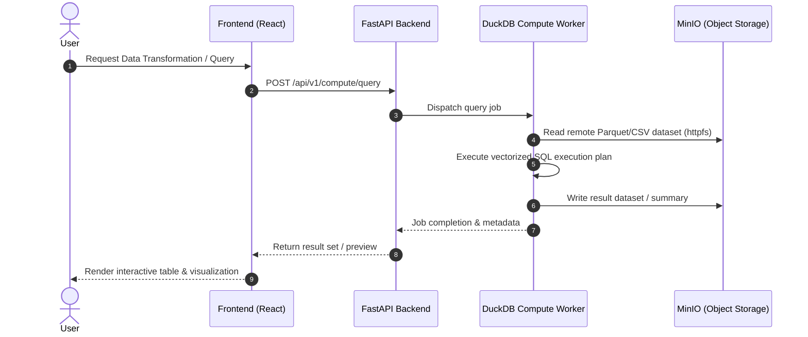

# DuckDB Compute Engine

CompassX incorporates an in-process and distributed analytical compute engine powered by **DuckDB** and containerized worker processes.

---

## Why DuckDB?

DuckDB serves as the embedded analytical execution engine for CompassX because:
1. **Columnar Vectorized Engine**: Fast analytical OLAP queries directly over structured files (Parquet, CSV, Arrow, JSON).
2. **Zero-Copy Data Transfer**: Integrates natively with Apache Arrow and Python Pandas without expensive data serialization.
3. **Direct S3 / MinIO Querying**: Directly queries object storage files using the `httpfs` extension without pre-loading data into memory.

---

## Compute Flow

