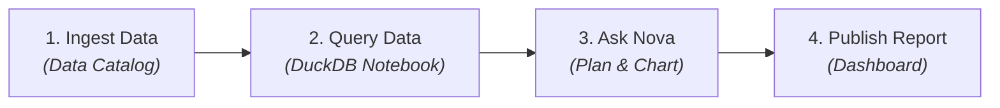

# Your First 5 Minutes Tutorial

This hands-on tutorial guides you through the complete CompassX core data loop: **ingesting a dataset into the catalog**, **querying it in an interactive notebook**, **collaborating with Nova (the AI Data Engineer)**, and **generating a dashboard visualization**.

---

## Tutorial Overview

In this 5-minute walkthrough, you will:
1. Log in and initialize your workspace.
2. Register a sample dataset in the **Data Catalog**.
3. Query the data in an **Interactive Notebook**.
4. Collaborate with **Nova** to analyze trends and generate charts.
5. Publish an insight to an interactive **Dashboard**.

---

## Step 1: Access the Workspace

1. Open your browser and navigate to **`http://localhost:5173`**.
2. Log in using the default administrative credentials:
   - **Username**: `admin`
   - **Password**: `admin`
3. Ensure the workspace switcher in the top bar is set to **`default`**.

---

## Step 2: Register Sample Data in the Data Catalog

1. From the left sidebar, navigate to **Data Catalog** (`/data-catalog`).
2. In the Catalog Explorer tree, select the **`default`** catalog and open the **`public`** schema.
3. Click **Create Table** or **Upload Volume File**:
   - Choose a sample CSV dataset (for example, monthly transaction records).
   - Enter table name: `sample_sales`.
   - CompassX automatically infers column data types and previews the schema.
4. Click **Create** to save the table. The dataset is now governed under:
   ```
   default.public.sample_sales
   ```

---

## Step 3: Query Data in an Interactive Notebook

1. From the left sidebar, navigate to **Notebooks** (`/notebooks`).
2. Click **+ New Notebook** and choose the **SQL / DuckDB** or **Python** kernel.
3. In the first cell, write a query to inspect the registered table:

```sql
SELECT 
    region,
    product_category,
    SUM(revenue) AS total_revenue,
    COUNT(transaction_id) AS order_count
FROM default.public.sample_sales
GROUP BY region, product_category
ORDER BY total_revenue DESC;
```

4. Press **Shift + Enter** to execute the cell. The DuckDB analytical engine processes the query in milliseconds and renders an interactive data table below the cell.

---

## Step 4: Collaborate with Nova (AI Data Engineer)

1. On the right-hand panel of the notebook editor, open the **Nova Assistant** chat tab.
2. Prompt Nova with an analytical task:

> *"Analyze regional sales performance, identify the top revenue drivers, and generate a stacked bar chart showing revenue by region and category."*

3. **Review Nova's Plan & Checkpoint**:
   - Nova inspects the schema of `default.public.sample_sales`.
   - Nova presents a structured, step-by-step plan.
   - Nova drafts the code diff adding transformation logic and Plotly visualization cells.
4. Click **Accept & Run**. Nova appends the cells directly into your notebook and executes them, rendering the chart inline.

---

## Step 5: Publish Insights to a Dashboard

1. From the top right of the generated chart cell, click **Add to Dashboard** (or navigate to **Dashboards** &rarr; **+ New Dashboard**).
2. Arrange your KPI summary cards and regional revenue charts on the dashboard canvas.
3. Click **Publish**. The dashboard is now accessible to team members and business stakeholders in the **Business Center**.

---

## Summary of Accomplishments

In just five minutes, you have executed the complete CompassX data intelligence lifecycle:



---

## Next Steps

Now that you understand the foundational workflow, dive deeper into individual platform modules:

- Explore advanced schema management in **[Data Catalog](../data-catalog/index.md)**.
- Learn about multi-language authoring in **[Interactive Notebooks](../notebooks/index.md)**.
- Automate recurring pipelines in **[Jobs & Orchestration](../jobs/index.md)**.
