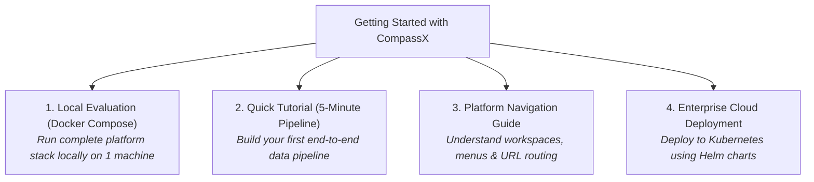

# Getting Started

Welcome to **CompassX**. Whether you are evaluating the platform locally on your development machine or deploying a high-availability cluster in your enterprise cloud environment, this guide helps you get up and running quickly.

In less than 10 minutes, you can launch the complete CompassX platform stack, explore the governed Data Catalog, execute queries in interactive notebooks, design visual Airflow pipelines, and build real-time executive dashboards.

---

## Onboarding Pathways

Choose the pathway that best matches your deployment goals:



---

## Prerequisites & System Requirements

To run CompassX locally using Docker Compose, ensure your system meets the following specifications:

| Requirement | Minimum Specification | Recommended Specification |
| :--- | :--- | :--- |
| **Operating System** | Windows 10/11 (WSL2), macOS (Apple Silicon/Intel), or Linux | Linux (Ubuntu 22.04 LTS) or macOS |
| **Docker Engine** | Docker Engine 24.0+ & Docker Compose v2.20+ | Latest Docker Desktop or Docker CE |
| **CPU (Cores)** | 4 Cores | 8+ Cores |
| **Memory (RAM)** | 8 GB RAM | 16 GB+ RAM |
| **Disk Space** | 20 GB free disk space | 50 GB+ SSD storage |

---

## The CompassX Core Service Map

When you launch CompassX, the following microservices and endpoints are initialized:

```
+-------------------------------------------------------------------------------+
|  COMPASSX LOCAL SERVICE MAP                                                   |
+-------------------------------------------------------------------------------+
|  Service Name              Port      Description                              |
|  Frontend Web Studio       :8008     React Web Studio & Dashboard UI          |
|  FastAPI Backend Core      :8000     API Gateway, Catalog & Metadata Engine   |
|  PostgreSQL Database       :5432     System Metastore & pgvector Embeddings   |
|  Enterprise Gateway        :8888     Jupyter Kernel Compute Sandboxes         |
|  Apache Airflow Webserver  :8080     Workflow Orchestration Engine            |
|  MinIO Object Storage      :9000     S3-Compatible Cloud Storage & Volumes    |
|  Prometheus Monitoring     :9090     Telemetry & Cluster Metrics              |
+-------------------------------------------------------------------------------+
```

---

## In This Section

<div class="grid cards" markdown>

-   **[Fast Onboarding with Docker Compose](quickstart-docker.md)**

    ---

    Launch the complete platform with a single command, verify container health, and explore the web interface.

    [:octicons-arrow-right-24: Start Docker Quickstart](quickstart-docker.md)

-   **[Workspace Navigation & Scoping](workspace-navigation.md)**

    ---

    Understand multi-tenant workspaces, master the navigation sidebar, and explore developer vs. business portals.

    [:octicons-arrow-right-24: Explore Workspace Navigation](workspace-navigation.md)

-   **[Build Your First Data Pipeline (5-Minute Tutorial)](first-data-pipeline.md)**

    ---

    Experience the core loop hands-on: upload a CSV volume, create a table, analyze in a notebook, and build a dashboard.

    [:octicons-arrow-right-24: Build Your First Pipeline](first-data-pipeline.md)

</div>

---

## Next Steps

To launch your local instance of CompassX in minutes, proceed to **[Fast Onboarding with Docker Compose](quickstart-docker.md)**.
