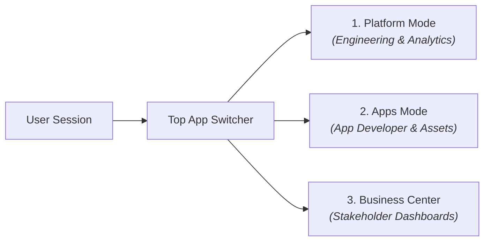

# Workspace Navigation & UI

The CompassX user interface provides a unified, role-aware workspace for data engineering, analytics, and business reporting. The interface is organized around **scoped workspaces** and **three dedicated application modes**.

---

## Workspace Architecture & URL Scoping

CompassX isolates assets, permissions, and execution environments using **Workspaces**. Every feature route is automatically scoped to your active workspace and application:

$$\text{http://localhost:5173}\boldsymbol{/}\text{w}\boldsymbol{/}\mathbf{\text{workspace-slug}}\boldsymbol{/}\mathbf{\text{app-id}}\boldsymbol{/}\text{feature-path}$$

- **Workspace Slug (`workspace-slug`)**: The active organization or project boundary (e.g., `default`, `finance-prod`, `growth-analytics`).
- **App ID (`app-id`)**: The active interface mode (`platform`, `apps`, or `business_center`).
- **Feature Path (`feature-path`)**: The active module (e.g., `/notebooks`, `/data-catalog`, `/dashboards`).

---

## The Three Application Modes

Using the top navigation bar, users can switch between three specialized operational modes tailored to their workflow:



### 1. Platform Mode (`/platform`)
The core environment for data engineers, analysts, and data scientists:

| Navigation Item | Route | Functionality |
| :--- | :--- | :--- |
| **Home** | `/home` | Activity dashboard, recent notebooks, quickstart shortcuts, and health status. |
| **Notebooks** | `/notebooks` | Multi-kernel interactive notebook editor (Python, SQL, R) with inline visualizations. |
| **Jobs** | `/jobs` | Visual DAG workflow designer, scheduled Airflow jobs, and execution history. |
| **Dashboards** | `/dashboards` | Real-time KPI cards, interactive charts, and parameterized filters. |
| **Data Catalog** | `/data-catalog` | Centralized catalog, schema, table, and storage volume explorer. |
| **SQL Editor** | `/sql-warehouse/editor` | High-speed ad-hoc query authoring against DuckDB and SQL Warehouses. |
| **SQL Warehouses** | `/sql-warehouse/warehouses` | Compute endpoints and cluster configurations for query execution. |
| **Query History** | `/sql-warehouse/history` | Audit log of all query executions, runtimes, status, and Nova agent actions. |
| **Agents & Nova** | `/agents` | Interactive chat with Nova (AI Data Engineer), custom agent tools, and knowledge bases. |
| **Connections** | `/connections` | Git repository integrations (Azure DevOps, GitHub) and external data sources. |
| **Compute** | `/compute` | Jupyter kernel runtimes, resource allocation, and execution gateways. |
| **Monitoring** | `/monitoring` | Cluster metrics, Prometheus telemetry, and resource utilization. |

### 2. Apps Mode (`/apps`)
Designed for analytics developers building custom data applications:
- **Assets (`/assets`)**: Asset management, structured entity models, and document schemas.
- **App Developer (`/apps_development`)**: Embedded Monaco code editor and file tree for authoring data applications.

### 3. Business Center (`/business_center`)
A streamlined, distraction-free portal designed for business decision-makers:
- **Dashboards (`/dashboards`)**: Direct access to published operational and executive KPI dashboards without engineering menus.

---

## Top Navigation Bar

The top header provides persistent platform controls accessible from any view:

```
[ CompassX Logo ]   [ App: Platform ▾ ]   [ Workspace: default ▾ ]   [ 🔍 Search (Ctrl+K) ]   [ 👤 Admin ]
```

1. **App Selector Dropdown**: Switch seamlessly between `Platform`, `Apps`, and `Business Center`.
2. **Workspace Switcher**: Switch between team workspaces or create a new workspace container.
3. **Global Search**: Search across catalogs, tables, notebooks, dashboards, and documentation.
4. **User Profile & Theme**: Manage credentials, tokens, and switch between Light and Dark visual modes.

---

## Next Steps

Proceed to **[Your First 5 Minutes Tutorial](first-data-pipeline.md)** to complete your first end-to-end data workflow.
