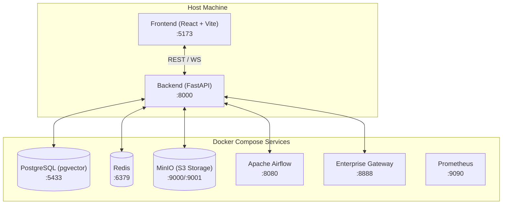

# CompassX Platform

Welcome to the **CompassX Platform** documentation. CompassX is an enterprise AI-native data & analytics platform designed for scalable data processing, interactive notebook computation, automated workflow orchestration, and AI-driven analytics.

---

## Quick Navigation

-   :material-rocket-launch:{ .lg .middle } **[Getting Started](development/getting-started/quickstart.md)**

    ---

    Step-by-step guide to get CompassX running locally in `local-dev` mode.

    [:octicons-arrow-right-24: Start Quickstart](development/getting-started/quickstart.md)

-   :material-sitemap:{ .lg .middle } **[Architecture Overview](data-management/data-engineering/overview.md)**

    ---

    Explore platform topology, service layers, DuckDB compute, and data flow.

    [:octicons-arrow-right-24: View Architecture](data-management/data-engineering/overview.md)

-   :material-server:{ .lg .middle } **[Backend & APIs](development/backend/overview.md)**

    ---

    FastAPI backend architecture, authentication, database models, and API reference.

    [:octicons-arrow-right-24: Explore Backend](development/backend/overview.md)

-   :material-docker:{ .lg .middle } **[Deployment](development/deployment/docker-compose.md)**

    ---

    Docker Compose profiles, service configurations, and production guides.

    [:octicons-arrow-right-24: Deployment Guides](development/deployment/docker-compose.md)

---

## 🏗️ Architecture at a Glance

In **`local-dev`** mode, CompassX runs developer-facing frontend and backend services natively on your host machine with hot-reload enabled, while backing infrastructure services run inside Docker containers:

---

## 💡 Key Platform Capabilities

- **AI-Native Analytics**: Native vector embeddings & similarity search powered by PostgreSQL `pgvector`.
- **Hybrid Compute Engine**: DuckDB-powered analytics engines for high-performance SQL querying and data transformations.
- **Interactive Notebooks**: Secure, isolated Jupyter notebook execution backed by Jupyter Enterprise Gateway.
- **Workflow Orchestration**: Automated DAG execution and data pipeline management via Apache Airflow.
- **S3-Compatible Storage**: Object and artifact storage backed by MinIO.
