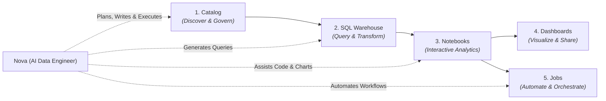

# What is CompassX?

**CompassX** is an open-source, agent-native data and analytics platform designed to unify data engineering, interactive computing, business intelligence, and autonomous AI agents into a single self-hosted workspace.

Built as a modern, self-hosted alternative to proprietary lakehouse platforms, CompassX brings together **interactive notebooks**, **real-time dashboards**, a **high-performance SQL warehouse**, a **unified data catalog**, and an embedded AI data engineer (**Nova**) that can plan, write, and execute data workflows alongside your team.

---

## Why CompassX?

Traditional enterprise data stacks are heavily fragmented: teams juggle isolated notebook servers for data science, separate cataloging tools for governance, external scheduling systems for ETL pipelines, siloed BI tools for reporting, and disconnected AI experiments.

CompassX unifies these capabilities into an **integrated, agent-native data platform**:

- **Agent-Native Intelligence**: Built-in AI Data Engineer (**Nova**) that understands catalog schemas, plans multi-step transformations, and executes queries within your governance boundaries.
- **Unified Single Source of Truth**: Centralized metadata, schema exploration, and volume storage management through the CompassX Data Catalog.
- **Self-Hosted Flexibility**: Deploy seamlessly anywhere &mdash; from a single Docker container on a local machine to a production-grade Kubernetes cluster on AWS, Azure, or GCP.
- **Governed Multi-Persona Collaboration**: Data engineers, business analysts, data scientists, and executives work on the same live data assets without friction.

---

## The CompassX Core Loop

At the heart of CompassX is a continuous, collaborative data loop that bridges raw data ingestion to executive-ready business decisions:

---

## Core Platform Capabilities

CompassX integrates six foundational capabilities into a unified operational interface:

| Capability | Description | Target Users |
| :--- | :--- | :--- |
| **[Data Catalog](data-catalog/index.md)** | Unified data discovery, metadata exploration, schema management, and storage volumes. | Data Engineers, Governance Teams, Analysts |
| **[Interactive Notebooks](notebooks/index.md)** | Multi-language collaborative authoring (Python, SQL, R) with live visualization and kernel isolation. | Data Scientists, Analysts, Engineers |
| **[SQL Warehouse & Compute](compute/index.md)** | In-memory analytical processing powered by DuckDB, dedicated SQL endpoints, and execution gateways. | All Platform Users |
| **[Automated Jobs](jobs/index.md)** | Visual DAG workflow orchestration, recurring batch schedules, dependency resolution, and monitoring. | Data Engineers, Analytics Engineers |
| **[Dashboards](dashboards/index.md)** | Real-time KPI summary cards, interactive charts, parameterized filters, and stakeholder sharing. | Business Analysts, Executives, Operations |
| **[AI Agents & Nova](agents/index.md)** | Embedded AI Data Engineer for conversational queries, automated planning, and document intelligence. | Business Users, Analysts, Data Leaders |

---

## In This Section

To explore CompassX's architecture, intelligence layer, and role-based use cases in depth, explore the following topics:

-   **[Platform Architecture & Foundations](what-is-compassx/platform-architecture.md)**

    ---

    Explore the decoupled service layers, three-level governance namespace, compute gateways, and storage topology.

    [:octicons-arrow-right-24: Read Architecture Deep Dive](what-is-compassx/platform-architecture.md)

-   **[AI-Native Data Intelligence & Nova](what-is-compassx/data-intelligence.md)**

    ---

    Learn how Nova plans multi-step data tasks, executes grounded queries, and leverages semantic vector search.

    [:octicons-arrow-right-24: Explore Data Intelligence](what-is-compassx/data-intelligence.md)

-   **[Teams, Personas & Use Cases](what-is-compassx/personas-and-use-cases.md)**

    ---

    Discover how Data Engineers, Analysts, Scientists, and Business Stakeholders collaborate across the platform.

    [:octicons-arrow-right-24: View Personas & Scenarios](what-is-compassx/personas-and-use-cases.md)

---

## Next Steps

Ready to get started with CompassX?

- Follow the **[Getting Started Guide](getting-started/index.md)** to log in, create a workspace, and run your first analysis.
- Explore the **[Data Catalog](data-catalog/index.md)** to discover datasets, schemas, and storage volumes.