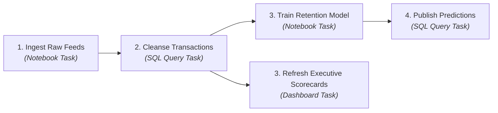
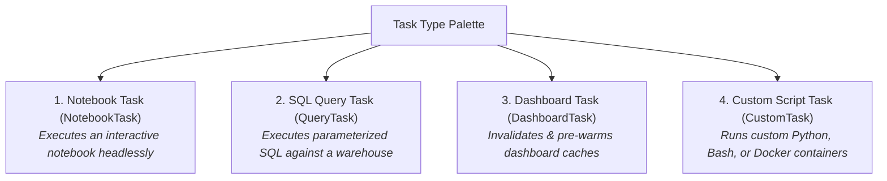
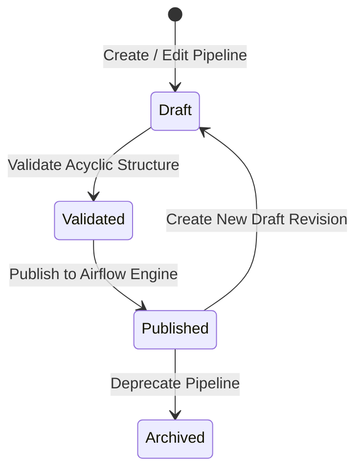

# Visual DAG Designer, Task Types & Dependencies

In modern data architectures, a data pipeline rarely consists of a single isolated script. A realistic enterprise pipeline often begins by extracting raw CSV files from a cloud storage volume, executing a series of SQL transformation models to cleanse and aggregate data, training a machine learning scoring script, and finally refreshing executive dashboard caches.

Managing these complex workflows requires a **Directed Acyclic Graph (DAG)** &mdash; a mathematical structure where tasks represent discrete units of work and directional arrows represent strict execution dependencies.

The **CompassX Visual DAG Designer** (`/jobs/designer`) allows engineers and analysts to build, configure, and connect multi-stage pipelines visually on an interactive canvas without writing complex Airflow Python boilerplate.

---

## 1. The Visual DAG Canvas (`TaskGraphCanvas`)

The **Visual DAG Canvas** provides a responsive, drag-and-drop studio for assembling data pipelines:



### Canvas Operations:
- **Adding Tasks**: Drag task types from the sidebar palette onto the canvas.
- **Connecting Dependencies (`depends_on`)**: Click and drag from an upstream task's output handle to a downstream task's input handle. CompassX automatically validates that the connection creates a valid acyclic graph, preventing circular loops.
- **Parallel Branching**: Connect a single upstream task to multiple downstream tasks (such as running machine learning scoring and dashboard refreshing simultaneously once cleansing finishes).

---

## 2. Supported Task Types Explained

CompassX provides four specialized task types to handle diverse analytical workloads:



| Task Type | Execution Mechanism | Primary Use Case |
| :--- | :--- | :--- |
| **`NotebookTask`** | Executes an interactive notebook headlessly using `airflow-notebook-runner`, capturing a rendered HTML/IPYNB snapshot of all cell outputs and charts. | Feature engineering, machine learning training, complex statistical modeling, and data cleansing. |
| **`QueryTask`** | Executes a parameterized ANSI SQL query directly against **DuckDB** or a dedicated **SQL Warehouse**. | Materializing dimensional tables (`CREATE TABLE ... AS SELECT`), running database updates, and updating aggregated marts. |
| **`DashboardTask`** | Sends a cache invalidation and pre-warming signal to published **Dashboards** in the **Business Center**. | Ensuring executive scorecards display fresh data immediately following the completion of upstream ETL jobs. |
| **`CustomTask`** | Executes arbitrary Bash scripts, Python CLI commands, or custom Docker container images. | Calling external third-party REST APIs, triggering webhooks, or running specialized C++ binaries. |

---

## 3. Configuring Tasks in the Task Drawer

Clicking any task node on the visual canvas opens the **Task Configuration Drawer**:

```
+-------------------------------------------------------------------------------+
|  TASK SETTINGS: Cleanse Financial Transactions                                |
+-------------------------------------------------------------------------------+
|  Task Identifier:     [ task_cleanse_transactions ]                           |
|  Task Type:           [ SQL Query Task ▾ ]                                    |
|  Target Warehouse:    [ analytics-prod ▾ ]                                    |
|                                                                               |
|  SQL Statement:                                                               |
|  +-------------------------------------------------------------------------+  |
|  | CREATE OR REPLACE TABLE production.curated_marts.daily_revenue AS       |  |
|  | SELECT customer_id, region, SUM(amount) AS revenue_usd                   |  |
|  | FROM production.raw_ingest.inbound_transactions                         |  |
|  | WHERE transaction_date = :RUN_DATE                                      |  |
|  | GROUP BY customer_id, region;                                           |  |
|  +-------------------------------------------------------------------------+  |
|                                                                               |
|  Compute & Timeout Settings:                                                  |
|  Hardware Profile:    [ Cloud-Standard (4 Cores / 16 GB) ▾ ]                  |
|  Execution Timeout:   [ 30 Minutes ▾ ]                                        |
|                                                                               |
|  Runtime Parameters:                                                          |
|  [ Key: RUN_DATE ] = [ Value: '{{ ds }}' (Airflow execution date macro) ]     |
+-------------------------------------------------------------------------------+
```

### Key Task Configuration Properties:
- **Target Asset**: Select the specific notebook, SQL warehouse, or dashboard linked to this task.
- **Compute Sizing**: Assign dedicated CPU and RAM profiles (`local`, `cloud-s`, `cloud-l`, `gpu`) to prevent resource contention.
- **Execution Timeout**: Set a maximum duration threshold (e.g., 30 minutes). If a task hangs due to an external network stall, Airflow terminates it safely.
- **Runtime Parameters (`params`)**: Pass dynamic key-value pairs or Airflow execution macros (such as `{{ ds }}` for execution date) directly into SQL queries and notebook parameter cells.

---

## 4. Draft vs. Published Version Lifecycle

To ensure that in-progress pipeline edits never disrupt production schedules, CompassX enforces strict **Draft and Publish isolation**:



1. **Draft Mode (`is_draft = true`)**: All visual layout edits, dependency connections, and parameter adjustments occur safely in draft state without affecting running production jobs.
2. **Atomic Publishing**: Clicking **Publish** generates an immutable `JobVersion` snapshot, compiles the visual DAG into native Airflow syntax, and synchronizes the schedule.
3. **Instant Rollback**: If a newly published pipeline version behaves unexpectedly, administrators can revert to any previous published version with a single click.

---

## Next Steps

To learn how to configure cron expressions, manage timezones, and set concurrency limits, proceed to **[Schedules, Cron Expressions & Triggers](schedules-and-triggers.md)**.
