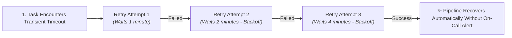
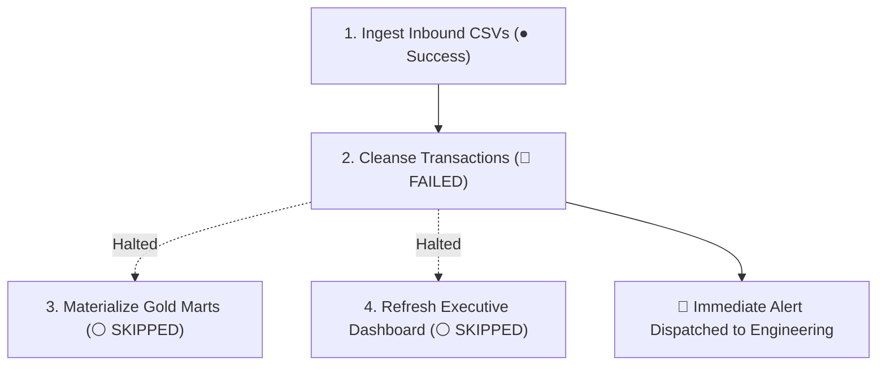

# Error Handling, Auto-Retry & Nova AI Diagnosis

In mission-critical enterprise environments, data pipelines will inevitably encounter errors &mdash; whether due to transient cloud network timeouts, third-party API rate limits, or upstream schema changes. The measure of an enterprise-grade platform is not whether errors ever occur, but **how gracefully the system recovers** and **how rapidly engineers can diagnose and patch failures**.

**CompassX Jobs** provides a multi-layered resilience architecture combining **automated retry policies with exponential backoff**, **cascade failure protection**, and **AI-powered root-cause diagnosis with Nova**.

---

## 1. Automated Retries & Exponential Backoff

Many pipeline failures are transient in nature: a cloud database briefly restarts, an external payment API experiences a 10-second traffic spike, or a storage volume encounters a momentary network blip.

CompassX allows engineers to configure automated retry policies on every task node:



```json
{
  "retries": 3,
  "retry_delay_seconds": 60,
  "retry_exponential_backoff": true,
  "max_retry_delay_seconds": 300
}
```

### Why Exponential Backoff Matters:
Without exponential backoff, immediate retries can overwhelm a recovering database or trigger third-party API rate limit bans. Exponential backoff progressively doubles the wait interval between retry attempts (e.g., 1 min &rarr; 2 min &rarr; 4 min), giving upstream services time to stabilize.

---

## 2. Cascade Failure Protection

When a data transformation task fails, the worst outcome is allowing corrupted or incomplete data to propagate downstream into executive scorecards.

CompassX prevents data corruption through **Cascade Failure Protection**:



- **Dependency Halting**: If `Cleanse Transactions` fails, all downstream dependent tasks (`Materialize Gold Marts` and `Refresh Executive Dashboard`) are immediately transitioned to a `skipped` state.
- **Data Integrity Guarantee**: Executive scorecards continue displaying the last known valid snapshot rather than incomplete or corrupted metrics.

---

## 3. Nova AI Root-Cause Failure Diagnosis

When a permanent failure occurs (such as an unexpected upstream schema change or code bug), traditional on-call triage requires engineers to manually parse thousands of lines of raw container logs.

CompassX transforms failure triage with **Nova AI Root-Cause Diagnosis**:

```
+-------------------------------------------------------------------------------+
|  TASK FAILED: task_cleanse_transactions (Run #142)                            |
+-------------------------------------------------------------------------------+
|  [ ⚡ Diagnose Failure with Nova ]                                             |
+-------------------------------------------------------------------------------+
|  🤖 NOVA AI DIAGNOSTIC REPORT:                                                |
|                                                                               |
|  📌 Root Cause Summary:                                                       |
|  The upstream CSV ingestion file added a new column ('settlement_currency')    |
|  containing NULL values, violating the NOT NULL constraint on table:         |
|  production.curated_marts.daily_revenue.                                      |
|                                                                               |
|  🛠️ Proposed Remediation Patch (Cell 2):                                      |
|  - gross_amount = row['amount']                                               |
|  + gross_amount = row['amount'] if pd.notna(row.get('amount')) else 0.0      |
|  + currency = row.get('settlement_currency', 'USD')                           |
|                                                                               |
|  [ ✅ Apply Patch to Draft Pipeline ]    [ 🔄 Re-Run Failed Task ]            |
+-------------------------------------------------------------------------------+
```

### How Nova Diagnoses Failures:
1. **Automated Traceback Analysis**: Nova reads the exact error stack trace from the worker pod logs.
2. **Schema & Environmental Inspection**: Nova queries the **Data Catalog** to compare the incoming dataset schema against the target table's schema definitions, identifying schema drift instantly.
3. **Actionable Plain-English Explanation**: Nova explains *why* the task failed in clear, business-friendly language rather than cryptic error codes.
4. **One-Click Patch Deployment**: Nova generates the exact SQL or Python code diff needed to fix the issue and allows you to apply the patch directly to a new pipeline draft.

---

## Next Steps

Now that you have mastered automated workflow orchestration, proceed to **[Dashboards & Business Intelligence](../dashboards/index.md)** to learn how to build real-time visual scorecards for executive stakeholders.
