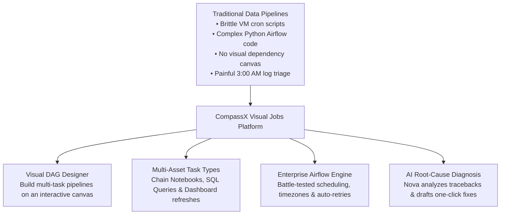
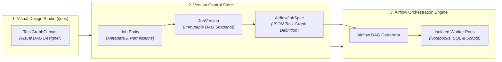
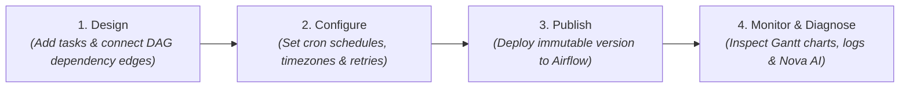

# Jobs & Workflow Orchestration

In enterprise data architectures, exploratory data transformations and analytical queries must be automated into reliable, production-grade pipelines that run on recurring schedules, respond to system triggers, and recover gracefully from infrastructure failures.

**CompassX Jobs** provides a complete enterprise workflow orchestration studio powered by **Apache Airflow**. By combining an intuitive drag-and-drop visual DAG designer with robust task versioning, automated retry policies, and **Nova AI root-cause failure diagnosis**, CompassX allows data teams to build, schedule, and monitor mission-critical data pipelines with zero infrastructure friction.

---

## The Challenge of Enterprise Pipeline Orchestration

Data engineering teams historically faced significant operational hurdles when building and maintaining data pipelines:
- **Brittle Cron Scripts**: Running isolated cron jobs on virtual machines led to silent failures, lack of dependency management, and race conditions when upstream data ingestion was delayed.
- **Steep Orchestration Learning Curves**: Tools like Apache Airflow traditionally required writing hundreds of lines of complex Python boilerplate just to define simple task dependencies and parameter passes.
- **Painful Failure Triage**: When a pipeline broke at 3:00 AM, on-call engineers spent hours sifting through dense log files to identify whether the root cause was a database timeout, an API schema change, or an out-of-memory crash.

CompassX solves these challenges by providing a **visual, AI-assisted orchestration platform**:



---

## The Decoupled Job Architecture

CompassX employs a decoupled, version-controlled architecture that isolates visual pipeline design from the underlying Airflow execution engine:



### Key Architectural Layers:
1. **Visual DAG Canvas (`TaskGraphCanvas`)**: Engineers and analysts design pipelines visually by connecting task nodes with directional dependency edges.
2. **Immutable Version Control (`JobVersion`)**: Every time a job is published, CompassX creates an immutable snapshot of the DAG specification (`AirflowJobSpec`). This allows teams to roll back to previous pipeline versions instantly if an issue arises.
3. **Airflow Execution Engine**: CompassX compiles the visual specification into native Airflow DAGs, executing tasks inside isolated container pods with full monitoring and telemetry.

---

## Anatomy of the Jobs Studio

The **Jobs Studio** (`/jobs`) provides a unified workspace for designing, configuring, and monitoring pipelines:

```
+-----------------------------------------------------------------------------------------------+
| [ ⏱️ Daily Financial ETL & Executive Reporting ]  [ Status: Published ]  [ ▶ Run Now ]  [ ⚙️ Settings ] |
+-----------------------------------------------------------------------------------------------+
|  VISUAL DAG CANVAS:                                                                           |
|                                                                                               |
|  [ Ingest Volume CSVs ] ───▶ [ Cleanse Transactions ] ───▶ [ Refresh KPI Dashboards ]          |
|      (Notebook Task)             (SQL Query Task)              (Dashboard Task)               |
|                                                                                               |
+-----------------------------------------------------------------------------------------------+
|  RUN HISTORY (Gantt Timeline):                                                                |
|  Run #142 (Today 06:00 UTC)  |  ● Success  |  Duration: 3m 42s                                |
|  ├─ Ingest Volume CSVs       |  ██████████░░░░░░░░░░░░░░░  (1m 15s)                           |
|  ├─ Cleanse Transactions     |  ░░░░░░░░░░██████████░░░░░  (1m 45s)                           |
|  └─ Refresh KPI Dashboards   |  ░░░░░░░░░░░░░░░░░░░░█████  (0m 42s)                           |
+-----------------------------------------------------------------------------------------------+
```

---

## The 4-Stage Job Operational Lifecycle



1. **Design**: Assemble tasks on the visual canvas &mdash; connecting notebooks, SQL queries, and dashboard refreshes into a directed acyclic graph.
2. **Configure**: Define execution schedules using standard cron expressions, set target timezones, establish retry backoff policies, and configure email/Slack alert notifications.
3. **Publish**: Deploy the pipeline to the Airflow engine with atomic versioning.
4. **Monitor & Diagnose**: Track live execution in real time, view task logs, analyze Gantt execution bottlenecks, and leverage Nova to fix failed runs.

---

## In This Section

Explore the comprehensive guides below to learn how to design, schedule, monitor, and troubleshoot automated data pipelines:

<div class="grid cards" markdown>

-   **[Visual DAG Designer, Task Types & Dependencies](dag-designer-and-tasks.md)**

    ---

    Master the visual canvas, configure task types (Notebooks, SQL, Dashboards), and define execution dependencies (`depends_on`).

    [:octicons-arrow-right-24: Learn DAG Design](dag-designer-and-tasks.md)

-   **[Schedules, Cron Expressions & Triggers](schedules-and-triggers.md)**

    ---

    Configure automated execution schedules, customize 5-field cron syntax, set timezones, and manage concurrency limits.

    [:octicons-arrow-right-24: Configure Schedules](schedules-and-triggers.md)

-   **[Job Monitoring, Gantt Timeline & Live Logs](monitoring-and-logs.md)**

    ---

    Track pipeline execution across the 7 task run states, analyze Gantt charts, and inspect live streaming logs.

    [:octicons-arrow-right-24: Monitor Pipeline Runs](monitoring-and-logs.md)

-   **[Error Handling, Auto-Retry & Nova AI Diagnosis](error-handling-and-nova.md)**

    ---

    Configure exponential retry policies, prevent cascade failures, and diagnose pipeline tracebacks with Nova AI.

    [:octicons-arrow-right-24: Troubleshoot with Nova](error-handling-and-nova.md)

</div>

---

## Next Steps

To learn how to use the visual DAG designer and configure multi-asset task graphs, proceed to **[Visual DAG Designer, Task Types & Dependencies](dag-designer-and-tasks.md)**.
