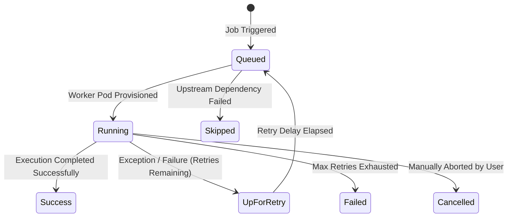

# Job Monitoring, Gantt Timeline & Live Logs

Deploying automated data pipelines into production is only half the battle &mdash; data engineering teams must maintain constant operational visibility into pipeline health, identify execution bottlenecks, and rapidly debug failed tasks before business SLAs are breached.

**CompassX Jobs** provides a centralized observability suite featuring a real-time **Jobs Dashboard**, interactive **Gantt Execution Timelines**, and a **Live Streaming Log Viewer** connected directly to isolated worker pods.

---

## 1. The Centralized Jobs Dashboard

The **Jobs Dashboard** (`/jobs`) serves as the primary command center for monitoring all scheduled, running, and historical pipelines across the workspace:

```
+-----------------------------------------------------------------------------------------------+
|  ENTERPRISE WORKFLOW PIPELINES (14 Active Jobs)                       [ 🔍 Search Pipelines ] |
+-----------------------------------------------------------------------------------------------+
|  Job Name                     Schedule      Last Run State    Duration   Next Scheduled Run   |
|  Daily Financial Ingestion    0 6 * * *     ● Success         3m 42s     Tomorrow 06:00 UTC   |
|  Customer Churn ML Scoring    0 8 * * 1-5   ● Success         12m 10s    Tomorrow 08:00 UTC   |
|  Real-Time Telemetry Sync     */15 * * * *  ● Running (72%)   1m 05s     In 14 minutes        |
|  Legacy ERP Data Migration    Manual        ● Failed          45s        --                   |
+-----------------------------------------------------------------------------------------------+
```

### Dashboard Capabilities:
- **Status Indicators**: Visual badges identify pipeline health (`Success`, `Running`, `Failed`, `Queued`).
- **Duration Metrics**: Track historical runtime trends to detect performance regressions.
- **Next Scheduled Trigger**: View countdown timers to the next execution run.

---

## 2. The 7 Task Run Lifecycle States

Every task execution within a pipeline transitions through explicit operational states managed by the Airflow orchestrator:



| Task Run State | UI Badge | Description & Operational Behavior |
| :--- | :--- | :--- |
| **`queued`** | 🟡 Yellow | Task is waiting for an available compute worker pod or waiting for an active upstream dependency to finish. |
| **`running`** | 🔵 Blue (Pulsing) | Task is currently executing code inside an isolated container pod. |
| **`success`** | 🟢 Green | Task finished execution with exit code 0. Downstream dependent tasks are triggered immediately. |
| **`up_for_retry`** | 🟠 Orange | Task encountered a transient error and is waiting in backoff state before retrying automatically. |
| **`failed`** | 🔴 Red | Task exhausted all configured retry attempts and terminated with an error. Downstream tasks are halted. |
| **`skipped`** | ⚪ Gray | Task was skipped because an upstream prerequisite failed or a conditional branch was not taken. |
| **`cancelled`** | 🟣 Purple | Execution was manually aborted by an administrator. |

---

## 3. The Visual Gantt Timeline (`JobRunsTimelineChart`)

When optimizing slow data pipelines, viewing raw run durations in a table is insufficient. The **Gantt Execution Timeline** visualizes parallel task execution and exposes critical path bottlenecks:

```mermaid
gantt
    title Pipeline Run #142 Execution Timeline (Total: 4m 15s)
    dateFormat  m:ss
    axisFormat %M:%S
    
    section Ingestion
    Ingest Inbound CSVs :done, t1, 00:00, 01:15
    
    section Transformations
    Cleanse Transactions :done, t2, 01:15, 02:45
    Validate Account IDs :done, t3, 01:15, 02:00
    
    section Aggregations
    Materialize Gold Marts :done, t4, 02:45, 03:45
    
    section BI & Dashboards
    Refresh KPI Scorecards :done, t5, 03:45, 04:15
```

### Identifying Bottlenecks:
- **Parallel vs. Sequential Execution**: Notice how `Cleanse Transactions` and `Validate Account IDs` run simultaneously in parallel worker pods, cutting pipeline execution time in half.
- **Critical Path Analysis**: Easily identify the single task consuming the majority of runtime (e.g., `Cleanse Transactions` taking 1m 30s) to focus optimization efforts where they have the highest impact.

---

## 4. Live Streaming Log Viewer

Clicking any failed or running task node opens the **Live Streaming Log Viewer**:

```
+-----------------------------------------------------------------------------------------------+
|  TASK LOGS: task_cleanse_transactions (Run #142)                         [ 🔍 Search Logs ]   |
+-----------------------------------------------------------------------------------------------+
|  [2025-08-30 06:01:15 UTC] [INFO] Starting container worker pod on node worker-pool-3        |
|  [2025-08-30 06:01:18 UTC] [INFO] Connecting to DuckDB SQL Warehouse (analytics-prod)...     |
|  [2025-08-30 06:01:20 UTC] [INFO] Executing query: CREATE OR REPLACE TABLE daily_revenue...  |
|  [2025-08-30 06:02:45 UTC] [INFO] Successfully processed 1,420,500 rows in 85.2 seconds.     |
|  [2025-08-30 06:02:46 UTC] [INFO] Task exited with return code 0 (Success)                   |
+-----------------------------------------------------------------------------------------------+
|  [ ⬇ Download Full Log ]     [ 📋 Copy Stack Trace ]     [ ⚡ Diagnose Failure with Nova ]      |
+-----------------------------------------------------------------------------------------------+
```

### Log Viewer Features:
- **Real-Time Streaming**: Watch task output stream live in real time as the container executes.
- **Log Search & Highlighting**: Filter logs by keywords (`ERROR`, `WARN`, `Exception`, `Timeout`) to jump directly to root-cause errors.
- **Full Traceback Capture**: Complete Python stack traces, SQL error codes, and container exit statuses are preserved for forensic review.

---

## Next Steps

To learn how to configure automated retry policies, prevent cascade failures, and troubleshoot broken pipelines using AI, proceed to **[Error Handling, Auto-Retry & Nova AI Diagnosis](error-handling-and-nova.md)**.
