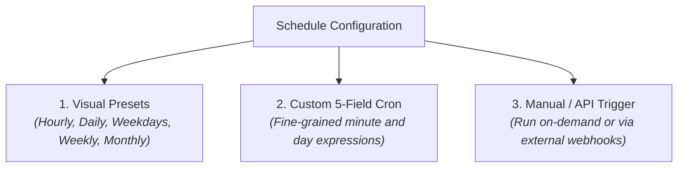

# Schedules, Cron Expressions & Triggers

Automating data pipelines requires precise control over **when** and **how frequently** tasks execute. Whether your organization runs nightly batch financial reconciliations at 2:00 AM, updates customer churn scores every weekday morning, or triggers intraday hourly sales aggregations, CompassX provides a flexible, enterprise-grade scheduling engine.

Powered by **Apache Airflow**, CompassX supports visual preset schedules, standard 5-field UNIX cron syntax, localized timezone management, and concurrency controls to prevent pipeline collisions.

---

## 1. The Schedule Builder Interface

The **Schedule Builder** (`/jobs/schedules`) provides a visual configuration studio designed for both business analysts and data engineers:

```
+-------------------------------------------------------------------------------+
|  SCHEDULE SETTINGS: Daily Executive Revenue Pipeline                          |
+-------------------------------------------------------------------------------+
|  Schedule Mode:       [●] Visual Presets       [○] Advanced Cron Syntax       |
|                                                                               |
|  Frequency:           [ Daily ▾ ]                                             |
|  Execution Time:      [ 06 : 00 ] UTC                                         |
|  Active Timezone:     [ UTC (Coordinated Universal Time) ▾ ]                  |
|                                                                               |
|  Human Translation:   ✨ Runs every day at 06:00 UTC                           |
|  Next Scheduled Run:  📅 Tomorrow at 06:00 UTC (in 14 hours, 22 minutes)       |
|                                                                               |
|  Concurrency Policy:                                                          |
|  Max Active Runs:     [ 1 Run (Prevents overlapping execution) ▾ ]            |
|  Catchup on Deploy:   [ Disabled (Skip missed historical runs) ▾ ]            |
+-------------------------------------------------------------------------------+
```

---

## 2. Standard Schedule Presets vs. Advanced Cron Syntax

CompassX allows teams to select from common schedule presets or author custom cron expressions:



### Supported Presets:
- **Hourly**: Executes at the top of every hour (`0 * * * *`).
- **Daily**: Runs once every 24 hours at a specified time (e.g., `0 6 * * *` for 6:00 AM).
- **Weekdays Only**: Runs Monday through Friday, skipping weekends (`0 6 * * 1-5`).
- **Weekly**: Runs on a designated day of the week (e.g., every Sunday at midnight).
- **Monthly**: Executes on the first day of each calendar month (`0 0 1 * *`).

---

## 3. Understanding 5-Field UNIX Cron Expressions

For advanced scheduling requirements, CompassX supports standard 5-field cron syntax:

$$\overbrace{\mathbf{0}}^{\text{Minute}} \quad \overbrace{\mathbf{6}}^{\text{Hour}} \quad \overbrace{\mathbf{*}}^{\text{Day of Month}} \quad \overbrace{\mathbf{*}}^{\text{Month}} \quad \overbrace{\mathbf{1-5}}^{\text{Day of Week}}$$

| Field Position | Permitted Values | Special Characters | Description |
| :--- | :--- | :--- | :--- |
| **1. Minute** | `0 - 59` | `*`, `,`, `-`, `/` | The exact minute within the hour. |
| **2. Hour** | `0 - 23` | `*`, `,`, `-`, `/` | The hour in 24-hour format (e.g., `18` for 6:00 PM). |
| **3. Day of Month** | `1 - 31` | `*`, `,`, `-`, `/`, `L` | The calendar day of the month. |
| **4. Month** | `1 - 12` (or `JAN - DEC`) | `*`, `,`, `-`, `/` | The calendar month of the year. |
| **5. Day of Week** | `0 - 6` (0 = Sunday, 6 = Saturday) | `*`, `,`, `-`, `/` | The specific day of the week. |

### Real-World Enterprise Cron Examples:
- `*/15 * * * *` &mdash; Runs every 15 minutes around the clock (ideal for near-real-time streaming ingest).
- `0 2 * * *` &mdash; Runs every night at 2:00 AM UTC (standard overnight batch ETL window).
- `30 7 * * 1` &mdash; Runs every Monday morning at 7:30 AM (weekly executive reporting).
- `0 0 1 1,4,7,10 *` &mdash; Runs at midnight on the first day of each financial quarter (Q1, Q2, Q3, Q4).

---

## 4. Timezones & Concurrency Management

### Timezone Handling:
While UTC (Coordinated Universal Time) is the industry standard for data pipelines, business stakeholders often operate in local timezones. CompassX allows you to configure an explicit timezone (e.g., `America/New_York`, `Europe/London`, or `Asia/Tokyo`) for each job. Airflow automatically accounts for Daylight Saving Time (DST) transitions, ensuring reports run at the correct local hour year-round.

### Concurrency & Overlap Protection (`max_active_runs`):
If an upstream data source experiences severe delays, a scheduled 2:00 AM pipeline run might still be processing when the 3:00 AM run is triggered. Without concurrency limits, both runs would compete for database locks and compute memory, causing catastrophic pipeline failures.

To prevent this, CompassX enforces **`max_active_runs = 1`** by default. If a previous run is still active when the next schedule fires, the incoming run waits in a `queued` state until the active run finishes.

---

## Next Steps

To learn how to monitor active pipeline runs, inspect Gantt charts, and review live execution logs, proceed to **[Job Monitoring, Gantt Timeline & Live Logs](monitoring-and-logs.md)**.
