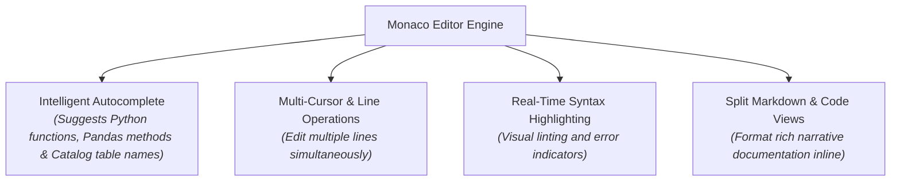
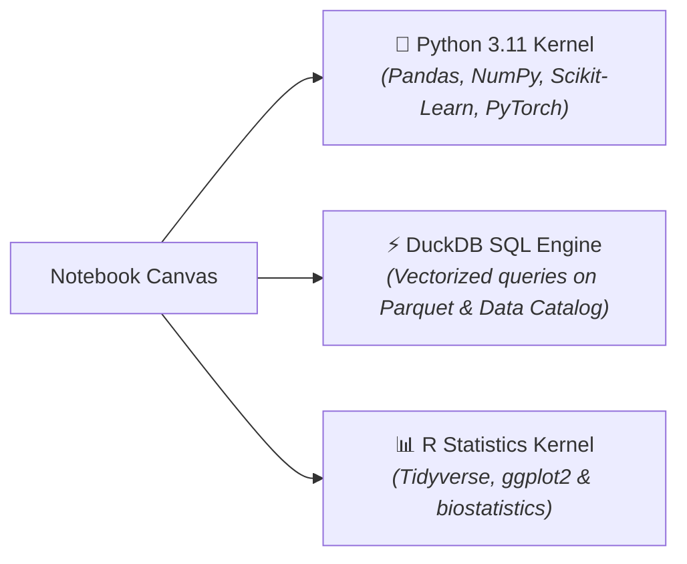
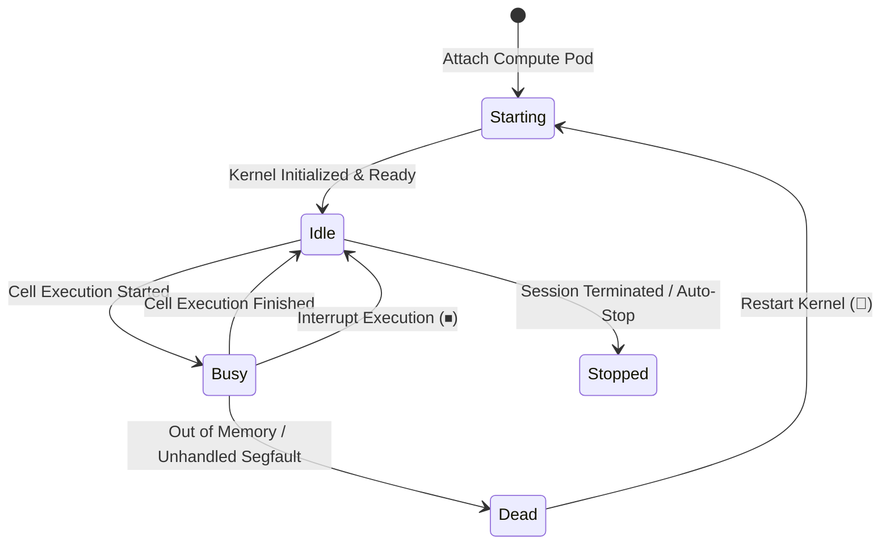

# Notebook Authoring, Kernels & Multi-Language Execution

At the heart of the CompassX interactive analytical experience is the **Notebook Authoring Studio**. Built on the high-performance **Monaco Editor** and powered by the **Jupyter Enterprise Gateway (EG)**, CompassX provides a responsive, multi-language coding environment where users can author Python, SQL, and R code within isolated, secure compute sandboxes.

This guide explains the code authoring experience, details available kernel runtimes, walks through kernel lifecycle management, and explains how to select hardware compute profiles to match workload requirements.

---

## 1. The Code Authoring Experience with Monaco

CompassX uses the **Monaco Editor** &mdash; the same battle-tested code editing engine that powers Microsoft Visual Studio Code. This ensures that data engineers and analysts enjoy a professional development experience directly inside their web browser:



### Essential Keyboard Shortcuts

CompassX Notebooks support two distinct operational modes: **Edit Mode** (indicated by a focused cursor inside a cell) and **Command Mode** (navigating between cells):

| Shortcut (Windows / Linux) | Shortcut (macOS) | Operational Action | Mode Required |
| :--- | :--- | :--- | :--- |
| **Shift + Enter** | **Shift + Return** | Execute active cell and advance focus to the next cell. | Edit / Command |
| **Ctrl + Enter** | **Cmd + Return** | Execute active cell and keep focus on the current cell. | Edit / Command |
| **Esc** | **Esc** | Exit Edit Mode and enter Command Mode. | Edit Mode |
| **Enter** | **Return** | Enter Edit Mode inside the currently selected cell. | Command Mode |
| **A** | **A** | Insert a new code cell **Above** the active cell. | Command Mode |
| **B** | **B** | Insert a new code cell **Below** the active cell. | Command Mode |
| **D, D** (Press D twice) | **D, D** | Delete the currently selected cell. | Command Mode |
| **M** | **M** | Convert the active cell to a **Markdown** documentation cell. | Command Mode |
| **Y** | **Y** | Convert the active cell to a **Code** execution cell. | Command Mode |
| **Ctrl + /** | **Cmd + /** | Toggle line comment (`#` in Python, `--` in SQL). | Edit Mode |

---

## 2. Multi-Language Execution & Polyglot Runtimes

CompassX allows data practitioners to work in the language best suited for their analytical task:



### 1. Python 3.11 Runtime (Default)
The default Python kernel comes pre-configured with a comprehensive enterprise data science stack:
- **Data Manipulation**: `pandas`, `polars`, `numpy`, `pyarrow`.
- **Analytical Compute**: `duckdb` (embedded high-speed SQL query engine).
- **Visualization**: `plotly`, `matplotlib`, `seaborn`, `altair`.
- **Machine Learning**: `scikit-learn`, `xgboost`, `lightgbm`, `torch`, `transformers`.
- **Cloud Connectors**: Built-in credential-free storage volume connectors and Data Catalog drivers.

### 2. DuckDB SQL Magic Cells
Analysts can execute SQL queries directly against Data Catalog tables and Parquet files without writing boilerplate Python connection strings:

```python
import duckdb

# Query live catalog tables directly and return a Pandas DataFrame
df = duckdb.query("""
    SELECT 
        region,
        DATE_TRUNC('month', order_timestamp) AS order_month,
        SUM(revenue_usd) AS total_revenue
    FROM production.curated_marts.daily_revenue
    GROUP BY region, order_month
    ORDER BY order_month DESC
""").df()
```

### 3. R Statistics Runtime
For biometricians, financial econometricians, and statisticians who prefer R, CompassX provides a dedicated R kernel equipped with `tidyverse`, `ggplot2`, and standard statistical modeling libraries.

---

## 3. Kernel Lifecycle Management & Sandboxing

Every notebook session runs inside an isolated, containerized kernel process managed by the **Jupyter Enterprise Gateway (EG)**. This ensures that memory-intensive data science calculations or runaway loops in one user's notebook cannot degrade the performance or crash the environment of other users.



### Understanding Kernel States:
- **`Starting`**: The Enterprise Gateway is provisioning an isolated Docker container or Kubernetes pod and launching the runtime process.
- **`Idle`**: The kernel is waiting for user input. Variables and loaded DataFrames are preserved in memory.
- **`Busy`**: The kernel is currently executing code. The status indicator displays a rotating spinner, and incoming cells are queued.
- **`Dead`**: The kernel encountered an unrecoverable hardware fault (such as exceeding memory limits). Clicking **Restart Kernel (🔄)** provisions a fresh container in seconds.

### Execution Control Actions:
- **Interrupt Execution (`⏹`)**: Sends a `SIGINT` interrupt signal to immediately halt the active running cell without losing variables or DataFrames already loaded in memory.
- **Restart Kernel (`🔄`)**: Clears the kernel state, flushes allocated RAM, and re-initializes the runtime environment from scratch.

---

## 4. Hardware Compute Profiles & Dynamic Resizing

CompassX provides preset hardware profiles to ensure that users allocate the right amount of CPU and RAM for their workloads:

```
+-------------------------------------------------------------------------------+
|  SELECT COMPUTE PROFILE                                                       |
+-------------------------------------------------------------------------------+
|  [○] Local Development       (2 vCPUs  | 4 GB RAM)   - Fast prototyping       |
|  [●] Cloud Standard          (4 vCPUs  | 16 GB RAM)  - Standard data science  |
|  [○] Cloud High-Memory       (16 vCPUs | 64 GB RAM)  - Large in-memory joins  |
|  [○] GPU Accelerated         (8 vCPUs  | 32 GB RAM + NVIDIA T4 GPU)           |
+-------------------------------------------------------------------------------+
```

### Profile Guidelines:
- **`local` (2 Cores / 4 GB)**: Ideal for exploratory data analysis, writing SQL queries, and lightweight prototyping.
- **`cloud-s` (Standard: 4 Cores / 16 GB)**: Recommended for standard Pandas pipelines, feature engineering, and standard ETL transformations.
- **`cloud-l` (Large: 16 Cores / 64 GB)**: Designed for heavy multi-gigabyte DataFrame joins, parallel computations, and large-scale data science models.
- **`gpu` (Accelerated: 8 Cores / 32 GB + NVIDIA GPU)**: Specifically configured for training deep learning models in PyTorch/TensorFlow and running local LLM embeddings.

---

## Next Steps

To learn how to render interactive data tables, Plotly charts, and mathematical equations, proceed to **[Visualizations, Interactive Data Grids & Outputs](visualizations-and-outputs.md)**.
