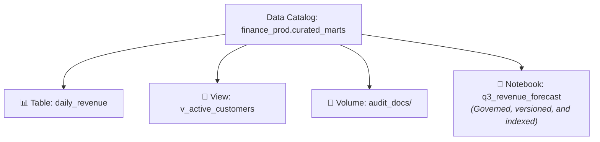
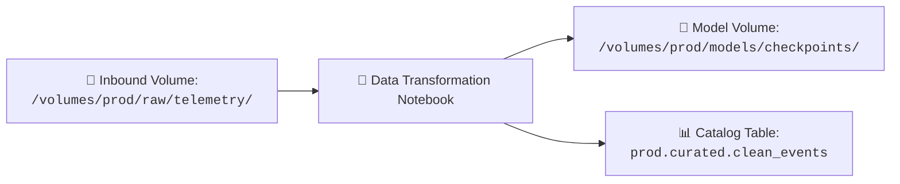

# Collaboration, Catalog Storage & Automated Scheduling

In enterprise analytics, an exploratory data science notebook should not remain an isolated experiment on a single developer's machine. To create lasting organizational value, analytical routines must be **discoverable across teams**, **persisted in governed cloud storage**, and **promoted into automated, recurring production pipelines**.

CompassX unifies notebook development with the **Data Catalog** and the **Workflow Orchestration Engine (Airflow)**, enabling seamless team collaboration and one-click operational scheduling.

---

## 1. Governed Notebook Persistence in the Data Catalog

Unlike standalone Jupyter environments where notebooks are scattered across local folders, CompassX treats notebooks as **first-class securable assets** registered directly within the **Data Catalog**:

$$\mathbf{\text{catalog}} \boldsymbol{.} \mathbf{\text{schema}} \boldsymbol{.} \mathbf{\text{notebook\_name}}$$



### Collaboration Benefits:
- **Centralized Discoverability**: Governed notebooks appear alongside tables and views in the **Catalog Explorer** tree. Teammates can search for notebooks using `Ctrl + K` or natural language AI search.
- **Role-Based Access Control**: Control who can view, edit, or execute a notebook using standard catalog permissions (`Admin`, `Write`, `Read`).
- **Cloud Storage Persistence**: Notebook files (`.ipynb`) and cell output states are automatically synced to the catalog's underlying cloud object storage (MinIO, S3, or Azure Blob Storage).

---

## 2. Accessing Storage Volumes for Notebook Inputs & Outputs

Notebooks can read raw input files and write output datasets directly using governed **Storage Volumes**:



### Typical Workflow Pattern:
1. **Load Raw Data**: Read incoming CSV or JSON feeds from a raw landing volume:
   ```python
   raw_df = pd.read_csv('/volumes/production/raw_ingest/inbound/orders.csv')
   ```
2. **Execute Transformations**: Cleanse, normalize, and calculate metrics in memory.
3. **Persist Cleaned Table**: Write the final DataFrame directly into a managed Data Catalog table using DuckDB:
   ```python
   duckdb.query("CREATE OR REPLACE TABLE production.curated_marts.orders AS SELECT * FROM raw_df")
   ```
4. **Save Model Checkpoints**: Export trained machine learning weights directly to a governed model volume:
   ```python
   joblib.dump(trained_model, '/volumes/production/curated_marts/ml_models/xgb_v1.pkl')
   ```

---

## 3. One-Click Automated Airflow Scheduling

Transitioning an analytical notebook from an interactive prototype into a scheduled, recurring production pipeline historically required data engineers to rewrite Python scripts into complex DAG files.

CompassX eliminates this friction with **One-Click Notebook Scheduling**:

```
+-------------------------------------------------------------------------------+
|  SCHEDULE NOTEBOOK AS RECURRING JOB                                           |
+-------------------------------------------------------------------------------+
|  Job Name:        [ Daily Customer Churn & Scorecard Pipeline ]              |
|  Target Notebook: production.curated_marts.q3_revenue_forecast.ipynb          |
|                                                                               |
|  Schedule:        [ Cron: 0 6 * * * ▾ ] (Runs every day at 06:00 UTC)         |
|  Compute Profile: [ Cloud-Standard (4 Cores / 16 GB) ▾ ]                      |
|                                                                               |
|  Runtime Parameters:                                                          |
|  [ Key: LOOKBACK_DAYS ] = [ Value: 30 ]                                       |
|  [ Key: REGION_FILTER ] = [ Value: 'ALL' ]                                    |
|                                                                               |
|  Failure Alerts:  [ Notify On Failure: data-team@company.com ]               |
+-------------------------------------------------------------------------------+
|  [ ⏱️ Create & Publish Scheduled Job ]                                         |
+-------------------------------------------------------------------------------+
```

### Behind the Scenes:
- **Headless Execution (`airflow-notebook-runner`)**: CompassX packages the notebook into an isolated container pod managed by the Airflow orchestrator.
- **Parameter Injection**: Dynamic parameters (such as `LOOKBACK_DAYS=30`) are injected into the notebook's top parameters cell at runtime.
- **Execution Snapshotting**: Each scheduled run captures a fully rendered HTML/IPYNB snapshot of all cell outputs, charts, and execution logs, accessible in the **Jobs Run History** (`/jobs/runs`).

---

## Next Steps

To learn how to chain multiple notebooks, SQL queries, and dashboard refreshes into complex visual DAG pipelines, proceed to **[Jobs & Workflow Orchestration](../jobs/index.md)**.
