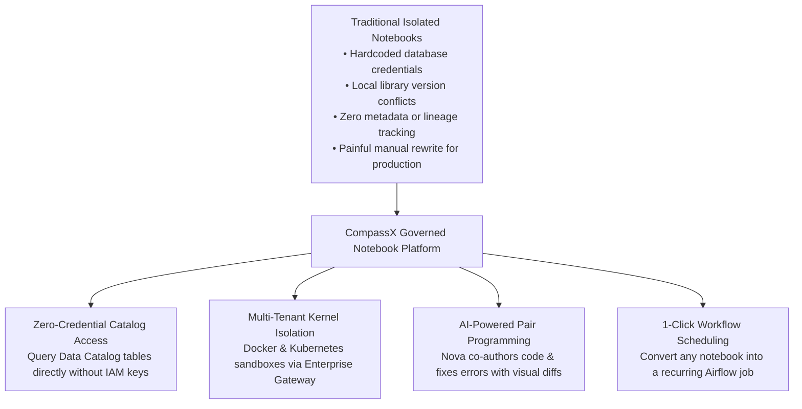
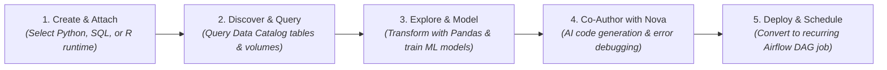

# Interactive Notebooks

In modern enterprise data platforms, **Interactive Notebooks** serve as the primary collaborative canvas where data scientists, data engineers, and business analysts explore raw datasets, author statistical models, test analytical queries, and prototype automated data transformations.

Unlike standalone Jupyter environments running on isolated local machines, CompassX Notebooks are **fully integrated into the enterprise data governance fabric**. Every notebook is natively connected to the **Data Catalog**, executes within isolated containerized kernels managed by the **Jupyter Enterprise Gateway**, and is equipped with **Nova** &mdash; the built-in AI Data Engineer capable of writing code, explaining anomalies, and diagnosing execution errors in real time.

---

## The Evolution of Enterprise Notebooks

Data science teams historically struggled with significant operational friction when using standalone or legacy notebook environments:
- **Credential Leakage**: Data scientists frequently copied AWS access keys or database passwords directly into notebook cells to connect to remote data sources.
- **Environment Inconsistency ("Works on My Machine")**: Local Python package versions differed across team members' laptops, causing code to break when handed over to data engineering for productionization.
- **Disconnected Governance**: Datasets loaded into notebooks lacked lineage tracking, making it impossible for data governance teams to know which raw files or database tables informed a published machine learning model.
- **Productionization Bottlenecks**: Converting an exploratory notebook into a scheduled, recurring production job often required rewriting the entire script into a separate orchestration tool.

CompassX transforms the notebook experience by embedding notebooks directly within a **unified, governed data architecture**:



---

## Anatomy of the CompassX Notebook Studio

The CompassX Notebook interface provides a modern, full-screen analytical studio built on the **Monaco Editor** &mdash; the same professional code engine powering Visual Studio Code:

```
+-----------------------------------------------------------------------------------------------+
| [ 📓 customer_churn_analysis.ipynb ]  [ Kernel: Python 3.11 ● Idle ]  [ Sizing: Cloud-Standard ▾ ] |
+-----------------------------------------------------------------------------------------------+
|  TOOLBAR: [ ▶ Run Cell ]  [ ⏹ Interrupt ]  [ 🔄 Restart ]  [ + Code ]  [ + Text ]  [ ⏱️ Schedule ] |
+-----------------------------------------------------------------------------------------------+
|  [ In 1 ]  -- Query 30-day active customer transactions from the Data Catalog                 |
|            import duckdb                                                                      |
|            import pandas as pd                                                                |
|            df = duckdb.query("""                                                              |
|                SELECT customer_id, region, SUM(revenue_usd) AS total_spend                    |
|                FROM production.curated_marts.daily_revenue                                    |
|                GROUP BY customer_id, region                                                   |
|            """).df()                                                                          |
|                                                                                               |
|  [ Out 1 ] [ Interactive DataFrame Grid: 1,420 rows | 3 columns | Export to CSV ]             |
|            customer_id    region      total_spend                                             |
|            104829         North       $14,250.00                                              |
|            209481         West        $8,920.50                                               |
+-----------------------------------------------------------------------------------------------+
|  [ In 2 ]  # Generate interactive Plotly distribution chart                                   |
|            import plotly.express as px                                                        |
|            fig = px.histogram(df, x="total_spend", color="region", nbins=30)                 |
|            fig.show()                                                                         |
|                                                                                               |
|  [ Out 2 ] [ 📊 Interactive Plotly Chart: Zoom / Pan / Hover Tooltips Enabled ]               |
+-----------------------------------------------------------------------------------------------+
```

### Core Interface Components:
1. **Header & Kernel Controls**: Displays the notebook title, active kernel runtime state (`Idle`, `Busy`, `Starting`, `Dead`), hardware profile selector (`local`, `cloud-s`, `cloud-l`, `gpu`), and quick-action buttons to interrupt or restart the session.
2. **Monaco Code & Markdown Cells**: Provides syntax highlighting, auto-indentation, multi-cursor editing, and rich autocomplete for Python, SQL, and Markdown.
3. **Interactive Output Canvases**: Renders rich outputs &mdash; including interactive paginated data grids with search and column sorting, Plotly charts, Matplotlib figures, JSON trees, and LaTeX equations.
4. **Nova AI Assistant Sidebar**: Collapsible AI companion that analyzes active cell contents, writes complex analytical routines, and proposes side-by-side code diffs (`AgentEditDiff`).

---

## The 5-Stage Notebook Operational Lifecycle

Every interactive notebook in CompassX follows a structured, repeatable operational lifecycle:



1. **Create & Attach**: Initialize a new notebook or import existing `.ipynb` files. Attach an isolated compute kernel sandbox (Python 3.11, DuckDB, or R) sized to your workload.
2. **Discover & Query**: Query governed catalog tables (`catalog.schema.table`) using DuckDB SQL or load unstructured CSV/JSON files directly from storage volumes using standardized POSIX paths.
3. **Explore & Model**: Perform statistical exploration with Pandas, NumPy, or Polars; generate publication-grade visualizations; or train machine learning models using Scikit-Learn, XGBoost, or PyTorch.
4. **Co-Author with Nova**: Prompt the built-in AI Data Engineer to generate visualization code, optimize slow queries, or diagnose execution tracebacks with one click.
5. **Deploy & Schedule**: Transition exploratory analysis into a production batch workflow by scheduling the notebook to run automatically via Airflow with parameterized inputs.

---

## In This Section

Explore the comprehensive guides below to learn how to author code, render interactive charts, collaborate with Nova, and schedule automated batch pipelines:

<div class="grid cards" markdown>

-   **[Authoring, Kernels & Multi-Language Execution](authoring-and-kernels.md)**

    ---

    Explore Monaco editor shortcuts, multi-language execution (Python 3.11, DuckDB SQL, R), kernel lifecycles, and hardware sizing profiles.

    [:octicons-arrow-right-24: Learn Notebook Authoring](authoring-and-kernels.md)

-   **[Visualizations, Interactive Data Grids & Outputs](visualizations-and-outputs.md)**

    ---

    Master interactive DataFrame grids, Plotly charts, Matplotlib figures, JSON trees, LaTeX math equations, and stdout streaming.

    [:octicons-arrow-right-24: Explore Output Types](visualizations-and-outputs.md)

-   **[Nova: AI Notebook Assistant & Error Debugging](nova-notebook-assistant.md)**

    ---

    Co-author analytical routines with Nova, review visual code diffs (`AgentEditDiff`), and fix cell errors with one-click automated debugging.

    [:octicons-arrow-right-24: Co-Author with Nova](nova-notebook-assistant.md)

-   **[Collaboration, Catalog Storage & Automated Scheduling](collaboration-and-scheduling.md)**

    ---

    Persist notebooks in the Data Catalog, manage volume checkpoints, and convert notebooks into scheduled production Airflow jobs.

    [:octicons-arrow-right-24: Learn Collaboration & Scheduling](collaboration-and-scheduling.md)

</div>

---

## Next Steps

To learn how to author notebook cells, select kernel runtimes, and utilize editor keyboard shortcuts, proceed to **[Authoring, Kernels & Multi-Language Execution](authoring-and-kernels.md)**.
