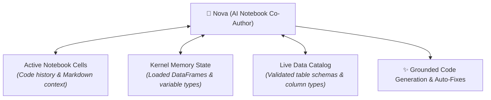
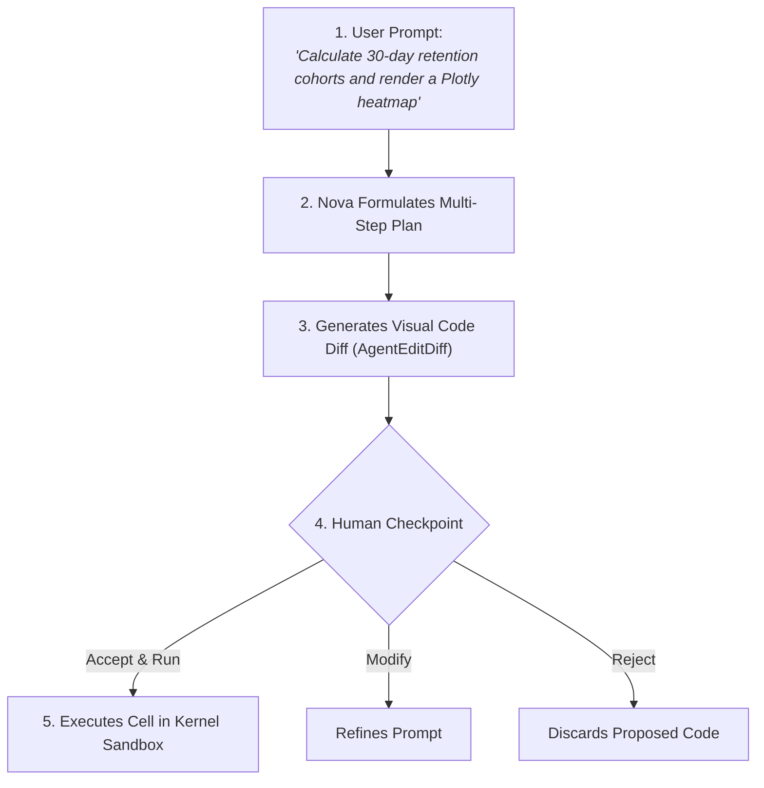

# Nova: AI Notebook Co-Author & Error Debugging

Writing complex data transformations, authoring statistical models, and debugging execution errors can consume hours of valuable engineering time. In traditional notebook workflows, developers constantly switch between their code editor and external web chatbots &mdash; manually copying error tracebacks, explaining table schemas, and pasting generated code snippets back and forth.

In CompassX, **Nova** (the autonomous AI Data Engineer) is embedded directly into the **Notebook Studio**. Aware of your active notebook variables, cell execution history, and live **Data Catalog** schemas, Nova acts as a senior pair programmer capable of co-authoring analytical routines, generating Plotly charts, and diagnosing execution errors with a single click.

---

## 1. Context-Aware AI Pair Programming

Unlike generic external chatbots that operate in complete isolation, Nova is deeply grounded in the live environmental state of your notebook session:



### Key Contextual Advantages:
- **Variable Awareness**: If you have already loaded a DataFrame named `sales_df` in Cell 1, Nova knows its column names and data types, generating downstream code that uses `sales_df` directly.
- **Data Catalog Grounding**: When asked to query production data, Nova references live schemas from the Data Catalog, ensuring table names and column identifiers are 100% accurate.
- **Zero Copy-Pasting**: Nova modifies cells directly on the notebook canvas, presenting changes as reviewable visual diffs.

---

## 2. The Plan & Checkpoint Co-Authoring Workflow

To maintain full transparency and human control, Nova operates under the **Plan & Checkpoint Model**:



### Step-by-Step Walkthrough:
1. **Prompt Nova**: Open the Nova assistant panel in the right sidebar and describe your analytical goal in plain English (e.g., *"Filter sales_df for enterprise customers, calculate average order value by month, and plot a bar chart"*).
2. **Review the Step-by-Step Plan**: Nova breaks your request into transparent logical steps before writing code.
3. **Inspect the Visual Diff (`AgentEditDiff`)**: Nova renders the proposed changes directly on the target cell with color-coded line additions (green) and deletions (red).
4. **Accept or Refine**:
   - **Accept & Run**: Applies the code and executes the cell immediately.
   - **Accept Only**: Applies the code to the cell for manual review before running.
   - **Modify with Prompt**: Instruct Nova to adjust specific parameters (e.g., *"Sort the bars descending and change color palette to Blues"*).
   - **Reject**: Discards the suggested edit without modifying your notebook.

---

## 3. Visual Code Diffs (`AgentEditDiff`)

The **`AgentEditDiff`** component ensures that AI code modifications are never applied silently or unpredictably:

```
+-------------------------------------------------------------------------------+
|  NOVA PROPOSED CHANGES (Cell 3)                                               |
+-------------------------------------------------------------------------------+
|  - # Legacy static plot                                                       |
|  - plt.plot(df['date'], df['sales'])                                          |
|  + # Interactive Plotly area chart with unified hover tooltips                |
|  + import plotly.express as px                                                |
|  + fig = px.area(df, x="date", y="sales", color="region",                     |
|  +               title="Regional Sales Trajectory")                           |
|  + fig.update_layout(template="plotly_white", hovermode="x unified")          |
|  + fig.show()                                                                 |
+-------------------------------------------------------------------------------+
|  [ ✅ Accept & Run ]      [ ✏️ Accept Only ]      [ ❌ Reject ]                |
+-------------------------------------------------------------------------------+
```

---

## 4. One-Click Traceback Debugging & Self-Healing

When a cell execution fails due to a Python exception (such as a `KeyError`, `IndexError`, or SQL syntax error), CompassX displays the **Ask Nova to Fix** action button directly above the error stack trace:

```
+-------------------------------------------------------------------------------+
|  CELL 4: EXECUTION FAILED (Traceback)                                         |
|  KeyError: 'revenue'                                                          |
|  File "<ipython-input-4>", line 3, in <module>                                |
|    total = df['revenue'].sum()                                                |
+-------------------------------------------------------------------------------+
|  [ ⚡ Ask Nova to Fix Error ]                                                 |
+-------------------------------------------------------------------------------+
```

### What Happens When You Click "Ask Nova to Fix":
1. **Traceback Analysis**: Nova reads the exact error type and the failing line of code.
2. **Schema & Environment Inspection**: Nova inspects the active DataFrame schema in memory and discovers that the actual column name is `revenue_usd` (not `revenue`).
3. **Automated Patch Generation**: Nova generates a visual diff correcting the column name, explains the root cause in plain English, and presents the fix for approval.

---

## Next Steps

To learn how to persist notebooks in the Data Catalog, manage volume checkpoints, and convert notebooks into scheduled Airflow jobs, proceed to **[Collaboration, Catalog Storage & Automated Scheduling](collaboration-and-scheduling.md)**.
