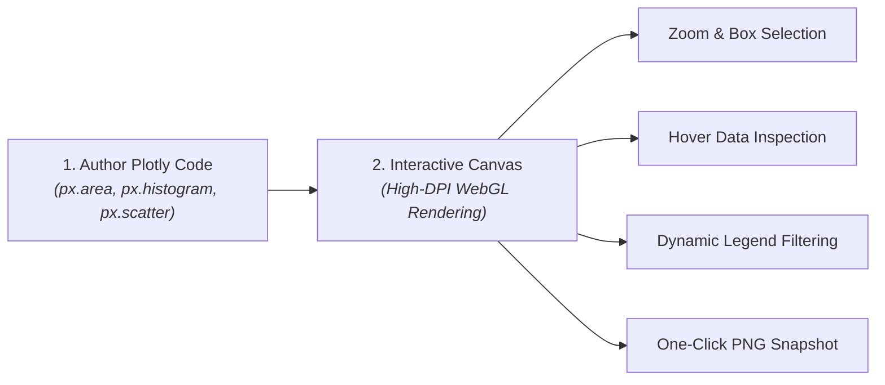

# Visualizations, Interactive Data Grids & Outputs

Data analysis is only as impactful as the clarity with which insights are communicated. In CompassX, notebooks are designed not merely as code execution scripts, but as **rich, interactive analytical reports**.

The CompassX Notebook Studio includes a multi-format output rendering engine that transforms raw query results and Python variables into **interactive data tables**, **dynamic Plotly charts**, **collapsible JSON trees**, and **publication-grade mathematical formulas**.

This guide explains how each output format operates, demonstrates how to render interactive visualizations, and details best practices for exporting presentation-ready artifacts.

---

## 1. The Interactive DataFrame Grid

When querying Data Catalog tables or manipulating Pandas and Polars DataFrames, standard Python notebooks typically print truncated ASCII text tables that are difficult to read and explore.

CompassX replaces static text with the **Interactive DataFrame Grid**:

```python
import pandas as pd
import duckdb

# Query active customer transactions
df = duckdb.query("""
    SELECT customer_id, region, subscription_tier, revenue_usd, signup_date
    FROM production.curated_marts.customer_summary
""").df()

# Render interactive grid
display(df)
```

```
+-----------------------------------------------------------------------------------------------+
|  INTERACTIVE DATAFRAME GRID: 1,420 rows | 5 columns                    [ ⬇ Export to CSV ]    |
+-----------------------------------------------------------------------------------------------+
|  #   customer_id   region      subscription_tier   revenue_usd    signup_date                 |
|  1   104829        North       Enterprise          $14,250.00     2025-01-14                  |
|  2   209481        West        Mid-Market          $8,920.50      2025-02-01                  |
|  3   301924        South       Enterprise          $22,100.00     2025-02-18                  |
|  4   408192        East        Starter             $1,200.00      2025-03-05                  |
+-----------------------------------------------------------------------------------------------+
|  Page 1 of 142  [ << ] [ < ] [ 1 ] [ 2 ] [ 3 ] [ > ] [ >> ]          Rows per page: [ 10 ▾ ]  |
+-----------------------------------------------------------------------------------------------+
```

### Interactive Grid Features:
- **Instant Sorting**: Click any column header to sort rows ascending or descending.
- **In-Grid Search & Filtering**: Type keywords in the search bar to filter table rows instantly without re-executing the Python cell.
- **Data Type Badges**: Displays column data types (`VARCHAR`, `DECIMAL`, `DATE`, `INTEGER`) to help users verify schema correctness at a glance.
- **One-Click Export**: Click **Export to CSV** or **Export to JSON** to download the filtered table to your local computer.

---

## 2. Interactive Charts with Plotly

CompassX provides native, hardware-accelerated rendering for **Plotly** &mdash; the modern standard for interactive web-based data visualization:

```python
import plotly.express as px

# Create an interactive multi-series revenue trend chart
fig = px.area(
    df, 
    x="signup_date", 
    y="revenue_usd", 
    color="subscription_tier",
    title="Cumulative Revenue Growth by Subscription Tier",
    labels={"revenue_usd": "Total Revenue (USD)", "signup_date": "Signup Date"}
)

# Customize chart layout and hover tooltips
fig.update_layout(template="plotly_white", hovermode="x unified")
fig.show()
```



### Why Plotly in CompassX?
- **Live Interactivity**: Viewers can click and drag to zoom into specific time ranges, double-click to reset, and hover over data points to inspect exact figures.
- **Interactive Legends**: Click items in the chart legend to toggle series visibility on and off dynamically.
- **Publication-Ready Export**: Click the camera icon in the chart toolbar to download high-resolution PNG snapshots for executive presentations.

---

## 3. Static Visualizations with Matplotlib and Seaborn

For statistical publications, regression analyses, and econometric papers, CompassX fully supports **Matplotlib** and **Seaborn**:

```python
import matplotlib.pyplot as plt
import seaborn as sns

plt.figure(figsize=(10, 5))
sns.boxplot(data=df, x="subscription_tier", y="revenue_usd", palette="Blues")

plt.title("Revenue Distribution across Customer Tiers", fontsize=14)
plt.xlabel("Subscription Tier")
plt.ylabel("Revenue (USD)")
plt.grid(True, linestyle="--", alpha=0.5)

plt.tight_layout()
plt.show()
```

---

## 4. Semi-Structured JSON Trees & Formatted Markup

Data science workflows often involve inspecting nested JSON payloads from external REST APIs or LLM model outputs:

### 1. Interactive Collapsible JSON Viewer
When a cell outputs a Python dictionary or JSON object, CompassX renders an interactive, collapsible tree viewer:
```python
api_response = {
    "status": "success",
    "customer": {
        "id": 104829,
        "profile": {"tier": "Enterprise", "region": "North"},
        "active_contracts": [
            {"product": "CompassX Lakehouse", "mrr": 4500},
            {"product": "Nova AI Copilot", "mrr": 1200}
        ]
    }
}
display(api_response)
```

### 2. LaTeX Mathematical Notation (KaTeX)
Document statistical models and equations directly within Markdown cells using standard LaTeX syntax:

```markdown
The estimated customer lifetime value ($CLV$) is defined by:

$$CLV = \sum_{t=1}^{T} \frac{(Revenue_t - Cost_t) \times Retention_t}{(1 + DiscountRate)^t}$$
```

---

## Next Steps

To learn how to co-author code, generate charts, and automatically fix errors using the built-in AI Data Engineer, proceed to **[Nova: AI Notebook Assistant & Error Debugging](nova-notebook-assistant.md)**.
