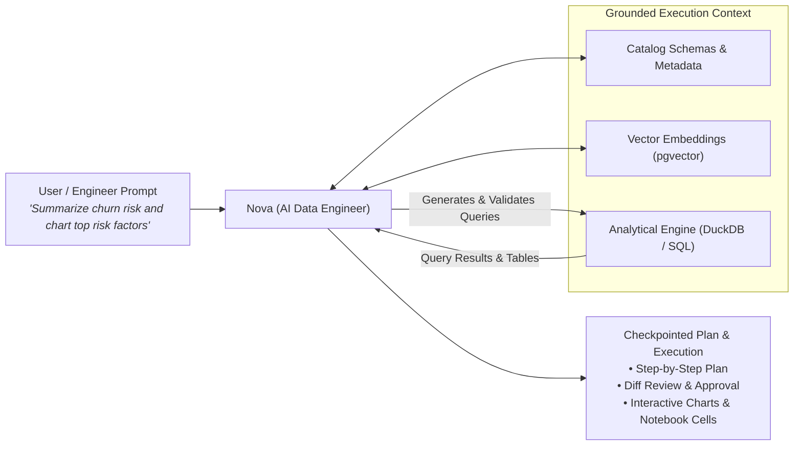

# AI-Native Data Intelligence & Nova

CompassX is designed from the ground up as an **agent-native platform**. Rather than treating artificial intelligence as a disconnected chatbot or external plugin, CompassX builds AI directly into every layer of the platform through **Nova**, the built-in AI Data Engineer.

Nova actively collaborates with data teams directly inside notebooks, SQL warehouses, and data catalogs &mdash; planning, writing, and executing data tasks alongside you.

---

## Meet Nova: Your Built-In AI Data Engineer

Unlike generic LLMs that generate code snippets without environmental context, **Nova** operates directly within your governed data workspace:

### The Plan & Checkpoint Model
Nova uses an interactive **Plan & Checkpoint** workflow that keeps humans in control:
1. **Goal Analysis**: Nova inspects the active notebook, catalog tables, and connected data sources to understand your request.
2. **Step-by-Step Plan**: Nova drafts an actionable plan detailing each query, transformation, or chart to be created.
3. **Diff Review & Approval**: Nova proposes code changes or cell additions as visual diffs for you to approve, modify, or reject.
4. **Execution & Feedback Loop**: Once approved, Nova executes the task in your isolated kernel and verifies the results. If an error occurs, Nova diagnoses the issue against the schema and auto-corrects.

---

## Core Intelligence Capabilities

### 1. Natural Language Data Inquiries
Business analysts and domain specialists can explore data without writing complex SQL:
- **Plain English Queries**: Ask questions like *"Show me monthly recurring revenue grouped by region for 2025"* and receive validated queries with instant visualizations.
- **Narrative Summaries**: Combines tabular outputs with clear executive commentary explaining seasonal trends, outliers, and key takeaways.
- **Contextual Awareness**: Remembers recent queries and table contexts within your active workspace.

### 2. Semantic Vector Search & Document Intelligence
CompassX bridges structured relational data with unstructured enterprise documents via PostgreSQL `pgvector`:
- **Document Knowledge Bases**: Ingest operational PDFs, research briefs, customer feedback, and documentation into indexed volumes.
- **Hybrid Search**: Query both structured transaction tables and unstructured document excerpts in a single workflow.
- **Semantic Clustering**: Group similar customer feedback or categorize product descriptions based on meaning rather than exact keywords.

### 3. Smart Code Assistance in Notebooks & SQL Editor
For data engineers and analytics developers:
- **Schema-Aware Autocomplete**: Recommends table names, join keys, and column types based on live catalog metadata.
- **Inline Query Optimization**: Explains slow execution plans and suggests indexes, partitions, or vectorized expressions.
- **Automated Data Profiling**: Instantly computes summary distributions, null counts, and correlations on newly ingested tables.

---

## Enterprise Governance & Grounded Execution

CompassX enforces strict safety and audit boundaries across all AI interactions:

| Governance Pillar | How CompassX Enforces It |
| :--- | :--- |
| **Grounded in Catalog Schemas** | Nova generates queries based strictly on validated Data Catalog metadata, eliminating hallucinations and invalid joins. |
| **Role-Based Permission Enforcement** | AI execution adheres strictly to user roles. Nova cannot access, query, or display data that the user does not have permission to view. |
| **Complete Audit Transparency** | Every query generated by Nova is tracked in the platform Query History with execution metrics, cost transparency, and reproducibility. |

---

## Related Topics

- Read the **[Platform Architecture](platform-architecture.md)** to explore the compute and execution stack.
- Explore how different teams leverage Nova in **[Teams, Personas & Use Cases](personas-and-use-cases.md)**.
- Learn about configuring agents and tools in the **[AI Agents Chapter](../agents/index.md)**.
