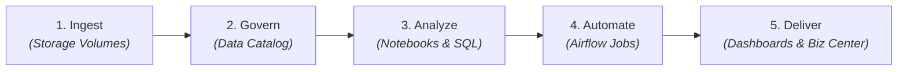
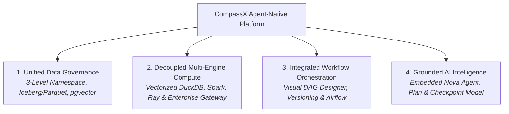

# What is CompassX?

**CompassX** is a unified, agent-native data and artificial intelligence platform designed to bridge the gap between data engineering, analytics, and business decision-making.

By unifying a governed **Data Catalog**, collaborative **Interactive Notebooks**, **Automated Workflow Orchestration**, real-time **BI Dashboards**, and autonomous **AI Agents** into a single cohesive architecture, CompassX eliminates tool fragmentation, prevents data silos, and empowers organizations to transform raw data into trusted business outcomes.

---

## The Core Loop: From Ingest to Executive Decision

In traditional enterprise stacks, taking a new dataset from ingestion to an executive dashboard requires jumping between 4 to 6 disconnected tools: cloud storage consoles, SQL editors, Python notebook servers, workflow orchestrators, external BI software, and web chatbots.

CompassX collapses this fragmented lifecycle into a continuous, 5-stage **Core Analytical Loop**:

1. **Ingest**: Land raw CSVs, JSON feeds, images, or PDF manuals directly into governed **Storage Volumes**.
2. **Govern**: Register tables and schemas in the **Data Catalog** with automated type inference, column documentation, and role-based permissions.
3. **Analyze**: Explore datasets, author transformations, and train machine learning models in **Interactive Notebooks** alongside **Nova** (the AI Data Engineer).
4. **Automate**: Promote exploratory notebooks and SQL queries into recurring, production-grade **Airflow Jobs** with automated retries.
5. **Deliver**: Publish real-time KPI scorecards to the **Business Center** for executive leadership and operational decision-makers.

---

## Architectural Pillars of CompassX

CompassX is structured around four foundational architectural pillars:

---

## In This Section

Explore the comprehensive guides below to learn more about the architectural foundation, data intelligence engine, and user personas supported by CompassX:

-   **[Platform Architecture](platform-architecture.md)**

    ---

    Explore the four decoupled platform layers, three-level catalog namespace, and cloud-native container infrastructure.

    [:octicons-arrow-right-24: Learn Platform Architecture](platform-architecture.md)

-   **[Data Intelligence & Nova](data-intelligence.md)**

    ---

    Understand the role of Nova (the built-in AI Data Engineer), the Plan & Checkpoint diff model, and vector grounding.

    [:octicons-arrow-right-24: Explore Data Intelligence](data-intelligence.md)

-   **[Personas & Use Cases](personas-and-use-cases.md)**

    ---

    Discover how Data Engineers, Analytics Engineers, Data Scientists, and Business Leaders collaborate on CompassX.

    [:octicons-arrow-right-24: Explore Personas & Use Cases](personas-and-use-cases.md)

---

## Next Steps

To dive deeper into the multi-layer system architecture, proceed to **[Platform Architecture](platform-architecture.md)**.
