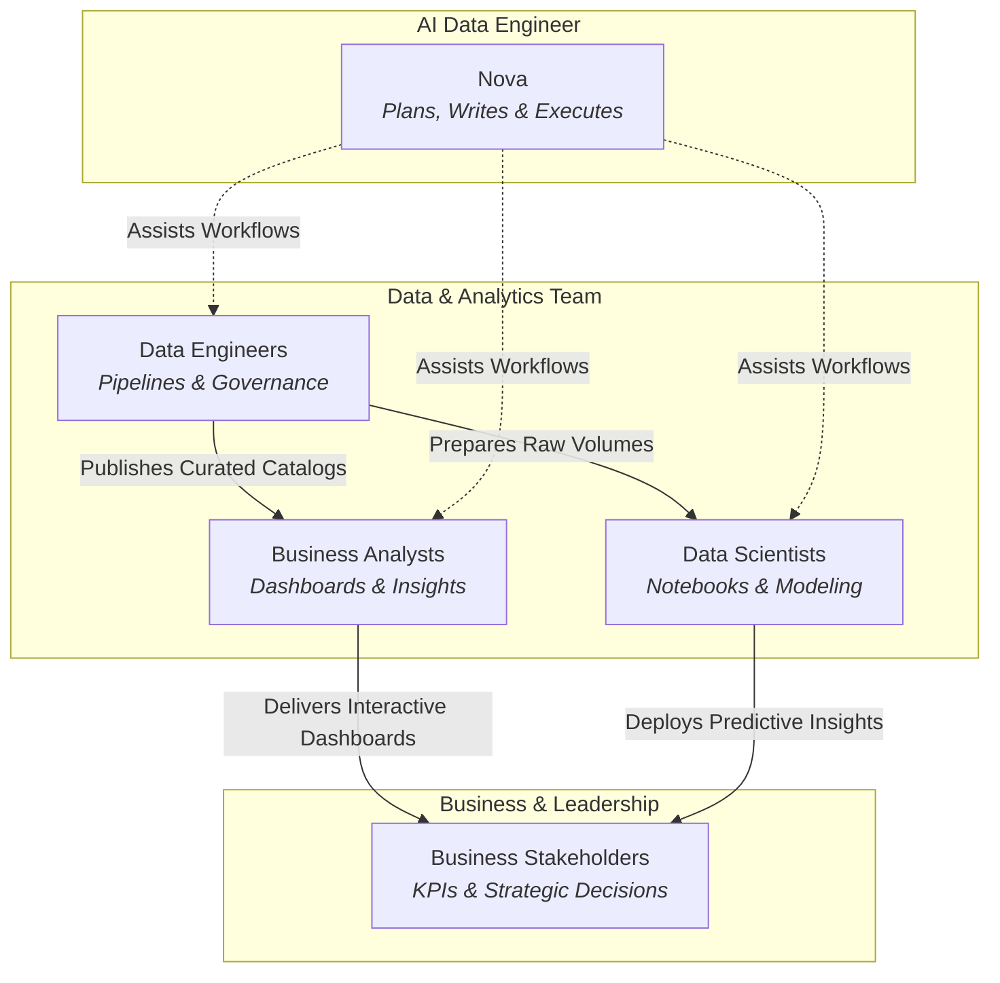

# Teams, Personas & Business Use Cases

CompassX is designed to unite cross-functional teams around a shared, trusted data foundation. By providing purpose-built tools for **Data Engineers**, **Business Analysts**, **Data Scientists**, and **Executive Stakeholders** alongside the embedded AI Data Engineer (**Nova**), CompassX eliminates departmental silos and accelerates organizational decision-making.

---

## Persona Overviews

---

## 1. Data Engineers & Analytics Engineers

Data Engineers build, automate, and govern the data pipelines that power enterprise intelligence.

### Primary Platform Capabilities Used:
- **[Data Catalog](../data-catalog/index.md)**: Registering catalogs, defining schemas, managing table properties, and mounting storage volumes.
- **[Automated Jobs](../jobs/index.md)**: Designing visual DAG pipelines, configuring dependency triggers, and scheduling Airflow batch executions.
- **[Compute & SQL Warehouses](../compute/index.md)**: Running high-throughput DuckDB transformations.

### Practical Workflow Scenario:
1. **Ingest**: Raw daily transaction CSVs arrive in a MinIO/S3 storage volume.
2. **Transform with Nova**: The engineer asks Nova: *"Create a pipeline to clean these daily files, deduplicate by transaction ID, and calculate rolling 30-day customer spend."* Nova drafts the multi-step plan, proposes the SQL diff, and the engineer approves.
3. **Automate**: The workflow is scheduled as a recurring CompassX Job that populates the `production.finance.daily_spend` catalog table.

---

## 2. Business Analysts & Domain Experts

Business Analysts explore data, build operational reports, and deliver actionable insights without writing complex backend code.

### Primary Platform Capabilities Used:
- **[Dashboards](../dashboards/index.md)**: Building real-time interactive dashboards with KPI counters, line charts, and parameterized filters.
- **[AI Agents & Nova](../agents/index.md)**: Asking questions in plain English to uncover root causes, trends, and comparisons.
- **[SQL Editor](../compute/index.md)**: Running ad-hoc exploratory queries against curated catalog tables.

### Practical Workflow Scenario:
1. **Explore**: The analyst opens the catalog and searches for `customer_retention` datasets.
2. **Inquire with Nova**: Asks Nova: *"What were the top 3 product categories by gross margin in Q3 across the European region?"* Nova writes the query, executes it on the SQL warehouse, and returns an interactive chart and summary.
3. **Publish**: The analyst embeds the widget into the executive quarterly review dashboard.

---

## 3. Data Scientists & ML Practitioners

Data Scientists perform exploratory data analysis, train predictive models, and deploy AI intelligence.

### Primary Platform Capabilities Used:
- **[Interactive Notebooks](../notebooks/index.md)**: Collaborative multi-kernel environment (Python, SQL, R) with isolated execution processes.
- **[Vector Intelligence](../what-is-compassx/data-intelligence.md)**: Utilizing `pgvector` for semantic search and document embeddings.
- **[Automated Jobs](../jobs/index.md)**: Packaging notebook experiments into scheduled scoring runs.

### Practical Workflow Scenario:
1. **EDA in Notebook**: Opens a Jupyter notebook attached to a dedicated Python kernel to analyze customer behavior patterns.
2. **Modeling**: Trains a churn prediction model using pandas and scikit-learn.
3. **Deployment**: Converts the notebook into a weekly Job that outputs predicted churn probabilities directly into a catalog table for sales outreach.

---

## 4. Business Stakeholders & Leadership

Executives, department heads, and operational managers require trusted metrics to make timely strategic decisions.

### Primary Platform Capabilities Used:
- **Real-Time Dashboards**: Accessing live operational dashboards with secure parameter filters.
- **Single Source of Truth**: Confidence that all reports originate from governed Data Catalog assets rather than unverified spreadsheets.
- **Accelerated Decisions**: Drastically shorter turnaround from business question to validated answers.

---

## Cross-Functional Collaboration Matrix

| Lifecycle Stage | Data Engineer | Business Analyst | Data Scientist | Business Leader | Nova (AI Engineer) |
| :--- | :--- | :--- | :--- | :--- | :--- |
| **1. Ingest & Store** | Connects storage & creates volumes | &mdash; | &mdash; | &mdash; | Inspects file schemas |
| **2. Clean & Model** | Orchestrates Jobs & DAGs | Validates business definitions | Prepares feature datasets | &mdash; | Drafts & validates queries |
| **3. Explore & Analyze** | Monitors pipeline runs | Queries SQL & builds dashboards | Trains models in notebooks | Reviews KPIs | Answers conversational queries |
| **4. Act & Decide** | Scales compute resources | Shares reports with stakeholders | Delivers predictions | Makes strategic decisions | Summarizes business insights |

---

## Next Steps

Ready to get started?

- Follow the **[Getting Started Guide](../getting-started/index.md)** to set up your first workspace.
- Learn about dataset discovery in the **[Data Catalog Chapter](../data-catalog/index.md)**.
