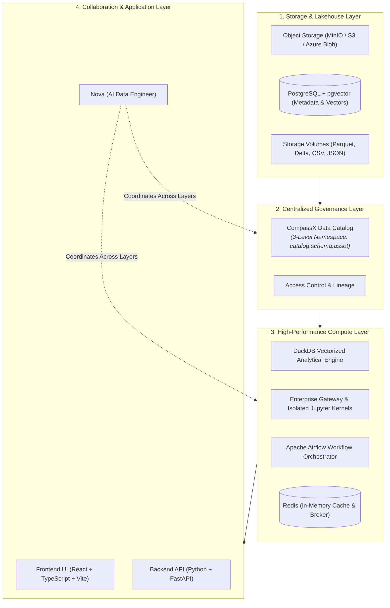
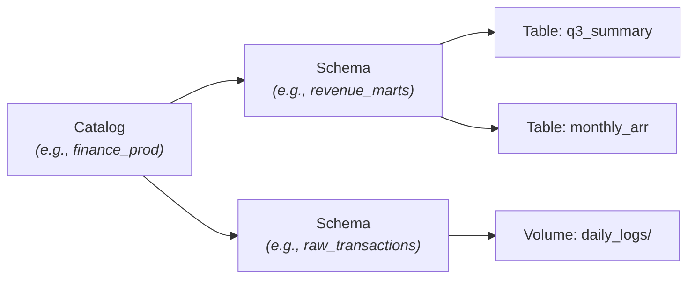

# Platform Architecture & Foundations

CompassX is engineered with a decoupled architecture separating **storage**, **centralized governance**, **elastic compute**, and **collaborative applications**. This design ensures high query performance, fine-grained access control, and flexible deployment across local and enterprise cloud environments.

---

## Architectural Overview

The platform integrates lightweight web services with containerized data infrastructure and vectorized in-memory compute engines:

---

## The Four Core Layers

### 1. Storage & Data Lake Layer
CompassX connects natively to modern cloud and on-premise storage backends:
- **Object Storage (MinIO / S3 / Azure Blob)**: High-throughput storage for Parquet files, Delta tables, and artifacts backed by S3-compatible APIs.
- **PostgreSQL with `pgvector`**: Stores transactional platform metadata, workspace permissions, user profiles, and high-dimensional semantic vector embeddings.
- **Storage Volumes**: Logical directories mapped to raw files (CSVs, JSON, PDFs) that can be accessed directly by notebook kernels and data pipelines.

### 2. Centralized Governance Layer (Data Catalog)
The governance layer acts as the single source of truth for all enterprise data assets:
- **Unified Cataloging**: Automatically indexes tables, schemas, and storage volumes.
- **Metadata Management**: Captures schemas, column types, descriptions, tags, and ownership records.
- **Access Governance**: Enforces security policies so users only access data permitted by their organization role.

### 3. High-Performance Compute & Execution Layer
Compute is decoupled from storage, allowing query processing and workflow jobs to scale independently:
- **DuckDB Analytical Engine**: Vectorized, in-memory analytical compute delivering sub-second SQL execution across large Parquet and Delta datasets.
- **Jupyter Enterprise Gateway**: Manages containerized, isolated execution kernels (Python, SQL, R), ensuring safe multi-tenant process isolation.
- **Apache Airflow Orchestration**: Coordinates automated DAG pipelines, complex multi-step dependencies, and scheduled batch workflows.
- **Redis In-Memory Broker**: Handles caching, real-time message brokering, and task queues.

### 4. Applications & Collaboration Layer
The unified web workspace gives all user personas access to their tools in one place:
- **Interactive Notebooks**: Multi-kernel collaborative environment with inline visualizations.
- **Automated Jobs**: Visual DAG workflow designer and scheduled job executor.
- **Real-time Dashboards**: Dynamic visualization canvas for operational and executive KPI reporting.
- **Nova AI Data Engineer**: Conversational interface for natural language querying and tool automation.

---

## The Three-Level Governance Namespace

All assets in CompassX follow a standardized three-level hierarchy, establishing clear organizational boundaries:

$$\text{catalog} \boldsymbol{.} \text{schema} \boldsymbol{.} \text{asset\_name}$$

1. **Catalog (`catalog`)**: Top-level container representing a business unit or environment (e.g., `production`, `marketing`, `finance`).
2. **Schema (`schema`)**: Logical grouping within a catalog representing a business subject or pipeline stage (e.g., `curated`, `staging`, `customer_360`).
3. **Asset (`asset_name`)**: Securable data objects, including:
   - **Tables**: Governed tabular datasets stored in Parquet or Delta formats.
   - **Views**: Virtual tables defined by saved SQL queries.
   - **Volumes**: Directories of raw or unstructured files.
   - **Notebooks**: Reusable analytical notebooks.

---

## Process & Execution Isolation

Security and multi-tenant stability are central to CompassX's design:

- **Isolated Kernel Sandboxes**: Every notebook session and job task runs within an isolated containerized process managed by the Enterprise Gateway.
- **Stateless Web Services**: The frontend and API tiers remain lightweight and stateless, routing compute-heavy tasks directly to execution workers.
- **Secure Storage Mounts**: Storage volumes use authenticated credentials and token management, preventing unauthorized direct storage modifications.

---

## Deployment Flexibility

CompassX supports flexible operational environments:
- **Docker Compose**: Standalone container stack running locally for development and evaluation.
- **Kubernetes Cloud Release**: Production Helm chart with horizontal pod autoscaling for AWS EKS, Azure AKS, and Google GKE.

---

## Related Topics

- Learn how embedded AI functions across the platform in **[AI-Native Data Intelligence & Nova](data-intelligence.md)**.
- Explore how different roles collaborate in **[Teams, Personas & Use Cases](personas-and-use-cases.md)**.
- Start using the platform with the **[Getting Started Guide](../getting-started/index.md)**.
